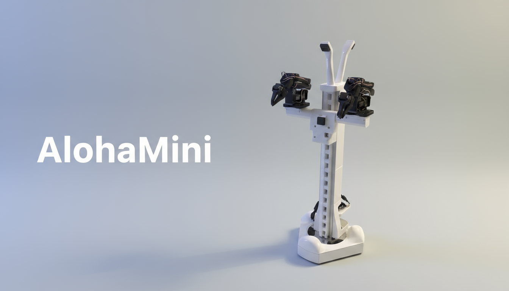

# AlohaMini

```{raw} html
<div class="am-project-links" aria-label="项目资源">
<a href="https://github.com/liyiteng/AlohaMini" aria-label="GitHub：AlohaMini 项目"></a>
<a href="https://github.com/liyiteng/AlohaMini/stargazers" aria-label="查看 AlohaMini 的 GitHub Stars"></a>
<a href="https://x.com/liyitengx" aria-label="在 X 上关注 @liyitengx"></a>
<a href="https://github.com/liyiteng/AlohaMini/blob/main/LICENSE" aria-label="Apache 2.0 开源许可证"></a>
<a href="https://discord.gg/CacMUBaFgJ" aria-label="加入 AlohaMini Discord 社区"></a>
</div>
<figure class="am-hero"><figcaption>AlohaMini 1 实机。二代升级为 AM-ARM200 双臂与强化移动底盘。</figcaption></figure>
```

## 介绍

**AlohaMini 是面向具身智能研究与教学的开源双臂移动机器人。**

从打印与组装开始，逐步完成遥操作、数据采集、策略训练和真机部署。硬件 CAD、打印文件与软件源码公开，方便自行搭建和继续开发。

基于 [LeRobot](https://github.com/huggingface/lerobot) 软件生态，结合双臂操作、全向移动与电动升降。

```{raw} html
<div class="am-actions"><a class="am-button primary" href="quickstart.html">快速开始 <i class="fa-solid fa-arrow-right" aria-hidden="true"></i></a><a class="am-text-link" href="specifications.html">查看机型与参数</a></div>
```

## 认识 AlohaMini 2

双臂协作、全向移动和电动升降，集成在一台可自行搭建的机器人上。硬件 CAD、打印文件与软件源码公开，软件基于 LeRobot。

```{raw} html
<div class="am-specs"><div class="am-spec"><strong>6+1 <small>DoF</small></strong><span>单臂自由度</span></div><div class="am-spec"><strong>52 <small>cm</small></strong><span>机械臂臂展</span></div><div class="am-spec"><strong>1 <small>kg</small></strong><span>单臂负载</span></div><div class="am-spec"><strong>5 <small>路</small></strong><span>摄像头视角</span></div></div>
<p class="am-spec-note">参数来自 AlohaMini 2 项目说明。<a href="specifications.html">查看机型对比与完整参数</a></p>
```

## 从这里开始

选择适合当前进度的入口，逐步完成你的第一台 AlohaMini。

```{raw} html
<div class="am-paths">
<a class="am-path" href="assembly.html"><strong>硬件组装 <span aria-hidden="true">↗</span></strong><p>物料采购、3D 打印、底盘与双臂的图文组装指南。</p></a>
<a class="am-path" href="software.html"><strong>软件安装与操作 <span aria-hidden="true">↗</span></strong><p>安装软件环境，完成设备配置、校准与遥操作。</p></a>
<a class="am-path" href="learning.html"><strong>数据采集与训练 <span aria-hidden="true">↗</span></strong><p>录制任务演示，进入策略训练与真机评估流程。</p></a>
<a class="am-path" href="simulation.html"><strong>仿真资源 <span aria-hidden="true">↗</span></strong><p>一代机器人的 URDF、RViz 可视化与 Gazebo 资源。</p></a>
</div>
```

## 官方教程路线

从结构件到第一条任务数据，每一阶段都有独立教程、操作命令与完成检查。初次搭建建议按顺序阅读；已有机器人可以直接进入软件配置。

| 阶段 | 教程 | 完成后的结果 |
|---|---|---|
| 01 · 准备硬件 | [物料清单](bom.md)、[打印指南](printing.md) | 核对模块、数量、打印件与采购范围 |
| 02 · 完成装配 | [硬件组装](assembly.md) | 按照片完成底盘、立柱、肩部、相机与走线 |
| 03 · 连接设备 | [软件安装](software.md)、[设备配置](configuration.md) | 两端环境可用，左右端口与相机映射明确 |
| 04 · 手动控制 | [校准](calibration.md)、[遥操作](teleoperation.md) | 主从臂跟随正常，底盘与升降可控 |
| 05 · 记录任务 | [数据采集与检查](learning.md) | 保存任务演示，并完成离线回看 |
| 06 · 学习与验证 | [策略训练](training.md)、[真机评估](evaluation.md) | 训练 ACT，记录真机任务结果 |

### 软件如何连接整台机器人

机器人端 Host 负责从臂、底盘、升降与相机；PC 端连接主臂，运行遥操作、录制和策略评估。训练读取已采集的数据，可在独立计算设备上完成。

一代使用 SO-ARM100 / SO-ARM101，二代与 Pro 使用 AM-ARM200 系列。不同机型的硬件 profile 与数据维度需要分别配置，教程中的命令会明确指出适用型号。

### 深入学习与问题处理

- 只有一套主从臂：从 [AM-ARM200 单臂教程](single-arm.md) 开始。
- 希望理解控制频率、反馈与保护：查看 [运行机制](runtime.md)。
- 准备接入 OpenPI：阅读 [Pi 0.5 专题](pi05.md) 的数据映射与版本条件。
- 找不到设备、缺图或录制失败：按 [调试与排错](troubleshooting.md) 逐项检查。
- 已熟悉流程：使用 [命令参考](commands.md) 快速定位入口。

## 项目进展

```{raw} html
<div class="am-update"><time datetime="2026-06-06">2026.06.06</time><p><strong>AlohaMini 2 发布</strong><br>升级 AM-ARM200 机械臂、升降机构与移动底盘，适配消费级 3D 打印机。</p></div>
<div class="am-update"><time datetime="2026-02-26">2026.02.26</time><p><strong>Pi 0.5 微调与部署指南</strong><br>在项目示例中查看基于 OpenPI 的训练与部署流程。</p></div>
```

## 一起构建

AlohaMini 由 **Li Yiteng** 与 **Wu Zhiyong** 创建。欢迎分享你的组装经验、实验结果，或帮助完善文档。

```{raw} html
<div class="am-resource-row"><a href="community.html">参与项目</a><a href="https://discord.gg/CacMUBaFgJ">加入 Discord</a><a href="https://github.com/liyiteng/AlohaMini/issues">反馈问题</a></div>
```


```{toctree}
:hidden:
:maxdepth: 2
:caption: 开始探索

quickstart
specifications
```

```{toctree}
:hidden:
:maxdepth: 2
:caption: 构建 AlohaMini 2

bom
printing
assembly
```

```{toctree}
:hidden:
:maxdepth: 2
:caption: 安装与操作

software
configuration
calibration
teleoperation
```

```{toctree}
:hidden:
:maxdepth: 2
:caption: 数据与学习

learning
training
evaluation
```

```{toctree}
:hidden:
:maxdepth: 2
:caption: 进阶教程

single-arm
pi05
simulation
runtime
```

```{toctree}
:hidden:
:maxdepth: 2
:caption: 参考与支持

commands
troubleshooting
legacy
community
```
