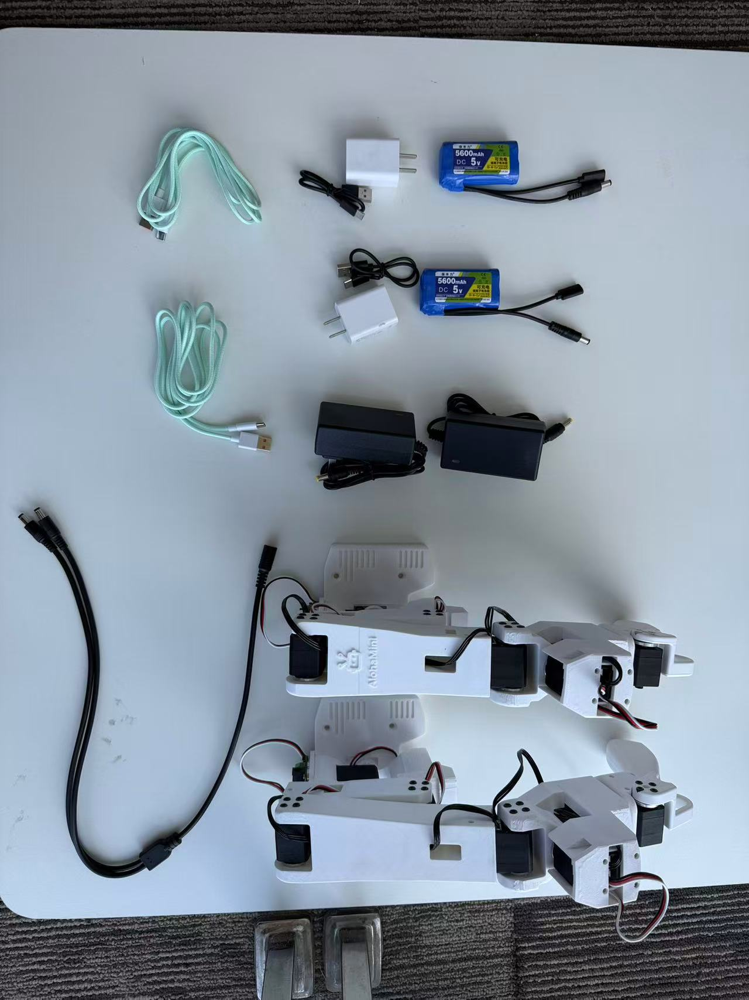
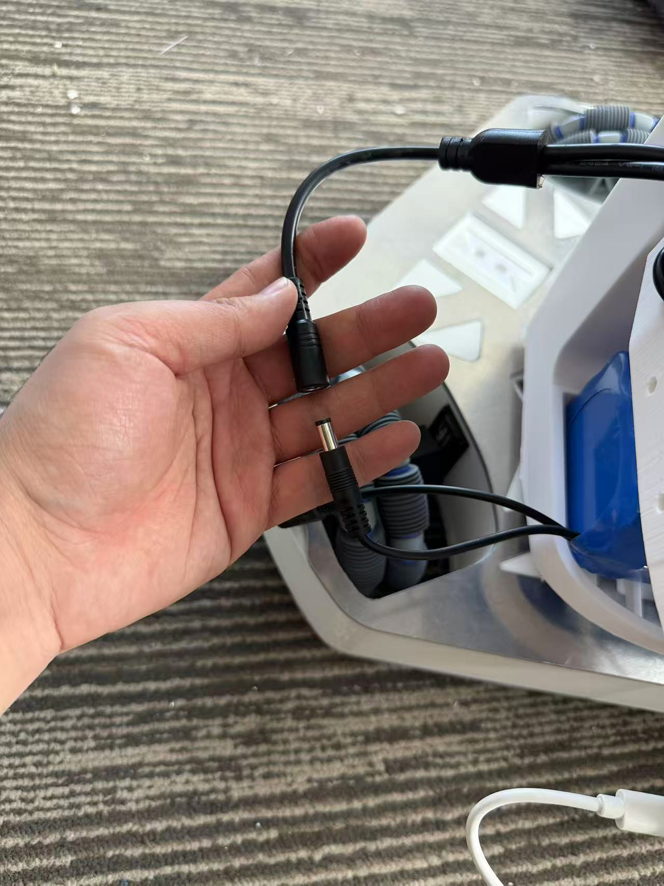
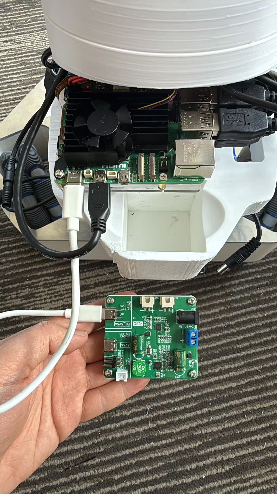
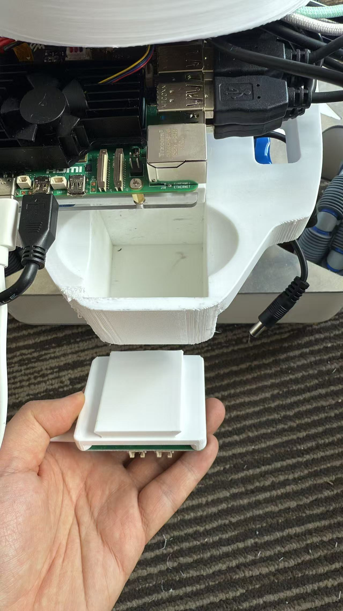
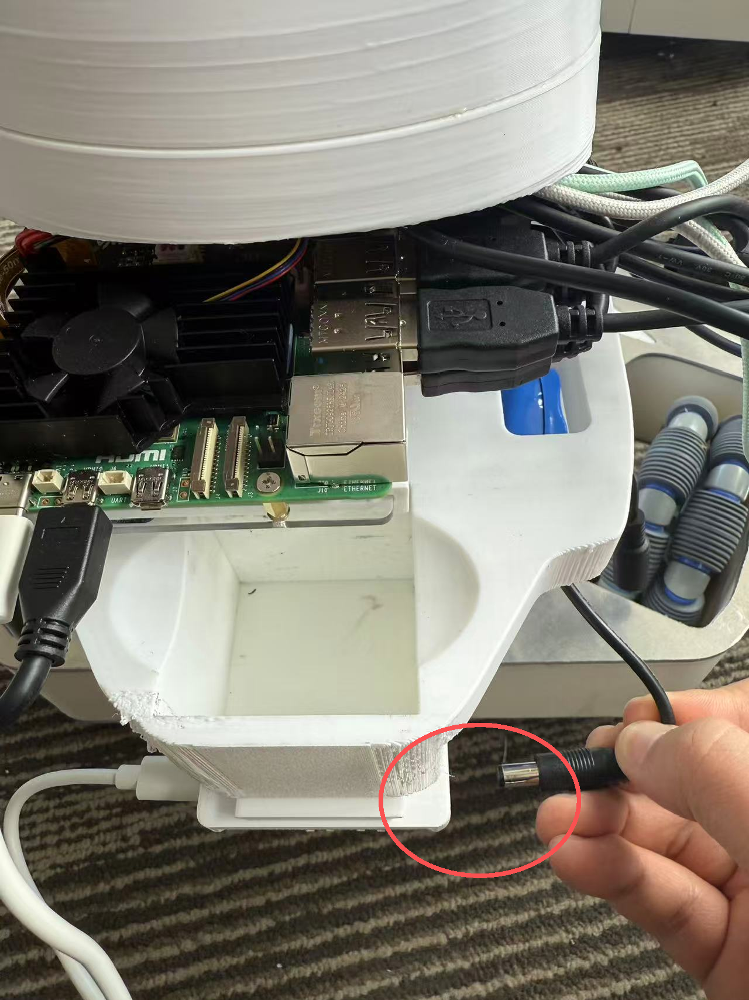
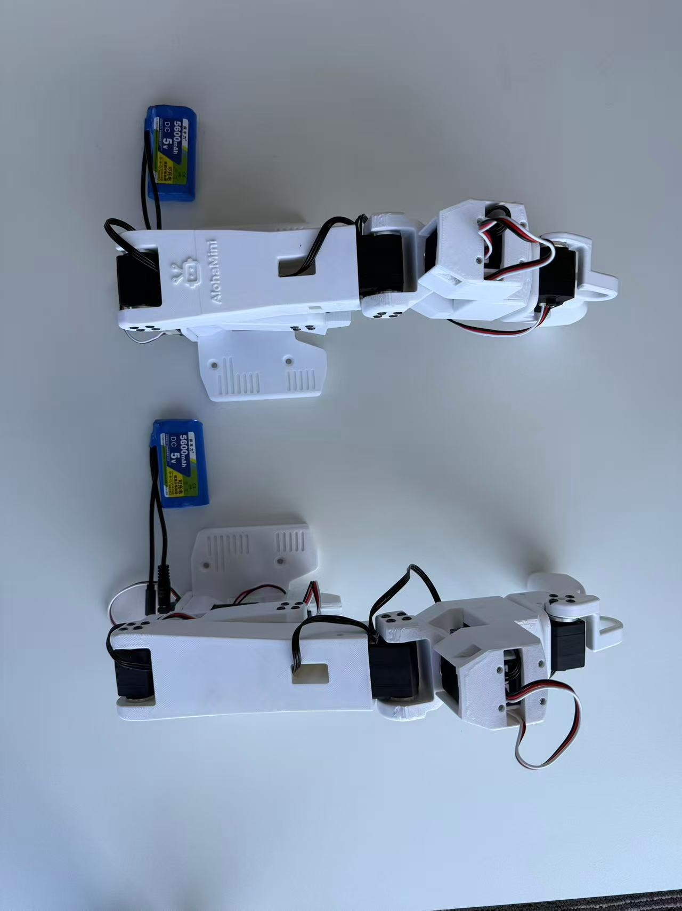
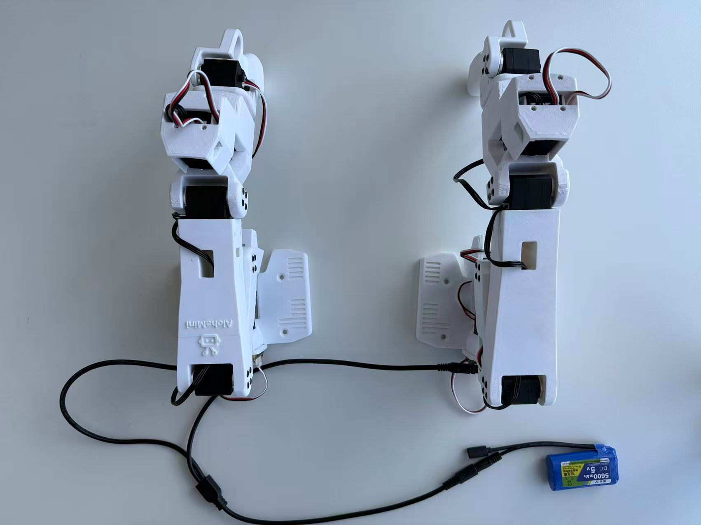

# 开箱与首次通电

适用：**已组装交付的 AlohaMini 2 / 2 Pro**。自行组装标准 2 请先完成 [硬件装配](assembly.md)。

## 开始前核对

| 设备 | 交付配置 | 检查重点 |
|---|---|---|
| 从臂、底盘和升降 | 一块 12 V 电池 | 核对 DC 接口、极性与实际套件标签 |
| 树莓派 | 另一块 12 V 电池 → 电源板 → PD 5 V / 5 A 接口 | 经电源板供电，不能将 12 V 直接接到树莓派 5 V 输入 |
| 两只遥操主臂 | 5 V 电源 | 先区分主臂与从臂，再连接对应电源 |
| PC 与树莓派 | 同一可互通的局域网 | 记录树莓派当前 IP，优先使用信号稳定的 5 GHz Wi-Fi |

照片对应特定交付批次。电池数量、线束和电源板有变化时，以随箱说明和设备标识为准。先断电核对接线，再通电检查。

感谢订购AlohaMini。

AlohaMini是一套用于算法教学与复现的双臂可升降机器人，打包发货时尽量没有拆线，硬件上只需要连好电池开机即可。

## 硬件安装

### 机器人端

1、找到箱子中的充电器和电池，2块12V锂电及充电器，2块5V锂电及充电器，12V锂电充电时充电器会红灯常亮，充满后绿灯常亮。5V充满后电池上会亮4个白灯。

```{raw} html
<div class="yq-rotated-image" style="aspect-ratio:1707/1280"></div>
```

2、将一块12V电池放入机器人底部仓位，连接好图上的DC线接口，为Follower Arms及升降底盘供电



3、将电源板插入卡槽，使用PD 5V5A插口与树莓派相连





4、将另一块 12V 电池放入底仓，为电源板供电。



5、成功后，树莓派屏幕会亮起，屏幕是触屏的，可以连接一个5 GHz 频段的wifi，记录下当前树莓派的IP地址，如：192.168.50.88

（如果不方便操作，也可以蓝牙连接键盘和鼠标。）

### 遥操端

将5V电源连接到DC线，给两个机械臂供电，下面的两种方式都行：

```{raw} html
<div class="yq-rotated-image" style="aspect-ratio:1707/1280"></div>
```



然后将2个机械臂的USB-C口连接PC电脑


## 通电后应该看到什么

- 树莓派屏幕正常亮起，能够进入桌面并连接网络。
- 记录的是机器人当前局域网地址，而非教程截图里的示例地址。
- 两个主臂的 USB-C 已连接 PC；USB 数据线与舵机电源都已接好。
- 机械臂、升降和底盘周围留出空间，线束不会卷入运动部件。

屏幕不亮或相机启动失败时，先看 [供电与设备排错](support.md)。不要用启动运动程序来判断接线是否正确。

## 接下来做什么

接线完成后，进入对应型号教程的第二步安装软件：

```{raw} html
<div class="am-resource-row"><a href="alohamini2.html#step-install">AlohaMini 2 →</a><a href="alohamini2pro.html#step-install">AlohaMini 2 Pro →</a></div>
```

后续配置、校准、遥操作和首次录制都在同一篇教程中完成。
