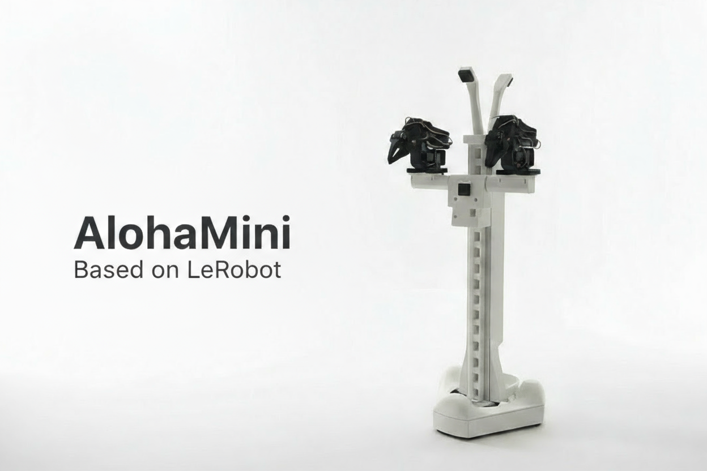

# AlohaMini

[← 教程资料库](../tutorial-library.md) · **AlohaMini 原始教程 / 原文全文**

本文是 AlohaMini 项目资料，具体代际以原文路径和硬件配置为准。

来源：[liyiteng/AlohaMini · `AlohaMini1/README.md`](https://github.com/liyiteng/AlohaMini/blob/17c6a98d79881a45ab869c1f392ed89c0723a298/AlohaMini1/README.md) · 版本 `17c6a98d` · [下载未经改写的源文档](../_static/upstream-originals/hardware/AlohaMini1/README.md.txt)

本页保留原文语言及全部段落、表格和代码；仅调整标题层级、页面组件、代码围栏格式、相对链接和媒体路径。原文中的价格、性能和运行结果属于该版本记录。

---

 

AlohaMini is a dual-arm mobile robot with a motorized vertical lift — beautifully designed, fully 3D-printable, and affordable.  

Built for embodied AI research and real-world manipulation. Assemble at home in ~60 minutes, customize every part, and train or deploy with LeRobot.

Note:
Use ROS only if you need URDF visualization, RViz inspection, or Gazebo simulation.

## Updates

- [2026-02-26] Update the fine-tuning and deployment guide for Pi 0.5 on Alohamini ('examples/pi0.5_openpi')
- [2025-12-18] URDF and simulation assets are now available for visualization and simulation (`simulation/src/Aloha/`)
- [2025-11-27] STEP (CAD) files are now available (`/hardware/mobile_base/step/`)

### What Makes It Different

- **Motorized vertical lift** — 0–60 cm travel (floor-to-table reach)
- **5-camera perception system** — top, front, back, and dual arm cameras engineered for embodied-AI reproducibility
- **Completely open-source** — hardware and software freely available
- **LeRobot-compatible** — works out of the box
- **Clean, modern design** — built for both function and aesthetics
- **Low-cost & accessible** — engineered so anyone can build a capable robot at home

## 📸 Gallery

  

## ⚙️ Bill of Materials (BOM)
### Main Components

| Component | Model / Notes | Qty | Unit Price (USD) |
|-----------|---------------|-----|------------------|
| Servo motors | Feetech STS3215 (12V bus) | 16 | $13.89 |
| Motor control boards | Waveshare Bus Servo Adapter (A) | 2 | $10.55 |
| Compute platform | Raspberry Pi 5 (4/8GB) | 1 | $80 |
| Cameras | 720p USB cameras (2 for arms, 3 for mobile base) | 5 | $20 |
| Mobility system | Omni wheels | 3 | $36.00 |
| Battery | 12V Li-ion pack | 2 | $32.99 |
| Frame | 3D-printed body (ABS / PETG / PLA) | — | ~4kg filament (self-print) |
| **Total** | — | — | **~$600 (self-print)** |

Note: 
- Printable STL files under `/hardware/`
- Compute platform can be replaced with Jetson Nano or similar SBCs if desired.
- URDF files will be released soon

## Quick Start

Start building and running AlohaMini:

1. **Hardware acquisition** — Purchase components and 3D print parts  
   See **[BOM & 3D-Print](hardware--alohamini1-docs-bom.md)**

1. **Assembly** — build the robot in ~60 minutes (SO-ARM pre-assembled)  
   See **[assembly guide](hardware--alohamini1-docs-hardware_assembly.md)**

1. **Software setup & teleoperation** — install, connect, and control the robot  
   See **[software guide](https://github.com/liyiteng/AlohaMini/tree/17c6a98d79881a45ab869c1f392ed89c0723a298/AlohaMini1/software)**

##  Product Line
| Model | Build | Rigidity | Target Users | Official Store (US) | Official Store (CN) |
|---|---|---|---|---|---|
| **AlohaMini** | Fully 3D-printed | Standard | Education, makers, research labs, home builds | - | [taobao](https://item.taobao.com/item.htm?abbucket=9&id=1015799132286) |
| **AlohaMini Pro** | Hybrid **3D-print + metal** | **~3×–5× stiffer** | Researchers needing plug-and-play, stable hardware | - | [taobao](https://item.taobao.com/item.htm?abbucket=9&id=1015799132286) |

> Same URDF & control stack across both versions — only structural materials differ.  
> Official store links are optional purchase channels for complete robots / kits.  
> AlohaMini remains open-source and can be self-built from the BOM, 3D-print files, and assembly docs.  

## Contact
Email: liyiteng+github@gmail.com  
WeChat: liyiteng  
Videos & tutorials soon on: Bilibili / YouTube / TikTok

## Team
AlohaMini is created by:  
**Li Yiteng** / **Wu Zhiyong**

##  Acknowledgements
Thanks to the open robotics community:  
**ALOHA · LeKiwi · SO-ARM100 · SO-ARM100-Track-Axis · Pi-0.5 · LeRobot · Hugging Face**

## ⭐ Support AlohaMini
If you like this project:
- ⭐ Star the repo  
- 🔔 Follow updates  
- 💬 Join the community  
