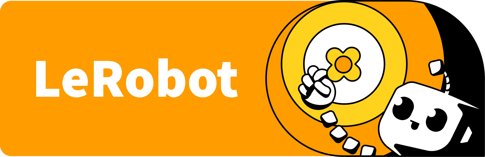

# LeRobot

[← 教程资料库](../tutorial-library.md) · **环境与训练工具 / 原文全文**

本文保留软件仓库的通用或进阶教程。示例中的机器人、数据集、路径和运行环境需按实际配置选择，不代表已经在 AlohaMini 2 / 2 Pro 上验证。

来源：[liyiteng/lerobot_alohamini · `docs/source/index.mdx`](https://github.com/liyiteng/lerobot_alohamini/blob/7843e5888366eaa553630e2f9d5539505a62dddf/docs/source/index.mdx) · 版本 `7843e588` · [下载未经改写的源文档](../_static/upstream-originals/software/docs/source/index.mdx.txt)

本页保留原文语言及全部段落、表格和代码；仅调整标题层级、页面组件、代码围栏格式、相对链接和媒体路径。原文中的价格、性能和运行结果属于该版本记录。

---

  <a target="_blank" href="https://huggingface.co/lerobot">
    </img>
  </a>

**State-of-the-art machine learning for real-world robotics**

🤗 LeRobot aims to provide models, datasets, and tools for real-world robotics in PyTorch. The goal is to lower the barrier for entry to robotics so that everyone can contribute and benefit from sharing datasets and pretrained models.

🤗 LeRobot contains state-of-the-art approaches that have been shown to transfer to the real-world with a focus on imitation learning and reinforcement learning.

🤗 LeRobot already provides a set of pretrained models, datasets with human collected demonstrations, and simulated environments so that everyone can get started.

🤗 LeRobot hosts pretrained models and datasets on the LeRobot HuggingFace page.

Join the LeRobot community on [Discord](https://discord.gg/s3KuuzsPFb)
