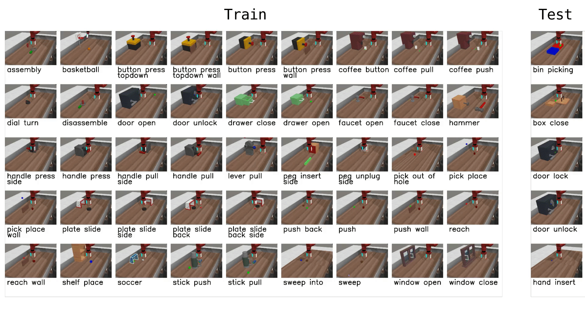

# Meta-World

[← 教程资料库](../tutorial-library.md) · **仿真与基准 / 原文全文**

本文保留软件仓库的通用或进阶教程。示例中的机器人、数据集、路径和运行环境需按实际配置选择，不代表已经在 AlohaMini 2 / 2 Pro 上验证。

来源：[liyiteng/lerobot_alohamini · `docs/source/metaworld.mdx`](https://github.com/liyiteng/lerobot_alohamini/blob/7843e5888366eaa553630e2f9d5539505a62dddf/docs/source/metaworld.mdx) · 版本 `7843e588` · [下载未经改写的源文档](../_static/upstream-originals/software/docs/source/metaworld.mdx.txt)

本页保留原文语言及全部段落、表格和代码；仅调整标题层级、页面组件、代码围栏格式、相对链接和媒体路径。原文中的价格、性能和运行结果属于该版本记录。

---


Meta-World is an open-source simulation benchmark for **multi-task and meta reinforcement learning** in continuous-control robotic manipulation. It bundles 50 diverse manipulation tasks using everyday objects and a common tabletop Sawyer arm, providing a standardized playground to test whether algorithms can learn many different tasks and generalize quickly to new ones.

- Paper: [Meta-World: A Benchmark and Evaluation for Multi-Task and Meta Reinforcement Learning paper](https://arxiv.org/abs/1910.10897)
- GitHub: [Farama-Foundation/Metaworld](https://github.com/Farama-Foundation/Metaworld)
- Project website: [metaworld.farama.org](https://metaworld.farama.org)



## Available tasks

Meta-World provides 50 tasks organized into difficulty groups. In LeRobot, you can evaluate on individual tasks, difficulty groups, or the full MT50 suite:

| Group      | CLI name             | Tasks | Description                                            |
| ---------- | -------------------- | ----- | ------------------------------------------------------ |
| Easy       | `easy`               | 28    | Tasks with simple dynamics and single-step goals       |
| Medium     | `medium`             | 11    | Tasks requiring multi-step reasoning                   |
| Hard       | `hard`               | 6     | Tasks with complex contacts and precise manipulation   |
| Very Hard  | `very_hard`          | 5     | The most challenging tasks in the suite                |
| MT50 (all) | Comma-separated list | 50    | All 50 tasks — the most challenging multi-task setting |

You can also pass individual task names directly (e.g., `assembly-v3`, `dial-turn-v3`).

We provide a LeRobot-ready dataset for Meta-World MT50 on the HF Hub: [lerobot/metaworld_mt50](https://huggingface.co/datasets/lerobot/metaworld_mt50). This dataset is formatted for the MT50 evaluation that uses all 50 tasks with fixed object/goal positions and one-hot task vectors for consistency.

## Installation

After following the LeRobot installation instructions:

```bash
pip install -e ".[metaworld]"
```


**原文提示**


If you encounter an `AssertionError: ['human', 'rgb_array', 'depth_array']` when running Meta-World environments, this is a mismatch between Meta-World and your Gymnasium version. Fix it with:

```bash
pip install "gymnasium==1.1.0"
```


## Evaluation

### Default evaluation (recommended)

Evaluate on the medium difficulty split (a good balance of coverage and compute):

```bash
lerobot-eval \
  --policy.path="your-policy-id" \
  --env.type=metaworld \
  --env.task=medium \
  --eval.batch_size=1 \
  --eval.n_episodes=10
```

### Single-task evaluation

Evaluate on a specific task:

```bash
lerobot-eval \
  --policy.path="your-policy-id" \
  --env.type=metaworld \
  --env.task=assembly-v3 \
  --eval.batch_size=1 \
  --eval.n_episodes=10
```

### Multi-task evaluation

Evaluate across multiple tasks or difficulty groups:

```bash
lerobot-eval \
  --policy.path="your-policy-id" \
  --env.type=metaworld \
  --env.task=assembly-v3,dial-turn-v3,handle-press-side-v3 \
  --eval.batch_size=1 \
  --eval.n_episodes=10
```

- `--env.task` accepts explicit task lists (comma-separated) or difficulty groups (e.g., `easy`, `medium`, `hard`, `very_hard`).
- `--eval.batch_size` controls how many environments run in parallel.
- `--eval.n_episodes` sets how many episodes to run per task.

### Policy inputs and outputs

**Observations:**

- `observation.image` — single camera view (`corner2`), 480x480 HWC uint8
- `observation.state` — 4-dim proprioceptive state (end-effector position + gripper)

**Actions:**

- Continuous control in `Box(-1, 1, shape=(4,))` — 3D end-effector delta + 1D gripper

### Recommended evaluation episodes

For reproducible benchmarking, use **10 episodes per task**. For the full MT50 suite this gives 500 total episodes. If you care about generalization, run on the full MT50 — it is intentionally challenging and reveals strengths/weaknesses better than a few narrow tasks.

## Training

### Example training command

Train a SmolVLA policy on a subset of Meta-World tasks:

```bash
lerobot-train \
  --policy.type=smolvla \
  --policy.repo_id=${HF_USER}/metaworld-test \
  --policy.load_vlm_weights=true \
  --dataset.repo_id=lerobot/metaworld_mt50 \
  --env.type=metaworld \
  --env.task=assembly-v3,dial-turn-v3,handle-press-side-v3 \
  --output_dir=./outputs/ \
  --steps=100000 \
  --batch_size=4 \
  --eval.batch_size=1 \
  --eval.n_episodes=1 \
  --env_eval_freq=1000
```

## Practical tips

- Use the one-hot task conditioning for multi-task training (MT10/MT50 conventions) so policies have explicit task context.
- Inspect the dataset task descriptions and the `info["is_success"]` keys when writing post-processing or logging so your success metrics line up with the benchmark.
- Adjust `batch_size`, `steps`, and `env_eval_freq` to match your compute budget.
