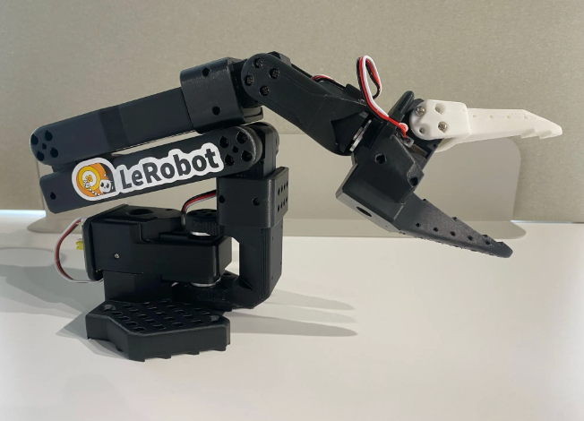
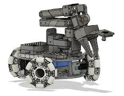
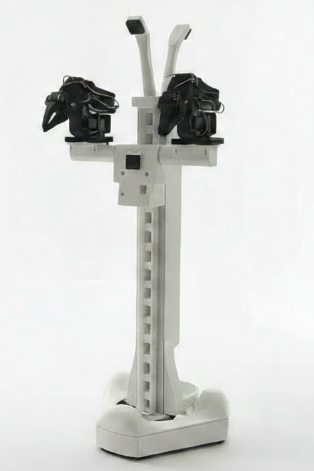
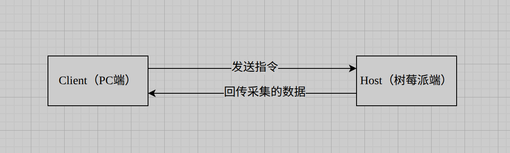
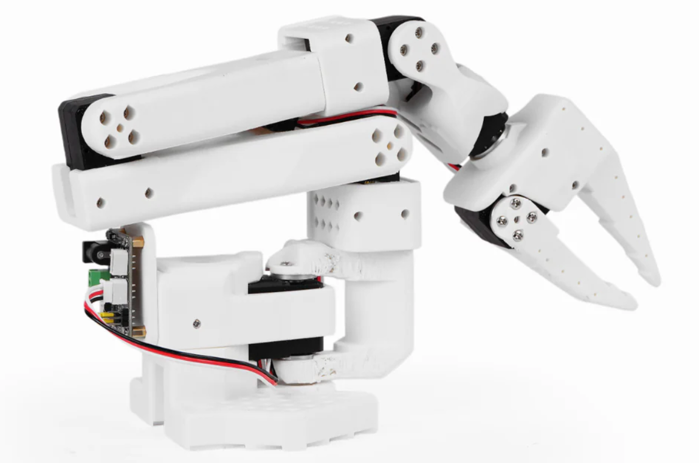
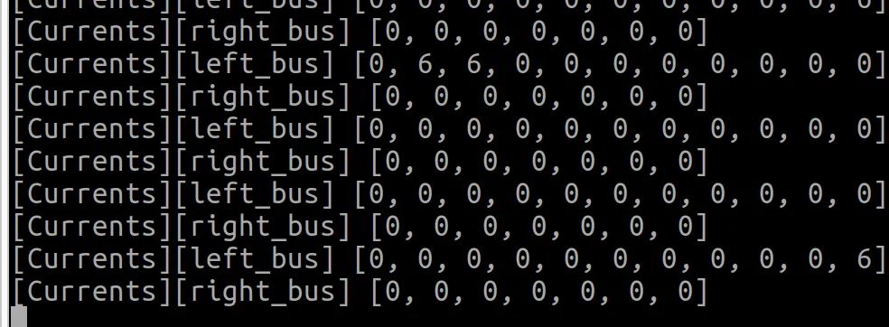

# AlohaMini 开发者手册_v1.3

[返回官方使用手册](../official-manual.md)

本手册介绍 SO-ARM 与 AM-ARM。AlohaMini 2 / 2 Pro 的机械臂舵机编号为 1–7，底盘为 8–10，升降为 11。请先确认硬件型号，再选择对应的设备配置和 [调试方法](../debug-tools.md)。

(yq-wgx9twozktvwssu3-PoM9d)=

## 发展历史

(yq-wgx9twozktvwssu3-ua526b108)=

LeRobot 是一款诞生于 2024 年初的机器人端到端训练框架，它的出现与当时 **Mobile ALOHA** 项目的走红密切相关。该项目让更多人看到了基于模仿学习（Imitation Learning）在机器人领域的巨大潜力。与此同时，传统 ROS 框架开发体验复杂、系统臃肿，难以满足快速实验与迭代的需求。

(yq-wgx9twozktvwssu3-u0878a824)=

在这样的背景下，LeRobot 应运而生。它整合了机械臂驱动、遥操作、数据采集、模型训练与推理等关键能力，大幅降低了端到端学习的门槛。

(yq-wgx9twozktvwssu3-ua8726ebe)=

然而，LeRobot 发布约半年后，能够运行相关算法的硬件成本仍然偏高——一套机械臂通常需要数万元人民币。为解决这一问题，开源社区开始探索低成本替代方案：

| 时间 | 里程碑 |
| --- | --- |
| 2024 年下半年 | **SO-ARM100** 诞生，将硬件门槛降至约 100 美元级别   |
| 2025 年上半年 | 在 SO-ARM100 基础上增加移动底盘，推出 **LeKiwi**   |
| 2025 年下半年 | **AlohaMini** 正式发布，补齐升降轴、双臂协同、多摄像头感知等关键模块，形成完整的低成本具身智能平台   |
| 2026 年上半年 | **AlohaMini2** 正式发布！相比上一代，机械臂升级至 6+1 DoF 架构，单臂负载提升至 1 kg，具备更强的操作能力和更大的工作空间。随着机械臂、升降机构和移动底盘的全面升级，AlohaMini 2 已初步具备开源家政机器人的核心能力，为具身智能研究、家庭服务场景探索以及端到端机器人学习提供了更强大的开放平台。 |

---

(yq-wgx9twozktvwssu3-cfOrp)=

## 为什么机器人长这个样子？

(yq-wgx9twozktvwssu3-u7fee7c54)=

很多人第一次看到 AlohaMini 时会有疑问：为什么机械臂不像人一样垂下来？顶部的两个"触角"摄像头是干什么的？胸口为什么还要再装一个摄像头？

(yq-wgx9twozktvwssu3-ua5913bc7)=

这些设计背后有两个明确的工程目标：**数据复用** 和 **算法适配**。

(yq-wgx9twozktvwssu3-VJuTP)=

### 1. 复用已有数据集

(yq-wgx9twozktvwssu3-uee572c29)=

当前绝大多数模仿学习数据集，都是在"桌面机械臂"场景下采集的——相机视角、操作空间、交互方式都默认机械臂固定在桌面前向工作。

(yq-wgx9twozktvwssu3-ud3f3595f)=

AlohaMini 采用类似的空间布局（机械臂前置，而非垂落式），本质上是为了最大程度兼容已有数据集，**无需从零构建新的数据体系，大幅降低训练成本**。

(yq-wgx9twozktvwssu3-RP7In)=

### 2. 适配主流算法的输入规范

(yq-wgx9twozktvwssu3-u4ea04103)=

当前主流具身智能算法的视觉输入已逐渐形成共识：**多视角 RGB 输入（全局视角 + 局部操作视角）**。

(yq-wgx9twozktvwssu3-u47e7b65c)=

以两款代表性模型为例：

| 模型 | 所需视角 |
| --- | --- |
| ACT | 前视、胸口、左腕、右腕 |
| Pi0.5 High-Level | 前视、后视、左腕、右腕 |
| Pi0.5 Low-Level | 前视、左腕、右腕 |

(yq-wgx9twozktvwssu3-ubfdd7f6b)=

因此，AlohaMini 采用了 **5 摄像头设计**：

- 前向（全局视角）

- 后向（环境补充）

- 胸口（中距离视角）

- 左腕 / 右腕（操作细节）

(yq-wgx9twozktvwssu3-u2233965a)=

各摄像头可通过软件灵活启用或关闭，以适配不同算法的输入需求。

(yq-wgx9twozktvwssu3-udf8b6b28)=

> (yq-wgx9twozktvwssu3-ub028c8af)=
> 
> 
> 
> **总结：** AlohaMini 的外形不是为了"像人"，而是为了最大化复用已有数据、对齐主流算法输入。这是一个为数据与算法优化的工程形态，不是仿生形态。

---

(yq-wgx9twozktvwssu3-q4PhA)=

## 硬件准备

(yq-wgx9twozktvwssu3-ue9fd7860)=

你可以通过以下两种方式获取 AlohaMini 硬件：

(yq-wgx9twozktvwssu3-uc86a508a)=

**方式一：自行组装**
根据 AlohaMini 仓库提供的开源 BOM（物料清单）自行采购零部件并组装。成本更低，适合有一定动手能力的开发者。

(yq-wgx9twozktvwssu3-u62c70417)=

**方式二：购买官方套件或整机**
前往官网 [www.alohamini.cn](http://www.alohamini.cn) 购买 Kits 套装或完整组装好的整机，省时省力，适合希望快速上手的用户。

---

(yq-wgx9twozktvwssu3-Q74b0)=

## 了解 AlohaMini 的舵机构成

(yq-wgx9twozktvwssu3-u609e2e85)=

在动手操作之前，先花两分钟了解机器人的内部结构，后面的调试步骤会更容易理解。

(yq-wgx9twozktvwssu3-u40a4163a)=

AlohaMini 整机由底盘、升降轴和双臂构成，各部分舵机的串联与接线方式如下：

- **底盘**：3 个舵机串联（编号 8、9、10）→ 串联到升降轴

- **升降轴**：1 个舵机（编号 11）→ 接入左臂驱动板

- **左臂**：6 个舵机串联（编号 1–6）→ 接入左臂驱动板

- **右臂**：6 个舵机串联（编号 1–6）→ 接入右臂驱动板

(yq-wgx9twozktvwssu3-u28ba366a)=

因此，左臂驱动板连接了 2 根串口线，右臂驱动板只有 1 根。

(yq-wgx9twozktvwssu3-u682fccef)=

**舵机编号总览：**

| 部位 | 舵机 ID |
| --- | --- |
| 机械臂关节（以SO-ARM为例） | 1 – 6 |
| 底盘车轮 | 8, 9, 10 |
| 升降轴 | 11 |

(yq-wgx9twozktvwssu3-ucfa1f331)=

> (yq-wgx9twozktvwssu3-u2fafc3ea)=
> 
> 
> 
> 了解这张表后，若需要精准控制某个关节，只需确认它属于哪个臂、编号是多少即可。
> 
> 
> 
> (yq-wgx9twozktvwssu3-uadefe8be)=
> 
> 
> 
> SO-ARM机械臂的关节是1-6
> 
> 
> 
> (yq-wgx9twozktvwssu3-ua8c019ed)=
> 
> 
> 
> AM-ARM机械臂的关节是1-7

---

(yq-wgx9twozktvwssu3-qhd1v)=

## AlohaMini 整机组件总览

(yq-wgx9twozktvwssu3-z0ITa)=

### 机械结构

- 双臂（SO-ARM / AM-ARM）

- 升降轴（Lift）

- 移动底盘（全向轮）

(yq-wgx9twozktvwssu3-UIxX8)=

### 传感器系统

| 摄像头 | 位置 |
| --- | --- |
| `forward` | 前视 |
| `backward` | 后视 |
| `chest` | 胸口 |
| `wrist_left` | 左腕 |
| `wrist_right` | 右腕 |

(yq-wgx9twozktvwssu3-jVGdA)=

### 控制系统

- **下位机：** 树莓派（随机器人运行）

- **上位机：** 你的电脑（负责训练与推理）

(yq-wgx9twozktvwssu3-Kpka7)=

### 通信架构

(yq-wgx9twozktvwssu3-uae0ddf1d)=

(yq-wgx9twozktvwssu3-u1e55c389)=



(yq-wgx9twozktvwssu3-udad6bbe0)=

(yq-wgx9twozktvwssu3-Ao9vB)=

### 供电系统

| 电源 | 用途 |
| --- | --- |
| 5V 锂电池 | Leader Arms 供电 |
| 12V 锂电池（×1） | Follower Arms 供电 |
| 12V 锂电池（×1）+ 降压板 | 树莓派供电（12V 转 5V） |

---

(yq-wgx9twozktvwssu3-ON5x3)=

## 代码结构说明

(yq-wgx9twozktvwssu3-ua000ccd1)=

仓仓库中与 AlohaMini 直接相关的代码集中在两个目录，遇到问题需要改代码时，先确认改的是哪一端：

| 目录 | 运行在 | 职责 |
| --- | --- | --- |
| `src/lerobot/robots/alohamini/` | 树莓派（下位机） | 机器人本体驱动、摄像头采集、舵机控制 |
| `examples/alohamini/` | PC（上位机） | 遥操作、数据采集、模型推理 |
| `examples/debug/` | 所有平台 |   [Debug函数列表](https://github.com/liyiteng/lerobot_alohamini/blob/main/examples/debug/README.md) |

(yq-wgx9twozktvwssu3-u249c203c)=

> (yq-wgx9twozktvwssu3-u071b849f)=
> 
> 
> 
> **两个仓库都需要在各自的机器上 clone 并安装环境。改树莓派端的文件要 SSH 登录后操作，改 PC 端的文件直接在本地操作。**

(yq-wgx9twozktvwssu3-uaab9d8e0)=

(yq-wgx9twozktvwssu3-ubaba6845)=

**机器人本体** `src/lerobot/robots/alohamini/`

| 文件 | 作用 |
| --- | --- |
| `config_alohamini.py` | 摄像头、端口、参数配置 |
| `alohamini.py` | 机器人底层驱动逻辑 |
| `alohamini_host.py` | 树莓派上运行的服务端入口 |

(yq-wgx9twozktvwssu3-u15640cb2)=

**遥操端** `examples/alohamini/`

| 文件 | 作用 |
| --- | --- |
| `teleoperate_bi.py` | 双臂无线遥操作 |
| `record_bi.py` | 采集演示数据集 |
| `replay_bi.py` | 重放数据集验证 |
| `evaluate_bi.py` | 评估数据集 |

(yq-wgx9twozktvwssu3-u191b601b)=

> (yq-wgx9twozktvwssu3-ua125c780)=
> 
> 
> 
> 两个目录的修改相互独立——改摄像头配置在本体目录，改遥操逻辑在 examples 目录。唯一例外是 `config_alohamini.py`，本体和 PC 端各有一份，修改后需要两边同步（详见「启用或关闭摄像头」章节）。

(yq-wgx9twozktvwssu3-u91008a70)=

(yq-wgx9twozktvwssu3-ofKtW)=

### 关键入口指令

(yq-wgx9twozktvwssu3-u9da35c07)=

每次使用机器人，基本都是固定的两步：先在树莓派启动 Host，再在 PC 端启动遥操。

(yq-wgx9twozktvwssu3-ude232572)=

> (yq-wgx9twozktvwssu3-u0b714b57)=
> 
> 
> 
> 这里仅作概览介绍，让你对整体流程有个印象。如果你是第一次上手，请继续按照后续章节一步步操作，完成环境配置和校准后再回来运行这两条指令。

(yq-wgx9twozktvwssu3-u2d0831b1)=

**第一步：树莓派端——启动机器人服务**（SSH 登录后执行）

```bash
conda activate lerobot_alohamini
cd lerobot_alohamini
python -m lerobot.robots.alohamini.alohamini_host \
  --robot_model alohamini2pro        # 根据实际机器人型号填写
```

(yq-wgx9twozktvwssu3-u08fcd600)=

`--robot_model` 可选值说明：

| **值** | **对应机械臂类型** |
| --- | --- |
| `alohamini1` | SO-ARM 5DoF，全 sts3215 舵机 |
| `alohamini2` | AM-ARM 6DoF，sts3215/sts3095 舵机 |
| `alohamini2pro` | AM-ARM 6DoF，sts3250/sts3095 舵机（升级版） |

(yq-wgx9twozktvwssu3-u750e262f)=

(yq-wgx9twozktvwssu3-u9ac488e5)=

**第二步：PC 端——启动遥操作**

```bash
conda activate lerobot_alohamini
cd lerobot_alohamini
# 将 IP 替换为本机地址；本段示例适用于 2 Pro
python examples/alohamini/teleoperate_bi.py \
  --robot.remote_ip 192.168.50.88 \
  --robot.robot_model alohamini2pro \
  --teleop.id am_leader_bi \
  --teleop.arm_profile am-leader-6dof
```

(yq-wgx9twozktvwssu3-ufc6e53b5)=

> (yq-wgx9twozktvwssu3-u80613070)=
> 
> 
> 
> 两条命令需要在**两个独立的终端窗口**中分别执行，树莓派端启动成功后再运行 PC 端。

(yq-wgx9twozktvwssu3-r6ItV)=

## 算力与系统环境

(yq-wgx9twozktvwssu3-h5Ckw)=

### 推荐硬件配置

| 项目 | 要求 |
| --- | --- |
| 操作系统 | Ubuntu 22.04 |
| 显卡 | NVIDIA RTX 4070 及以上 |

(yq-wgx9twozktvwssu3-UqWl9)=

### 为什么用 Ubuntu，不用 Windows？

(yq-wgx9twozktvwssu3-u99b27f39)=

AlohaMini 所依赖的机器人软件生态（包括 LeRobot、串口通信、CUDA 驱动等）在 Linux 下支持最完善，Windows 下会遇到大量兼容性问题。Ubuntu 22.04 是目前社区最主流的选择，遇到问题也最容易找到解答。

(yq-wgx9twozktvwssu3-ude860fe6)=

如果你的电脑目前是 Windows，可以选择双系统安装 Ubuntu，或使用专门的 Ubuntu 机器来跑训练和推理。

(yq-wgx9twozktvwssu3-ayZoo)=

### 什么是 Conda？为什么需要它？

(yq-wgx9twozktvwssu3-u2d493eda)=

Conda 是一个 Python 环境管理工具。不同的项目可能依赖不同版本的 Python 库，如果都装在同一个系统环境里，很容易互相冲突。Conda 可以为每个项目创建一个独立的"隔离环境"，互不干扰。

(yq-wgx9twozktvwssu3-u9dda4b2c)=

AlohaMini 使用的环境名为 `lerobot_alohamini`，后续所有命令都需要在这个环境激活后才能运行。

(yq-wgx9twozktvwssu3-lxDEm)=

### 软件源注意事项

(yq-wgx9twozktvwssu3-ua5016aa0)=

> (yq-wgx9twozktvwssu3-u63e0c925)=
> 
> 
> 
> ⚠️ 请保持 Ubuntu **默认软件源**，**不要切换为国内镜像源**（如清华源、中科大源等），否则可能导致部分依赖版本不匹配，引发难以排查的错误。

(yq-wgx9twozktvwssu3-z7lY5)=

### 安装步骤

(yq-wgx9twozktvwssu3-u85695ccd)=

**第一步：安装 Miniconda**

(yq-wgx9twozktvwssu3-u9cc4a7ca)=

前往 [https://docs.conda.io/en/latest/miniconda.html](https://docs.conda.io/en/latest/miniconda.html) 下载 Linux 版安装包，然后在终端执行：

```bash
bash Miniconda3-latest-Linux-x86_64.sh
```

(yq-wgx9twozktvwssu3-ud2bce429)=

按提示一路回车确认，安装完成后重新打开终端，输入 `conda --version`，能看到版本号说明安装成功。

(yq-wgx9twozktvwssu3-uc4076164)=

**第二步：克隆仓库并完成环境配置**

(yq-wgx9twozktvwssu3-u0ff2a47d)=

参考官方文档完成步骤 1–4：
👉 [https://github.com/liyiteng/lerobot_alohamini](https://github.com/liyiteng/lerobot_alohamini)

(yq-wgx9twozktvwssu3-u2423702d)=

核心流程如下：

```bash
# 克隆仓库
git clone https://github.com/liyiteng/lerobot_alohamini.git
cd lerobot_alohamini

# 创建并激活 Conda 环境
conda create -n lerobot_alohamini python=3.12
conda activate lerobot_alohamini

# 安装依赖
pip install -e ".[all]"
pip install pyzmq feetech-servo-sdk
conda install -y ffmpeg=7.1.1 -c conda-forge
```

(yq-wgx9twozktvwssu3-u6411e089)=

> (yq-wgx9twozktvwssu3-u47670485)=
> 
> 
> 
> 安装过程可能需要 10–20 分钟，期间会下载大量依赖包，请保持网络连接。

(yq-wgx9twozktvwssu3-u0824b6b1)=

**第三步：验证安装**

```bash
conda activate lerobot_alohamini
python -c "import lerobot; print('安装成功')"
```

(yq-wgx9twozktvwssu3-u34b959db)=

输出"安装成功"即可进行下一步。

(yq-wgx9twozktvwssu3-lEEqY)=

### 关于终端的基本操作

(yq-wgx9twozktvwssu3-u8b450af1)=

后续所有操作都在**终端（Terminal）**中完成。Ubuntu 打开终端的方式：按 `Ctrl + Alt + T`，或在应用列表中搜索"Terminal"。

(yq-wgx9twozktvwssu3-u5b53cecf)=

**几个必须知道的基本命令：**

| 命令 | 作用 | 示例 |
| --- | --- | --- |
| `cd 目录名` | 进入某个目录 | `cd lerobot_alohamini` |
| `ls` | 查看当前目录下的文件 | `ls` |
| `pwd` | 查看当前所在目录的完整路径 | `pwd` |
| `conda activate 环境名` | 激活 Conda 环境 | `conda activate lerobot_alohamini` |

(yq-wgx9twozktvwssu3-ubd788b94)=

> (yq-wgx9twozktvwssu3-ub8499519)=
> 
> 
> 
> ⚠️ **重要：** 后续所有 `python` 命令，都需要先 `cd` 进入仓库根目录（即 `lerobot_alohamini/`），并确保 Conda 环境已激活（终端提示符前会显示 `(lerobot_alohamini)`），再执行。

---

(yq-wgx9twozktvwssu3-zowtr)=

## 让机械臂第一次动起来

(yq-wgx9twozktvwssu3-cKrpy)=

### 第一步：准备单臂

(yq-wgx9twozktvwssu3-u8f3c283b)=

准备一个独立的机械臂。若机械臂已安装在机器人上，可直接通电并通过 Type-C 连接至 PC 使用，或用 M3 六角螺丝刀将其从 T 型支架上取下通电使用（建议取右臂）。

(yq-wgx9twozktvwssu3-BaJfo)=

### 第二步：确认端口为空

(yq-wgx9twozktvwssu3-uf31e2c83)=

打开终端，先进入仓库目录并激活环境：

```bash
cd lerobot_alohamini
conda activate lerobot_alohamini
```

(yq-wgx9twozktvwssu3-u12a59a1f)=

然后输入：

```bash
ls /dev/ttyACM*
```

(yq-wgx9twozktvwssu3-uc06d22f2)=

此时应提示"找不到任何端口"。若有端口占用，请拔掉对应设备后重试。

(yq-wgx9twozktvwssu3-fhWNY)=

### 第三步：连接机械臂

- 舵机驱动板上的黑色 DC 接口：接入 **12V 锂电**

- Type-C 接口：连接至 **PC**

(yq-wgx9twozktvwssu3-eMwkD)=

### 第四步：确认端口识别

(yq-wgx9twozktvwssu3-u9ff1d148)=

再次输入：

```bash
ls /dev/ttyACM*
```

(yq-wgx9twozktvwssu3-ufd30657a)=

此时应显示一个端口，例如 `/dev/ttyACM0`。

(yq-wgx9twozktvwssu3-eSvsH)=

### 第五步：读取舵机状态

(yq-wgx9twozktvwssu3-ub69b9f14)=

进入 Conda 环境并执行调试命令：

```bash
conda activate lerobot_alohamini
python examples/debug/motors.py get_motors_states \
  --port /dev/ttyACM0
```

(yq-wgx9twozktvwssu3-u4e8f76bc)=

你将看到所有舵机的实时状态。移动各关节时，`POS` 数值会随之变化——这是舵机磁编码器在工作，实时读取当前位置。

(yq-wgx9twozktvwssu3-u7f82493f)=

> (yq-wgx9twozktvwssu3-u4485087d)=
> 
> 
> 
> **POS 取值范围：** 0–4095，最小旋转精度为 360 ÷ 4096 ≈ **0.088°**

(yq-wgx9twozktvwssu3-V85Ec)=

### 第六步：控制单个舵机旋转

(yq-wgx9twozktvwssu3-u5f40ff97)=

将机械臂摆到"休息位"，记录 1 号舵机的 POS 值（假设为 `2039`）。

(yq-wgx9twozktvwssu3-u756c8c48)=

> (yq-wgx9twozktvwssu3-uf9f06c65)=
> 
> 
> 
> **什么是休息位？** 休息位是机械臂的标准初始姿态，此时各关节自然伸展、不受力、不碰触任何物体。具体形态可参考下方图片。
> 
> 
> 
> (yq-wgx9twozktvwssu3-u262e3f1a)=
> 
> 
> 
> (yq-wgx9twozktvwssu3-u4d887922)=
> 
> 
> 
> 

(yq-wgx9twozktvwssu3-uadcee2fa)=

**微小旋转（+1，约 0.088°）：**

```bash
python examples/debug/motors.py move_motor_to_position \
  --id 1 \
  --position 2040 \
  --port /dev/ttyACM0
```

(yq-wgx9twozktvwssu3-ud692d9ae)=

**较大旋转（+500，约 44°）：**

```bash
python examples/debug/motors.py move_motor_to_position \
  --id 1 \
  --position 2540 \
  --port /dev/ttyACM0
```

(yq-wgx9twozktvwssu3-u752555c5)=

> (yq-wgx9twozktvwssu3-u2c30ff0b)=
> 
> 
> 
> ⚠️ **安全提醒：** 操作时确保舵机旋转路径不被阻挡。一旦发生堵转，电流会在数秒内飙升并烧毁舵机。发现异常请**立即拔除电源**。

(yq-wgx9twozktvwssu3-uf434e707)=

(yq-wgx9twozktvwssu3-udda135ae)=

更多的Debug函数，可以参考文档：

(yq-wgx9twozktvwssu3-ud2d1201a)=


[Debug函数列表](https://github.com/liyiteng/lerobot_alohamini/blob/main/examples/debug/README.md)

(yq-wgx9twozktvwssu3-u2b857ef4)=

(yq-wgx9twozktvwssu3-mPBeW)=

## 第一次校准与遥操作

(yq-wgx9twozktvwssu3-QYYF2)=

### 概念说明

(yq-wgx9twozktvwssu3-ueb040b94)=

机械臂分为两种类型：

- **Leader Arm（主臂）：** 由人手动操控

- **Follower Arm（从臂）：** 实时接收并复现主臂的关节角度

(yq-wgx9twozktvwssu3-uf69bc8e2)=

通过遥操作，可以收集演示数据集，进而训练机器人。

(yq-wgx9twozktvwssu3-ycUWV)=

### 为什么需要校准？

(yq-wgx9twozktvwssu3-u88117229)=

两个机械臂在出厂或首次安装后，各关节的 POS 初始值是随机的。例如，A 臂在休息位时 1 号舵机 POS 为 2000，B 臂可能是 3000。若不校准直接遥操作，主臂的 POS 会直接传给从臂，导致从臂突然大幅旋转。

(yq-wgx9twozktvwssu3-u9df39fad)=

**解决方案：** 对两个机械臂分别进行一次校准，建立统一的零点参考。

(yq-wgx9twozktvwssu3-ZvZ0T)=

### 校准流程

(yq-wgx9twozktvwssu3-ua4a2fd6c)=

**第一步：断开所有 USB 设备，确认端口为空**

```bash
ls /dev/ttyACM*
```

(yq-wgx9twozktvwssu3-u78f14dcf)=

**第二步：校准 Leader Arm**

(yq-wgx9twozktvwssu3-u3ccf7cae)=

用 5V 锂电为 Leader Arm 供电，Type-C 连接至 PC，确认端口为 `/dev/ttyACM0`，然后执行：

```bash
lerobot-calibrate \
  --teleop.type=so101_leader \
  --teleop.port=/dev/ttyACM0 \
  --teleop.id=leader_arm_0218 \
  --teleop.arm_profile=am-leader-6dof
```

(yq-wgx9twozktvwssu3-u9edfbdfa)=

> (yq-wgx9twozktvwssu3-u624d5e03)=
> 
> 
> 
> `--teleop.id`**是什么？** 这是你给这个机械臂起的自定义名字，用于保存和识别校准数据。名字可以随意填写（如 `my_leader_arm`），但一旦确定，后续遥操作和数据采集命令中需要保持一致，否则会找不到对应的校准文件。

(yq-wgx9twozktvwssu3-ud2afc6a6)=

> (yq-wgx9twozktvwssu3-u8044480a)=
> 
> 
> 
> `arm_profile` 请根据机械臂类型选择：
> 
> 
> - SO-ARM 系列 → `so-arm-5dof`
> 
> - AM-ARM200 / AM-ARM200 Pro 系列 → `am-leader-6dof`
> 
> 
> (yq-wgx9twozktvwssu3-ue63044a0)=
> 
> 
> 
> 完整映射表参见：
> [https://github.com/liyiteng/lerobot_alohamini/blob/main/docs/alohamini/profiles.md](https://github.com/liyiteng/lerobot_alohamini/blob/main/docs/alohamini/profiles.md)

(yq-wgx9twozktvwssu3-u7e1a889b)=

(yq-wgx9twozktvwssu3-u957ea71c)=

校准流程可参考视频：[https://b23.tv/Dd1xFYz](https://b23.tv/Dd1xFYz)

(yq-wgx9twozktvwssu3-u77c58b1f)=

**1. 设置中位（Middle Point）**

(yq-wgx9twozktvwssu3-u6d895e04)=

校准的第一步是将机械臂各关节调至中间位置，此时程序会强制将所有舵机的编码器值（POS）写入为 2048。

(yq-wgx9twozktvwssu3-u7244d159)=

这样做的原因：舵机磁编码器的量程为 0–4096，中位对应 2048，意味着向左或向右各旋转 90° 后，POS 分别落在 1000 和 3000 附近，两侧均有充足裕量。若不强制写入 2048，中位可能是任意值（如 3500），向右转 90° 后 POS 将达到 4500，超出编码器范围，导致异常。

(yq-wgx9twozktvwssu3-u1e88fc15)=

**2. 旋转至最小值和最大值**

(yq-wgx9twozktvwssu3-uf7af3629)=

依次将各关节转至行程两端，记录 min 和 max。**左右旋转幅度必须对称**——例如向左转 90° 后，也需向右转 90°。若两侧幅度不一致，机械臂在运行时会出现姿态偏斜。

(yq-wgx9twozktvwssu3-uc2bc6ff5)=

**3. 验证校准结果**

(yq-wgx9twozktvwssu3-uc0848d2c)=

校准完成后，程序自动记录各关节的 min/max 值。预期范围如下：

| 关节 | min | max |
| --- | --- | --- |
| 夹爪 | ~2000 | ~3000 |
| 其余关节 | ~1000 | ~3000 |

(yq-wgx9twozktvwssu3-u534dc174)=

若实际值偏差较大（如 1500–3500），说明校准过程存在问题，需重新执行。

(yq-wgx9twozktvwssu3-u64165ba6)=

(yq-wgx9twozktvwssu3-u974b6e61)=

**第三步：校准 Follower Arm**

(yq-wgx9twozktvwssu3-ud77fbc09)=

保留 Leader Arm 的连接，再用 12V 锂电为 Follower Arm 供电，Type-C 连接至 PC，确认端口为 `/dev/ttyACM1`，然后执行：

```bash
lerobot-calibrate \
  --robot.type=so101_follower \
  --robot.port=/dev/ttyACM1 \
  --robot.id=follower_arm_0218 \
  --robot.arm_profile=am-follower-6dof-hd
```

(yq-wgx9twozktvwssu3-u497f67c4)=

> (yq-wgx9twozktvwssu3-u5186bc77)=
> 
> 
> 
> `--robot.id` 同理，是从臂的自定义名字，同样需要在后续命令中保持一致。
> 
> 
> 
> (yq-wgx9twozktvwssu3-u21280a53)=
> 
> 
> 
> `arm_profile` 请根据机械臂类型选择：
> 
> 
> - SO-ARM 系列 → `so-arm-5dof`
> 
> - AM-ARM200 系列 →`am-follower-6dof`
> 
> - AM-ARM200-Pro 系列 →`am-follower-6dof-hd`
> 完整映射表参见：
> [https://github.com/liyiteng/lerobot_alohamini/blob/main/docs/alohamini/profiles.md](https://github.com/liyiteng/lerobot_alohamini/blob/main/docs/alohamini/profiles.md)

(yq-wgx9twozktvwssu3-u6dc92ce4)=

**第四步：启动遥操作**

```bash
lerobot-teleoperate \
  --teleop.type=so101_leader \
  --teleop.port=/dev/ttyACM0 \
  --teleop.id=leader_arm_0218 \
  --teleop.arm_profile=am-leader-6dof \
  --robot.type=so101_follower \
  --robot.port=/dev/ttyACM1 \
  --robot.id=follower_arm_0218 \
  --robot.arm_profile=am-follower-6dof-hd
```

(yq-wgx9twozktvwssu3-u293fda84)=

此时，Leader Arm 的动作会实时镜像到 Follower Arm。

(yq-wgx9twozktvwssu3-u79e40e6e)=

> (yq-wgx9twozktvwssu3-ud376954b)=

---

(yq-wgx9twozktvwssu3-WXINw)=

## 底盘与升降调试

(yq-wgx9twozktvwssu3-AkBb7)=

### 接线说明

(yq-wgx9twozktvwssu3-ud7c1b78c)=

仔细观察机器人左右机械臂的舵机驱动板，你会发现：

- **左臂驱动板**：连接了 **2 根**串口线（一根接机械臂，一根接升降轴）

- **右臂驱动板**：只连接了 **1 根**串口线（仅接机械臂）

(yq-wgx9twozktvwssu3-OTZIk)=

### 底盘调试

(yq-wgx9twozktvwssu3-u26252326)=

用 12V 电源为左臂供电，Type-C 连接 PC，确认端口后，**先读取所有电机状态**，验证底盘和升降轴的舵机是否正常识别：

```bash
conda activate lerobot_alohamini
python examples/debug/motors.py get_motors_states \
  --port /dev/ttyACM0
```

(yq-wgx9twozktvwssu3-ufbb5551f)=

输出中应能看到编号 8、9、10（底盘车轮）和 11（升降轴）的舵机状态。手动拨动对应关节时，`POS` 数值会随之变化。

(yq-wgx9twozktvwssu3-ua452daf1)=

> (yq-wgx9twozktvwssu3-ua5e9f40e)=
> 
> 
> 
> ⚠️ 如果某个编号缺失，说明该舵机未被识别，请检查对应的串口线是否插紧、舵机是否正常供电，排查后再继续。

(yq-wgx9twozktvwssu3-uedb3445a)=

确认舵机全部在线后，执行底盘控制程序：

```bash
python examples/debug/wheels.py \
   --port /dev/ttyACM0
```

(yq-wgx9twozktvwssu3-u180dd89d)=

键盘控制说明：

| 按键 | 功能 |
| --- | --- |
| `W` / `S` | 前进 / 后退 |
| `A` / `D` | 左转 / 右转 |
| `Z` / `X` | 左平移 / 右平移 |

(yq-wgx9twozktvwssu3-lVBiD)=

### 升降调试

```bash
python examples/debug/axis.py \
   --port /dev/ttyACM0
```

(yq-wgx9twozktvwssu3-zAXgp)=

### 键盘控制说明：

| 按键 | 功能 |
| --- | --- |
| `U` / `J` | 上升 / 下降 |

(yq-wgx9twozktvwssu3-MBHZB)=

### 常见问题：按键无响应

(yq-wgx9twozktvwssu3-u593458e3)=

请检查 Ubuntu 当前使用的显示协议：

- 若为 **Wayland** → 切换为 **X11（Xorg）**，重新运行程序即可恢复正常

---

(yq-wgx9twozktvwssu3-bbOaQ)=

## 第一次启动AlohaMini整机

(yq-wgx9twozktvwssu3-ue24cce9e)=

将左右臂安装到升降轴上，接通电源，将树莓派连上 WiFi，记录 IP 地址（例如 `192.168.8.3`）。

(yq-wgx9twozktvwssu3-u22b4d486)=

> (yq-wgx9twozktvwssu3-u75512156)=
> 
> 
> 
> **如何查看树莓派的 IP 地址？** 可以登录路由器后台（通常是浏览器打开 `192.168.1.1` 或 `192.168.8.1`），在已连接设备列表中找到树莓派对应的 IP；或者在树莓派上接一个临时显示器，在终端输入 `ip addr` 查看。

(yq-wgx9twozktvwssu3-F6rC5)=

### 什么是 SSH？

(yq-wgx9twozktvwssu3-u6ce07a30)=

SSH 是一种远程登录工具，可以让你在自己的电脑上操控另一台机器（这里是树莓派），就像在那台机器上直接打字一样。AlohaMini 的机器人服务运行在树莓派上，需要通过 SSH 进入树莓派来启动它。

(yq-wgx9twozktvwssu3-uf788a8e3)=

Ubuntu 和 macOS 自带 SSH，直接在终端使用即可。Windows 用户可以使用系统自带的 PowerShell，或安装 [MobaXterm](https://mobaxterm.mobatek.net/)。

(yq-wgx9twozktvwssu3-uaea3f5f2)=

**SSH 远程登录树莓派：**

```bash
# 格式：ssh 用户名@IP地址
ssh pi5@192.168.8.3
```

(yq-wgx9twozktvwssu3-u5b2269c9)=

第一次连接会询问是否信任该主机，输入 `yes` 回车即可。登录成功后，终端提示符会变为树莓派上的用户名，后续命令都在树莓派上执行。

(yq-wgx9twozktvwssu3-u75467b56)=

登录后，安装 Conda 环境及 `lerobot_alohamini` 仓库（参考官方文档），然后激活环境并启动机器人服务：

```bash
python -m lerobot.robots.alohamini.alohamini_host --robot_model alohamini2pro
```

(yq-wgx9twozktvwssu3-u8b6ae78f)=

**若是第一次运行**，程序会提示按 `C` 键进行机械臂校准，流程与前面单臂校准相同，区别是需要**连续校准左右两臂**。

(yq-wgx9twozktvwssu3-u0364c438)=

校准完成后，屏幕上会开始持续输出各关节的电流值

(yq-wgx9twozktvwssu3-gCeqM)=



表示机器人已成功启动。

(yq-wgx9twozktvwssu3-u3914d146)=

> (yq-wgx9twozktvwssu3-u4cd60618)=
> 
> 
> 
> **校准成功后，通常无需重复校准。**以后每次启动程序时，直接按 **Enter** 键即可加载已保存的校准数据。
> 如需重新校准，请再次运行本程序，并在提示时按 **C** 键进入校准流程。

---

(yq-wgx9twozktvwssu3-FNZ5l)=

## 第一次无线遥操作双臂

(yq-wgx9twozktvwssu3-ua079febb)=

在 **PC 端**激活 Conda 环境，配置好 `teleoperate_bi.py` 中的端口号，然后执行：

```bash
python examples/alohamini/teleoperate_bi.py \
  --robot.remote_ip 192.168.8.3 \
  --robot.robot_model alohamini2pro \
  --teleop.id am_leader_bi \
  --teleop.arm_profile am-leader-6dof
```

(yq-wgx9twozktvwssu3-u8da43436)=

> (yq-wgx9twozktvwssu3-u7990a1b9)=
> 
> 
> 
> `arm_profile` 请根据机械臂类型选择：
> 
> 
> - SO-ARM 系列 → `so-arm-5dof`
> 
> - AM-ARM200 / 200 Pro 系列 →`am-leader-6dof`
> 完整映射表参见：
> [https://github.com/liyiteng/lerobot_alohamini/blob/main/docs/alohamini/profiles.md](https://github.com/liyiteng/lerobot_alohamini/blob/main/docs/alohamini/profiles.md)

(yq-wgx9twozktvwssu3-ucc83229e)=

程序会提示进行 Leader Arms 校准，校准完成后即进入遥操作模式——双臂的动作将实时同步到机器人上。

(yq-wgx9twozktvwssu3-u99c13df7)=

---

(yq-wgx9twozktvwssu3-qr7Ur)=

## 启用或关闭摄像头

(yq-wgx9twozktvwssu3-uec7ce973)=

AlohaMini 配备了 5 个摄像头，但并非所有算法都需要全部启用。你可以通过修改配置文件，按需启用或关闭对应的摄像头，从而减少不必要的带宽占用和推理开销。

(yq-wgx9twozktvwssu3-WPDJl)=

### 配置文件位置

(yq-wgx9twozktvwssu3-u5bd71554)=

这个配置文件同时存在于**两端**，路径相同：

```text
src/lerobot/robots/alohamini/config_alohamini.py
```

| 所在机器 | 作用 |
| --- | --- |
| 树莓派（下位机） | 控制实际摄像头的采集 |
| PC（上位机） | 控制客户端订阅哪些摄像头数据 |

(yq-wgx9twozktvwssu3-u612a604d)=

> (yq-wgx9twozktvwssu3-u4c41c69f)=
> 
> 
> 
> ⚠️ **两端必须保持一致。** 若树莓派启用了某个摄像头而 PC 端没有，或反之，会导致连接异常或数据不匹配。每次修改后，请同步更新两台机器上的文件。

(yq-wgx9twozktvwssu3-LfuSI)=

### 摄像头配置说明

(yq-wgx9twozktvwssu3-u2a364288)=

配置文件中，摄像头通过 `alohamini_cameras_config()` 函数统一管理。当前的完整配置如下：

```python
def alohamini_cameras_config() -> dict[str, CameraConfig]:
    return {
        "forward": OpenCVCameraConfig(
            index_or_path="/dev/am_camera_forward", fps=30, width=640, height=480, rotation=Cv2Rotation.NO_ROTATION
        ),
        # "backward": OpenCVCameraConfig(
        #     index_or_path="/dev/am_camera_backward", fps=30, width=640, height=480, rotation=Cv2Rotation.NO_ROTATION
        # ),
        # "chest": OpenCVCameraConfig(
        #     index_or_path="/dev/am_camera_chest", fps=30, width=640, height=480, rotation=Cv2Rotation.NO_ROTATION
        # ),
        # "wrist_left": OpenCVCameraConfig(
        #     index_or_path="/dev/am_camera_wrist_left", fps=30, width=640, height=480, rotation=Cv2Rotation.NO_ROTATION
        # ),
        "wrist_right": OpenCVCameraConfig(
            index_or_path="/dev/am_camera_wrist_right", fps=30, width=640, height=480, rotation=Cv2Rotation.NO_ROTATION
        ),
    }
```

(yq-wgx9twozktvwssu3-u8a8796f9)=

可以看到，目前代码中启用的是 `forward` 和 `wrist_right`，其余三个摄像头处于注释状态（关闭）。

(yq-wgx9twozktvwssu3-fsfqQ)=

### 操作方法

(yq-wgx9twozktvwssu3-ua281e8a5)=

**启用某个摄像头：** 删除对应行的 `#` 注释符。

(yq-wgx9twozktvwssu3-u3a67a081)=

以启用左腕摄像头为例：

```python
# 修改前（关闭）
# "wrist_left": OpenCVCameraConfig(
#     index_or_path="/dev/am_camera_wrist_left", fps=30, width=640, height=480, rotation=Cv2Rotation.NO_ROTATION
# ),

# 修改后（启用）
"wrist_left": OpenCVCameraConfig(
    index_or_path="/dev/am_camera_wrist_left", fps=30, width=640, height=480, rotation=Cv2Rotation.NO_ROTATION
),
```

(yq-wgx9twozktvwssu3-uc22dc3f2)=

**关闭某个摄像头：** 在对应行前加上 `#` 即可，操作方向相反。

(yq-wgx9twozktvwssu3-pFs54)=

### 各算法推荐的摄像头组合

| 算法 | 建议启用的摄像头 |
| --- | --- |
| ACT | `forward`、`chest`、`wrist_left`、`wrist_right` |
| Pi0.5 High-Level | `forward`、`backward`、`wrist_left`、`wrist_right` |
| Pi0.5 Low-Level | `forward`、`wrist_left`、`wrist_right` |

(yq-wgx9twozktvwssu3-ufbc5b257)=

> (yq-wgx9twozktvwssu3-uc95b7dcf)=
> 
> 
> 
> ⚠️ **修改后需重启服务。** 在树莓派上重新运行 `alohamini_host`，在 PC 端重新运行遥操作或推理脚本，配置才会生效。

---

(yq-wgx9twozktvwssu3-m0ajs)=

## 下一步

(yq-wgx9twozktvwssu3-ue7d1fe69)=

完成遥操作后，你已经打通了从硬件调试到无线控制的完整流程。接下来可以继续探索：

| 功能 | 说明 |
| --- | --- |
| 收集数据集 | 通过遥操作录制机器人的演示动作 |
| 重放数据集 | 验证录制的数据是否正确 |
| 训练模型 | 用 ACT 或 Diffusion Policy 在采集的数据上训练 |
| 评估模型 | 让机器人自主执行任务，观察成功率 |

(yq-wgx9twozktvwssu3-u8956d108)=

详细命令行用法请参考 GitHub README：
👉 [https://github.com/liyiteng/lerobot_alohamini](https://github.com/liyiteng/lerobot_alohamini)

---

(yq-wgx9twozktvwssu3-VnTUE)=

## 遇到问题？

(yq-wgx9twozktvwssu3-u9d027e72)=

遇到报错或卡住不知道怎么办时，可以通过以下渠道寻求帮助：

(yq-wgx9twozktvwssu3-ue983434f)=

**1. 先看报错信息的最后几行**

(yq-wgx9twozktvwssu3-u418b1ace)=

终端输出的错误通常在最后几行，复制关键词到AI或社区提问，往往能快速找到解答。

(yq-wgx9twozktvwssu3-u745bca61)=

**2. 提交 GitHub Issue**

(yq-wgx9twozktvwssu3-u12be364d)=

如果判断是代码或文档的问题，欢迎在仓库提 Issue，附上报错截图和操作步骤：
👉 [https://github.com/liyiteng/lerobot_alohamini/issues](https://github.com/liyiteng/lerobot_alohamini/issues)

(yq-wgx9twozktvwssu3-ue94927d3)=

**常见问题速查：**

| 现象 | 排查方向 |
| --- | --- |
| `ls /dev/ttyACM*` 无输出 | 检查 USB 线是否插好、驱动板是否供电 |
| 舵机不动 | 确认驱动板供电正确（Leader 5V / Follower 12V），确认驱动板已连接到PC电脑 |
| 舵机工作状态不正常 | 使用get_motors_states函数，明确舵机当前状态，再逐步寻找问题点 |
| 底盘键盘无响应 | 切换显示协议为 X11（见底盘调试章节） |
| SSH 连不上树莓派 | 确认 PC 和树莓派在同一 WiFi 网络，IP 地址是否正确 |
| 遥操作时从臂突然大幅旋转 | 对主从臂断电，重新对两臂分别执行校准流程 |
| 树莓派频繁掉线 | 树莓派与路由器兼容性问题导致，解决办法：修改路由器信道：● 2.4GHz：1 / 6 / 11（不推荐用2.4G，延迟太大）● 5GHz：36 / 40 / 44 / 48（优先） |
| 为什么机械臂端口一会儿是ACM0,一会儿是ACM1 | Ubuntu系统根据USB口插拔顺序命名，第一个插入的设备是ACM0,第二个设备是ACM1,以此类推。 |
