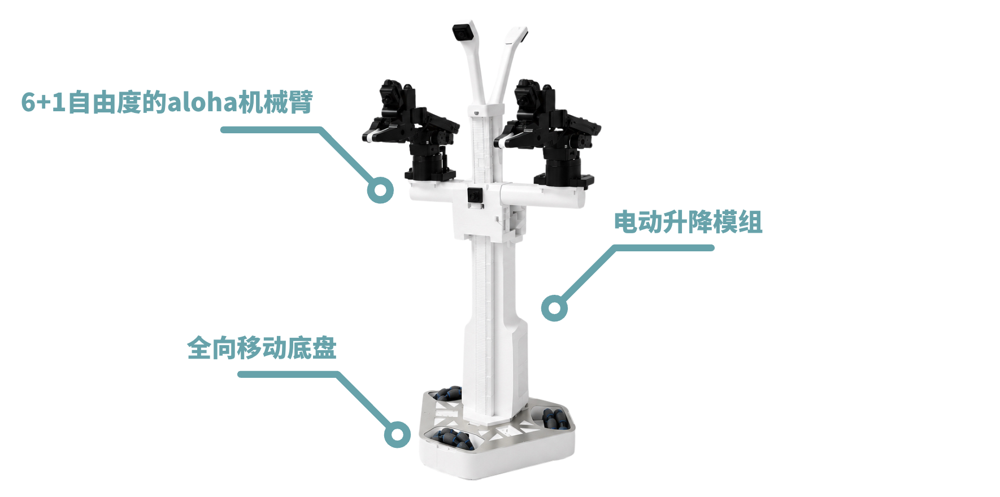
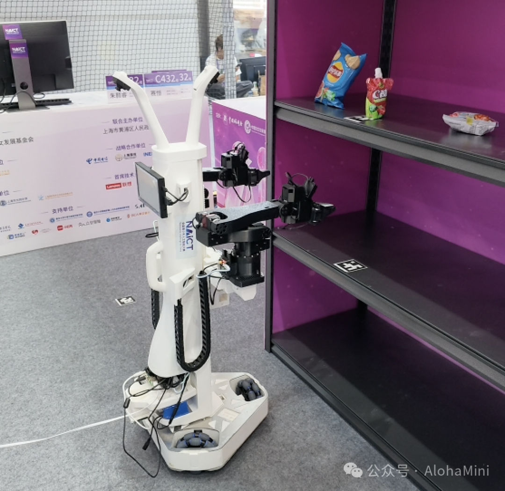
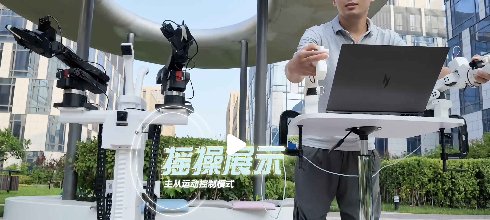
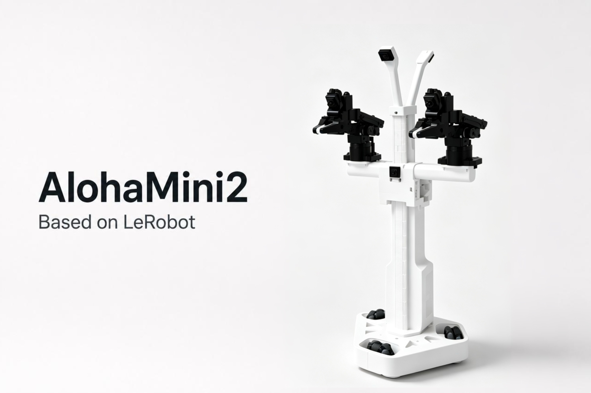
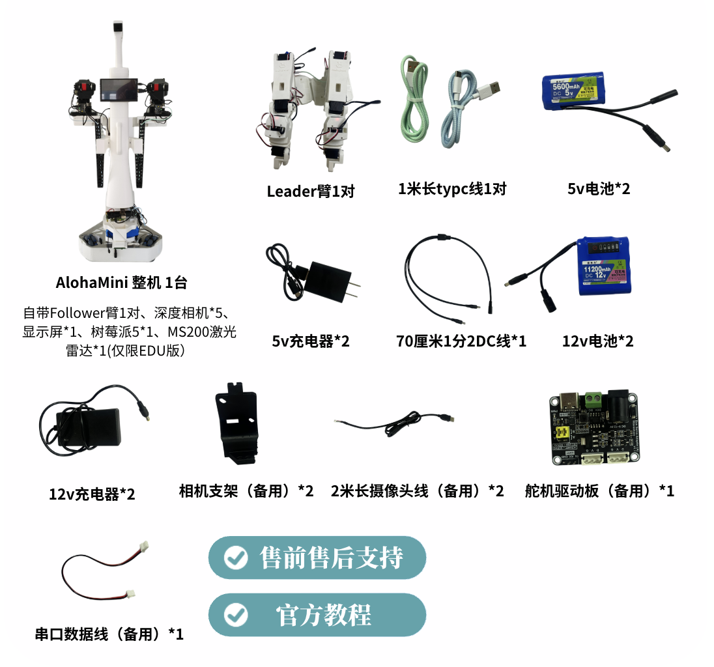
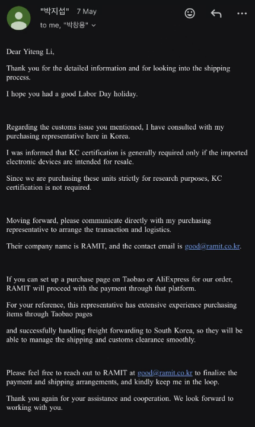

# AlohaMini产品说明（面向K12教育）

[官方使用手册](../official-manual.md) · [语雀来源](https://alohamini.yuque.com/lq44as/tiv9xs/ixkt9xrygz0zv9b6) · 2026-09-28 整理

```{note}
本页保留语雀产品与教学资料的正文。参数、价格、赛事与课程安排按原文收录日期理解；实际套件配置以交付资料为准。
```

(yq-ixkt9xrygz0zv9b6-991c284e)=

## 一、“具身智能”时代正在到来

(yq-ixkt9xrygz0zv9b6-u1070154c)=

2026 年 7 月 17 日，国家主席习近平在上海出席 **2026 世界人工智能大会暨人工智能全球治理高级别会议**开幕式，并发表主旨讲话。

(yq-ixkt9xrygz0zv9b6-u0b894713)=

(yq-ixkt9xrygz0zv9b6-uf1d6f317)=


(yq-ixkt9xrygz0zv9b6-u06637ff8)=

围绕人工智能发展与治理，习近平主席提出四点意见：

(yq-ixkt9xrygz0zv9b6-ud20fcf57)=

**坚持开放共赢｜强化风险意识｜鼓励包容并蓄｜倡导和衷共济**

(yq-ixkt9xrygz0zv9b6-uf850ee46)=

其中，在“坚持开放共赢，驱动创新发展”方面，习近平主席强调：

(yq-ixkt9xrygz0zv9b6-uf1608f43)=

人工智能是世界经济增长的新引擎和新旧动能转换的加速器，正从“数字世界”走向“物理世界”。抓住难得的历史性机遇，鼓励开源开放、合作共享，全面促进人工智能科技创新、产业发展、场景应用，协同推进传统产业改造升级、新兴产业培育壮大、未来产业前瞻布局，让人工智能赋能千行百业。[央视网讲话全文](https://news.cctv.com/2026/07/17/ARTISggfKpymc0SrNJMOww8c260717.shtml)

(yq-ixkt9xrygz0zv9b6-uf5787e29)=

(yq-ixkt9xrygz0zv9b6-u7fd3dc71)=

**人工智能，正从“数字世界”走向“物理世界”。**

(yq-ixkt9xrygz0zv9b6-ud964b9a5)=

以 ChatGPT、DeepSeek、豆包等为代表的大模型，已经能够理解语言、图像和知识。

(yq-ixkt9xrygz0zv9b6-u25f794d9)=

而具身智能（**Embodied AI**），让人工智能进一步拥有了感知和行动的能力：它能够看见环境、理解任务、控制机器人完成移动、抓取、摆放等操作，并在真实场景中不断学习和改进。

(yq-ixkt9xrygz0zv9b6-uda4b426f)=

**数字能力** 会说｜会看｜会推理

(yq-ixkt9xrygz0zv9b6-uf6af76b3)=

↓

(yq-ixkt9xrygz0zv9b6-u0cd730f1)=

**具身能力** 能感知｜能行动｜能操作｜能解决真实问题

(yq-ixkt9xrygz0zv9b6-u1605c981)=

(yq-ixkt9xrygz0zv9b6-ua6de2e77)=

**目前，具身智能已成为国家重点布局的未来产业**《“十五五”规划纲要》已将具身智能纳入未来产业重点方向。

(yq-ixkt9xrygz0zv9b6-u49badd5e)=

国家税务总局数据显示，2026 年 1 至 5 月，我国具身智能产业保持较快增长：

| **领域** | **同比增长** |
| --- | --- |
| 具身智能产业企业销售收入 | **22.40%** |
| 机器人本体与整机制造 | **30.10%** |
| AI 算法与软件集成 | **24.50%** |
| 系统集成与行业应用 | **27.90%** |

(yq-ixkt9xrygz0zv9b6-u62b080af)=

[查看国家税务总局产业数据](https://www.chinatax.gov.cn/chinatax/n810219/n810724/c5250672/content.html)

(yq-ixkt9xrygz0zv9b6-u0ecc6e45)=

同期，工业企业购进具身智能机器人的总金额同比增长 **2.3 倍**，反映出具身智能机器人与工业生产的融合正在持续加深。随着技术从实验室走向工厂、服务与更多真实场景，产业需要的不再只是单一领域的技术人才，而是能够理解人工智能、机器人本体、视觉感知、数据训练和场景应用的复合型人才。

(yq-ixkt9xrygz0zv9b6-u1cd2f630)=

具身智能融合人工智能、机器人、机械结构、计算机视觉、数据训练和真实场景应用等多项能力。工业和信息化部、国务院国资委在 2026 年人形机器人与具身智能实景实训专项行动中，明确提出要培养“既掌握核心技术、又精通行业场景应用的多元复合型人才”，加快构建产业人才梯队。

(yq-ixkt9xrygz0zv9b6-u098d6bea)=

(yq-ixkt9xrygz0zv9b6-ue5fe65e2)=

**人才培养要面向产业未来，也要从基础教育阶段开始播下种子。**

(yq-ixkt9xrygz0zv9b6-u1aa78a82)=

**学生不仅需要会使用人工智能工具，更需要理解人工智能如何感知、学习、决策与行动。**

(yq-ixkt9xrygz0zv9b6-u48234100)=

**让学生在真实机器人上开展观察、操控、数据采集、模型训练和任务验证，是人工智能教育从“认识技术”走向“创造技术”的重要一步。**

(yq-ixkt9xrygz0zv9b6-1ffc9ad0)=

## 二、K12 具身智能教育现状

(yq-ixkt9xrygz0zv9b6-u665269cf)=

近年来，人工智能、编程和机器人教育已逐步走进中小学课堂、社团和科技活动。学生通过图形化编程、智能硬件搭建、机器人控制与项目实践，开始理解算法、传感器和自动化技术如何影响真实生活。

(yq-ixkt9xrygz0zv9b6-u5da7d867)=

机器人、人工智能类赛事也为学生提供了展示、交流与持续实践的舞台。教育部公布的 2025—2028 学年面向中小学生的全国性竞赛活动共有 47 项，其中，自然科学素养类赛事已覆盖人工智能、机器人、无人机、发明创造等多个方向。[教育部名单](https://hudong.moe.gov.cn/srcsite/A29/202510/t20251029_1418393.html)

(yq-ixkt9xrygz0zv9b6-u708b35b8)=

以下为与机器人和人工智能实践关联较为直接的代表性赛事：

| **赛事** | **主要实践方向** | **学生可获得的核心体验** |
| --- | --- | --- |
| 全国青少年人工智能创新挑战赛 | 人工智能应用、智能硬件与创新实践 | 从问题出发，运用人工智能技术设计解决方案 |
| 世界机器人大会青少年机器人设计与信息素养大赛 | 机器人设计、编程、信息素养与任务挑战 | 搭建、编程、控制机器人，完成指定任务 |
| 全国青少年无人机大赛 | 飞行器操控、编程与工程实践 | 认识智能飞行、自动控制与工程协作 |
| 首届全国青少年人工智能大赛 | 人工智能基础、工具应用、科学研究、具身智能与大语言模型应用 | 从人工智能工具使用，进一步走向模型训练与真实场景实践 |

(yq-ixkt9xrygz0zv9b6-ufb20cbc5)=

这些赛事共同构成了 K12 人工智能与机器人教育的重要实践生态：学生可以从编程、搭建和控制入门，逐步进入智能硬件、人工智能应用和科技创新项目。

(yq-ixkt9xrygz0zv9b6-ud855d617)=

(yq-ixkt9xrygz0zv9b6-u153ceb9b)=

**从“控制机器人”到“让机器人学习”，是新的能力升级**

(yq-ixkt9xrygz0zv9b6-u8fcf8f24)=

传统机器人学习和竞赛，通常侧重搭建、编程、路径规划、传感器控制和固定任务执行。这些能力依然重要，是学生进入人工智能与工程实践的基础。

(yq-ixkt9xrygz0zv9b6-u07d67a56)=

而具身智能进一步提出了新的问题：机器人不仅要执行人预先写好的指令，还要能够感知环境、理解任务、从人的示范中获得经验，并在真实环境中作出行动。

(yq-ixkt9xrygz0zv9b6-ua86ea776)=

可以将这一变化理解为：

(yq-ixkt9xrygz0zv9b6-u96e3f949)=

**传统机器人实践** 搭建机器人 → 编写程序 → 执行指定动作

(yq-ixkt9xrygz0zv9b6-ud197eb4d)=

↓

(yq-ixkt9xrygz0zv9b6-u4175640e)=

**具身智能实践** 观察环境 → 人来示范 → 采集数据 → 模型学习 → 真机行动 → 持续改进

(yq-ixkt9xrygz0zv9b6-ua632fdbf)=

这并不是替代传统机器人教育，而是在其基础上，让学生进一步接触人工智能与真实物理世界结合的前沿方向。

(yq-ixkt9xrygz0zv9b6-ueb5ecb8c)=

(yq-ixkt9xrygz0zv9b6-u9b68b5df)=

**具身智能赛道，为 K12 学生提供了面向未来的真实实践出口**

(yq-ixkt9xrygz0zv9b6-u041a7368)=

首届全国青少年人工智能大赛设置人工智能基础知识、人工智能工具应用、人工智能驱动科学、具身智能和大语言模型应用五个前沿赛道。其中，赛道四“青少年具身智能大赛”的独特之处在于：它不只考查学生是否能够控制机器人完成任务，更考查学生能否让机器人在真实场景中“学习”和“行动”。

(yq-ixkt9xrygz0zv9b6-u2d457c2f)=

赛事以“微型超市取货、结账”为应用场景，采用“线上仿真 + 线下真机”的比赛方式。学生需要完成环境理解、遥操作示范、数据采集、模型训练、仿真调试、真机部署和现场测试等环节。[赛道四决赛指南](https://www.sclc2017.org/c/2026-06-18/21660.shtml)

(yq-ixkt9xrygz0zv9b6-uc4328eb3)=

因此，这一赛道对应的并不是单一的机器人操作能力，而是一条完整的具身智能实践链路：

(yq-ixkt9xrygz0zv9b6-u70d7f818)=

**理解任务 → 教机器人示范 → 采集真实数据 → 训练或调用模型 → 在真机上验证 → 根据结果****持续改进**

(yq-ixkt9xrygz0zv9b6-ubdfb3c9b)=

从目前公开的白名单赛事及赛项规则看，首届全国青少年人工智能大赛并非历史最久的机器人赛事；但它具有鲜明的前沿定位：**将“具身智能”作为独立赛道，明确把模型、数据、仿真与真机实践结合起来。** 同时，它也是首个落户上海的自然科学素养类白名单赛事，决赛汇集了来自全国 31 个省、自治区、直辖市、新疆生产建设兵团及港澳地区的 856 名选手。[上海市政府报道](https://www.shanghai.gov.cn/nw4411/20260802/e5374613836b48edaca5ac3fbeb62360.html)

(yq-ixkt9xrygz0zv9b6-uc45ca533)=

(yq-ixkt9xrygz0zv9b6-u73c60d87)=

**AlohaMini，让学校能够把“前沿赛道”变成日常实践**

(yq-ixkt9xrygz0zv9b6-u98a4c003)=

AlohaMini 作为首届全国青少年人工智能大赛决赛赛道四“青少年具身智能大赛”的比赛用机，为学校提供了连接日常教学、社团活动、研究性学习与赛事训练的统一平台。

(yq-ixkt9xrygz0zv9b6-u88c7c625)=

学生可以先通过摇操作学习如何教机器人完成任务，再进一步完成数据采集、模型训练和真机验证；教师则可围绕同一设备，持续开展课程、社团项目、课题研究和竞赛备赛。

(yq-ixkt9xrygz0zv9b6-ua6b88bc0)=

AlohaMini 的意义，不只是帮助学生参加一项赛事，更在于让学校能够提前开展面向未来的具身智能实践：让学生从“控制机器人”，逐步走向“理解机器人如何学习”，并尝试以真实数据和真实任务创造新的可能。

(yq-ixkt9xrygz0zv9b6-f5c97cd4)=

## 三、AlohaMini产品说明

(yq-ixkt9xrygz0zv9b6-u49e20b9c)=

**AlohaMini 是一台面向具身智能科普教育、学生课题研究、社团活动与竞赛实践的双臂可移动升降机器人。**

(yq-ixkt9xrygz0zv9b6-2c199ae5)=

### 硬件构型：AlohaMini能做什么任务？

(yq-ixkt9xrygz0zv9b6-uce1d93d1)=

AlohaMini集成了**移动、升降、双臂操作与视觉感知能力**，可以支持学生围绕真实生活和校园问题，设计、训练并验证不同任务。

(yq-ixkt9xrygz0zv9b6-uac72b302)=

(yq-ixkt9xrygz0zv9b6-u629041d6)=



- **桌面操作**：整理文具、分类积木、摆放实验材料，将物品准确放入指定容器。

- **低位拾取**：从地面或较低位置拿取物品，再放置到桌面、收纳架或指定区域。

- **双臂协作**：一只机械臂固定物品，另一只机械臂完成操作；也可以连续完成“拿取 - 移动 - 放置”等多步骤任务。

- **移动取放**：在模拟商超、实验室或校园服务场景中，机器人自主移动至指定区域，识别目标物品，并完成抓取、转运和交付。

- **场景创新**：学生可结合校园生活自主搭建场景，如“智能商超”“实验器材整理”“图书递送”“垃圾分类”“物资分拣”等

(yq-ixkt9xrygz0zv9b6-ua92e763c)=

例如：

(yq-ixkt9xrygz0zv9b6-uff90ba89)=

在首届全国青少年人工智能大赛具身智能赛道决赛现场，参赛学生围绕“智能商超购物”任务开展实践：AlohaMini 从起始点移动至目标货架区域，通过视觉识别定位目标商品，再由双臂完成抓取、转运，并将商品准确放置至交付区域。

(yq-ixkt9xrygz0zv9b6-u2990e15f)=

(yq-ixkt9xrygz0zv9b6-uc7df84c3)=



(yq-ixkt9xrygz0zv9b6-ua2d4e835)=

(yq-ixkt9xrygz0zv9b6-u0cccb1c5)=

(yq-ixkt9xrygz0zv9b6-4e455b6f)=

### 模仿学习：AlohaMini 如何学会自主行动？

(yq-ixkt9xrygz0zv9b6-u8cb2eb53)=

**模仿学习，是当前让机器人获得真实操作能力的重要方法之一。**

(yq-ixkt9xrygz0zv9b6-u12a26977)=

与传统机器人按照固定程序重复动作不同，模仿学习让机器人从人的示范中学习任务。

(yq-ixkt9xrygz0zv9b6-u15e7b4e7)=

可以把它理解为学生学习一项新技能的过程：

(yq-ixkt9xrygz0zv9b6-u15dc16cd)=

**先观察老师怎样做****➡️****反复练习****➡️****独立自主地完成**

(yq-ixkt9xrygz0zv9b6-u3408fed1)=

对于机器人也是如此：

(yq-ixkt9xrygz0zv9b6-u4acf73b5)=

**人示范一次，机器人学习一次；不断增加真实经验，机器人就有机会把任务做得更好**

(yq-ixkt9xrygz0zv9b6-ua8987826)=

AlohaMini 通过以下流程，帮助学生理解机器人如何从“由人操控”逐步走向“自主行动”：

(yq-ixkt9xrygz0zv9b6-ubc9f8519)=

**摇操作示范 → 数据采集 → 模型训练或推理 → 真机验证 → 迭代优化**

(yq-ixkt9xrygz0zv9b6-u15357e79)=

**第一步：摇操作示范**

(yq-ixkt9xrygz0zv9b6-uf38cbba4)=

学生通过一对手持控制臂（Leader 臂），向 AlohaMini 示范如何完成一项任务。

(yq-ixkt9xrygz0zv9b6-u1e141ffc)=

这一过程称为“摇操作”或“遥操作”。

(yq-ixkt9xrygz0zv9b6-u8b49ca1f)=

通俗来说，就是：**学生亲手带着机器人完成一次任务，告诉它“这件事应该怎样做”。**

(yq-ixkt9xrygz0zv9b6-u6b449833)=

(yq-ixkt9xrygz0zv9b6-u0c6dfbc5)=



(yq-ixkt9xrygz0zv9b6-u4482b70f)=

**第二步：数据采集**

(yq-ixkt9xrygz0zv9b6-u069a5cf0)=

在学生示范的同时，AlohaMini 会同步记录：

- 机械臂如何移动；

- 夹爪在何时抓取、松开物品；

- 相机看到了什么画面；

- 机器人在完成任务时所经历的连续步骤。

(yq-ixkt9xrygz0zv9b6-uc1ae3395)=

这些记录构成机器人学习任务所需的真实数据，是机器人在真实环境中“看到什么、做了什么”的经验。

(yq-ixkt9xrygz0zv9b6-ub6c100e7)=

**第三步：模型学习**

(yq-ixkt9xrygz0zv9b6-uf9769579)=

利用采集到的数据，师生可以通过 ACT 等模仿学习方法，让机器人学习任务规律。

(yq-ixkt9xrygz0zv9b6-uae1d257a)=

例如，当机器人看到目标商品时，模型会学习判断：下一步应当靠近还是抓取？应当怎样调整机械臂角度？抓取后又应当移动到哪里？

(yq-ixkt9xrygz0zv9b6-ud923fd8c)=

（注：ACT 是当前具身智能领域常用的模仿学习方法之一，尤其适合抓取、摆放等精细操作任务。）

(yq-ixkt9xrygz0zv9b6-u823cfd4d)=

Hugging Face 的 LeRobot 工具体系将 ACT 作为机器人模仿学习的重要入门方法之一。[LeRobot ACT 文档](https://huggingface.co/docs/lerobot/act)

(yq-ixkt9xrygz0zv9b6-u5ebb4cad)=

**第四步：真机验证**

(yq-ixkt9xrygz0zv9b6-uaf56d8a8)=

完成模型训练或推理后，师生可以将学习结果运行在 AlohaMini 上，观察机器人能否在真实场景中自主完成相似任务。

(yq-ixkt9xrygz0zv9b6-u4c312414)=

例如，机器人是否能够识别目标物品？是否能够稳定抓取？是否能够把物品放到正确位置？

(yq-ixkt9xrygz0zv9b6-u90191b91)=

学生能够直观看到：模型的能力边界在哪里，真实环境中的光线、摆放位置、物体形状和操作路径，又会如何影响机器人表现？

(yq-ixkt9xrygz0zv9b6-u7d58475f)=

**第五步：迭代优化**

(yq-ixkt9xrygz0zv9b6-ua5bab98a)=

如果机器人没有完成任务，学生可以分析原因：

- 示范次数是否不足？

- 任务环境是否变化过大？

- 相机是否看清了目标物品？

- 物品摆放方式是否影响抓取？

- 是否需要补充新的示范数据？

(yq-ixkt9xrygz0zv9b6-uc8f5ab0a)=

在补充示范、调整环境和重新测试的过程中，学生会经历一次真实的工程与科研过程：

(yq-ixkt9xrygz0zv9b6-uae67654f)=

**提出问题、记录证据、调整方案、验证结果、****持续改进****。**

(yq-ixkt9xrygz0zv9b6-u272debed)=

**通过 AlohaMini，学生可以从“教机器人完成一个任务”开始，进一步理解数据如何影响模型、模型如何影响动作，以及如何通过真实验证不断提升机器人的任务表现。**

(yq-ixkt9xrygz0zv9b6-u107a38fe)=

**这样，具身智能不再只是一个抽象概念，而成为学生能够亲手参与、观察和研究的真实过程。**

(yq-ixkt9xrygz0zv9b6-u25985461)=

(yq-ixkt9xrygz0zv9b6-e5282ee3)=

### 全栈生态适配：AlohaMini 如何持续支持前沿具身智能实践？

(yq-ixkt9xrygz0zv9b6-u7e36da00)=

具身智能仍处于快速发展的阶段，新的开源模型、训练方法和开发工具不断涌现。

(yq-ixkt9xrygz0zv9b6-u66b84701)=

**AlohaMini 的价值，不只在于支持当前的教学任务，也在于为学生提供一个能够持续接触、理解和验证前沿技术的真实机器人平台。**

(yq-ixkt9xrygz0zv9b6-u761d0057)=

**AlohaMini 深度兼容 Hugging Face LeRobot 开源工具体系。**

(yq-ixkt9xrygz0zv9b6-udcccf7d9)=

LeRobot 可以理解为一套面向机器人学习的开源“工具体系”。 它将机器人控制、数据采集、数据管理、模型训练、模型推理和真机测试等环节连接起来，并提供相对统一的使用方式。

(yq-ixkt9xrygz0zv9b6-u3d604e44)=

**这意味着，师生无需针对每一种方法都从零搭建复杂的软件环境，而可以基于 AlohaMini，在同一条实践链路中开展学习、测试与创新：**

(yq-ixkt9xrygz0zv9b6-ud59676a1)=

**任务设计 → 摇操作示范 → 数据采集 → 模型训练或推理 → 真机验证 → 结果改进**

(yq-ixkt9xrygz0zv9b6-ubd074911)=

目前，AlohaMini 已支持ACT、Diffusion Policy、FastWAM 等主流模仿学习方法的实践。对于初学者而言，ACT 等方法能够帮助学生理解：机器人如何从人的示范中，学习完成抓取、摆放、分拣等任务。

(yq-ixkt9xrygz0zv9b6-ud06603ad)=

随着学习逐步深入，学生还可以围绕同一个任务，比较不同数据量、示范方式或学习方法对机器人表现的影响。例如：

- 增加示范次数，是否能提高任务完成的成功率？

- 改变物品的摆放位置后，机器人能否继续完成任务？

- 不同模型在抓取、分拣或双臂协作任务中，表现是否存在差异？

- 怎样改进场景设计和训练数据，让机器人完成任务更稳定？

(yq-ixkt9xrygz0zv9b6-u499d9ab9)=

**这些问题既可以成为社团的长期项目，也可以发展为高中研究性学习、科技创新竞赛或课题论文的研究内容。**

(yq-ixkt9xrygz0zv9b6-ub5a06a4d)=

对于具备进阶基础的师生，AlohaMini 还可围绕 Pi-0.5、SmolVLA、EO-1、VLA-JEPA、GR00T N1.7、EVO1 等开源具身智能模型方向，开展复现、适配与真机测试。

(yq-ixkt9xrygz0zv9b6-uad92c177)=

当新的开源模型具备公开代码、开放接口，并满足相应软硬件条件时，AlohaMini 可作为真实机器人平台，支持师生开展适配、测试与验证。

(yq-ixkt9xrygz0zv9b6-u8faa41bd)=

**因此，AlohaMini 不只服务于某一门固定课程或某一种固定算法，还可支撑不同深度的具身智能实践：**

- **面向入门**：理解机器人如何从人的示范中学习；

- **面向社团与竞赛**：围绕真实任务进行数据采集、模型推理与调试；

- **面向课题研究**：比较数据、模型和任务设计对机器人表现的影响；

- **面向前沿探索**：在具备条件时，将新的开源方法带到真实机器人上进行验证。

(yq-ixkt9xrygz0zv9b6-u039819c4)=

**从学习已有方法，到验证新的技术思路；从一次课堂体验，到持续积累课程案例、学生项目和研究成果，AlohaMini 为学校提供了一条连接开源技术与真实机器人实践的路径。**

(yq-ixkt9xrygz0zv9b6-u0e380f0b)=

*注：不同开源模型对计算资源、传感器配置、软件环境和任务形态有不同要求，具体适配范围以实际条件及官方技术支持方案为准。*

(yq-ixkt9xrygz0zv9b6-1731d736)=

### 软硬件全开源：AlohaMini 如何支持学生从使用者走向创造者？

(yq-ixkt9xrygz0zv9b6-ua0073e71)=

AlohaMini 的软硬件全开源，使学生不只能够使用既有功能，还可以**围绕自己的课题和创意，理解、修改并拓展机器人的能力。**

(yq-ixkt9xrygz0zv9b6-ub39accf1)=

AlohaMini 1 与 AlohaMini 2 已开放硬件与软件资料。具备进阶基础的学生、教师，可根据课题或项目需要，进一步修改机械结构、增加传感器或末端工具，开发新的控制方式，并围绕实际场景构建属于自己的机器人应用。

(yq-ixkt9xrygz0zv9b6-uf2619ad9)=

可开放与扩展的内容包括：

- 机械结构设计图纸；

- 机器人数字模型与仿真描述文件；

- 底层控制与软件支持代码；

- 面向 LeRobot 的机器人软件支持与开发资料。

(yq-ixkt9xrygz0zv9b6-u4a7e1af4)=

相关开源资料：

- 硬件：[AlohaMini 开源硬件项目](https://github.com/liyiteng/AlohaMini)

- 软件：[AlohaMini LeRobot 软件支持](https://github.com/liyiteng/lerobot_alohamini)

(yq-ixkt9xrygz0zv9b6-u31bcbd8d)=

**从完成一个既定任务，到为机器人设计新的能力、工具和场景，AlohaMini 为学生提供了由“使用者”走向“创造者”的空间。**

(yq-ixkt9xrygz0zv9b6-ua664636b)=

**来自开源社区的创意实践**

(yq-ixkt9xrygz0zv9b6-u6cdb2d00)=

AlohaMini 的开放性，为全球创客开展二次开发提供了基础。

(yq-ixkt9xrygz0zv9b6-u2f2511ad)=

目前，已有多位海外开发者可以在AlohaMini的基础上进行二次开发，以探索更多有趣且真实的应用。

- **案例 1**

(yq-ixkt9xrygz0zv9b6-u9fc3c0ab)=

海外创客 Eric Gradman把视觉模型、Hermes Agent、行为树和导航能力接入AlohaMini,使得AlohaMini能够与人语音对话互动、在家中建图导航、自主停靠指定工作地点、看见并理解周围环境、甚至用机械臂外挂的激光逗狗玩。

(yq-ixkt9xrygz0zv9b6-u815447c5)=

暂时无法在飞书文档外展示此内容

- **案例2**

(yq-ixkt9xrygz0zv9b6-u6cedb1ea)=

来自东京大学松尾·岩泽实验室（Matsuo Iwasawa Lab）的开发者 @PgChiyo 在AlohaMini基础上升级了底盘、电池、夹爪、机械臂。

(yq-ixkt9xrygz0zv9b6-u1f47ce9f)=

暂时无法在飞书文档外展示此内容

- **案例3**

(yq-ixkt9xrygz0zv9b6-ufb9e0636)=

海外创客sean将AlohaMini与 SO107 机械臂和XLeRobot 夹爪结合。

(yq-ixkt9xrygz0zv9b6-u52bb66b1)=

暂时无法在飞书文档外展示此内容

- **案例4**

(yq-ixkt9xrygz0zv9b6-u3c96a564)=

海外创客 Histochemichael 为 AlohaMini 开发了一套远程遥操作方案：操作者可使用 4 个脚踏板控制底盘前后移动及机器人的升降，通过电脑摄像头进行面部追踪来控制底盘转向，并使用 So101 主操作臂远程同步控制 AlohaMini 的双臂动作

(yq-ixkt9xrygz0zv9b6-u35da4fe7)=

暂时无法在飞书文档外展示此内容

- **案例5**

(yq-ixkt9xrygz0zv9b6-u649dec0a)=

海外创客skpro109为 AlohaMini 配置了 so101 机械臂，并创新性地利用 iPhone 摄像头作为控制器进行机械臂的动作映射。

(yq-ixkt9xrygz0zv9b6-ubf4549b4)=

暂时无法在飞书文档外展示此内容

- **案例6**

(yq-ixkt9xrygz0zv9b6-u5b7cb2cf)=

海外创客kang minkyu升级 So101 夹持器，解决大件、异形物体抓取难题，适配 VLA 视觉语言动作模型研究。

(yq-ixkt9xrygz0zv9b6-ud834f6a6)=

暂时无法在飞书文档外展示此内容

(yq-ixkt9xrygz0zv9b6-bb5a36b3)=

### 其他优势

(yq-ixkt9xrygz0zv9b6-ub76319ce)=

AlohaMini 除了具备真实的具身智能开发能力外，也通过**高性价比、安全设计、整机交付、售后支持**，降低学校开展相关实践的门槛

(yq-ixkt9xrygz0zv9b6-c0b46c6f)=

#### ✅高性价比

(yq-ixkt9xrygz0zv9b6-ub35a1965)=

传统的“移动底盘 + 升降结构 + 双臂协作”机器人平台，动辄几十万。

(yq-ixkt9xrygz0zv9b6-uc9546808)=

AlohaMini 将这一完整构型带入万元级范围，使学校能够以高性价比的方式，配置一套可用于摇操作、数据采集、模型训练和真机验证的真实机器人平台。

(yq-ixkt9xrygz0zv9b6-2d51f08f)=

#### ✅安全设计

(yq-ixkt9xrygz0zv9b6-u84d5cae5)=

与面向工业作业、高速运动或大负载任务的高扭矩机器人不同，AlohaMini 采用低扭矩执行器设计，更适合在教师指导下开展摇操作、数据采集和任务测试等教学实践。

(yq-ixkt9xrygz0zv9b6-ua275346a)=

高功率、高扭矩机器人能够完成更高速、更大负载的动作，但在操作失误、碰撞或控制异常时，可能带来更高的冲击力与风险。AlohaMini 则将教学场景中的人机交互安全与设备保护纳入设计考量，帮助师生在真实机器人上更安心地开展反复探索。

(yq-ixkt9xrygz0zv9b6-u4a8a7ad3)=

设备具备两级关节堵转保护：

- 当夹爪受到异常阻力时，系统自动卸除夹持力，降低夹持过载风险；

- 当机械臂关节负载超过设定范围时，系统停止输出力矩，降低设备过载与碰撞风险。

(yq-ixkt9xrygz0zv9b6-u8effcb99)=

(yq-ixkt9xrygz0zv9b6-bcac6ed9)=

## 四、AlohaMini在学校的应用场景

(yq-ixkt9xrygz0zv9b6-uafe70e7e)=

AlohaMini 致力于成为学校开展具身智能教育、研究性学习、社团活动和竞赛训练等活动的实践平台。

(yq-ixkt9xrygz0zv9b6-98d2d37e)=

### 学｜理解具身智能

(yq-ixkt9xrygz0zv9b6-u0ffe1520)=

学生可以从认识机器人结构开始，逐步了解相机如何帮助机器人“看见”环境，机械臂和夹爪如何完成抓取与摆放，移动底盘和升降结构如何帮助机器人适应不同位置、不同高度的任务。

(yq-ixkt9xrygz0zv9b6-ub619e2b4)=

AlohaMini 配套提供持续更新的官方教程与开发资料，帮助教师和学生按照由浅入深的路径开展学习：

(yq-ixkt9xrygz0zv9b6-u823d99e5)=

[AlohaMini_新手教程_v1.3 · AlohaMini开源机器人](developer-manual.md)

- **认识AlohaMini**：了解硬件结构，如双臂、相机、底盘、升降结构及其作用；

- **摇操作**：学习摇操作、数据采集等，学会让机器人动起来

- **ACT训练：**团队可提供远程技术支持，帮助完成首个 ACT / AM-ACT 模型训练或推理实践，即帮助机器人完成第一个自主任务

(yq-ixkt9xrygz0zv9b6-uc4e7bbb3)=

对于教师而言，配套资料可帮助将前沿技术转化为可组织、可讲解、可操作的学习活动；对于学生而言，则能够从“认识一台机器人”，逐步走向真正“训练一个机器人完成自主任务”。

(yq-ixkt9xrygz0zv9b6-u4c960dff)=

(yq-ixkt9xrygz0zv9b6-u1f1d3d3b)=


(yq-ixkt9xrygz0zv9b6-338dd39f)=

### 练｜亲身训练机器人

(yq-ixkt9xrygz0zv9b6-uf98eef4e)=

学生可以亲自通过摇操作向机器人示范任务，理解真实数据如何产生，以及模型如何从人的示范中学习任务规律。

(yq-ixkt9xrygz0zv9b6-ue9b78043)=

原本抽象的“数据采集”“模型训练”“真机验证”，将成为可操作、可观察、可复盘的实践过程。

(yq-ixkt9xrygz0zv9b6-865b486e)=

### 赛｜开展具身智能备赛

(yq-ixkt9xrygz0zv9b6-u510e9893)=

AlohaMini 已作为首届全国青少年人工智能大赛决赛赛道四（具身智能赛道）比赛用机。

(yq-ixkt9xrygz0zv9b6-udb570380)=

学校可基于同一平台，组织学生熟悉机器人操作、任务设计、数据采集与模型推理等流程，围绕赛事任务开展日常训练和项目积累。

(yq-ixkt9xrygz0zv9b6-u7ea588ca)=

暂时无法在飞书文档外展示此内容

(yq-ixkt9xrygz0zv9b6-01b40484)=

### 研｜为高中研究性学习提供载体

(yq-ixkt9xrygz0zv9b6-uea8ce846)=

学生可以围绕一个具体问题开展高中阶段课题研究，例如：

- 如何让机器人更准确地完成物品分拣？

- 示范次数和质量如何影响机器人的任务表现？

- 相机视角、物体摆放方式或操作路径，会如何影响结果？

- 如何通过调整数据和任务环境，提高任务完成的稳定性？

(yq-ixkt9xrygz0zv9b6-ucb487e37)=

学生可据此设计实验、采集数据、训练或测试模型、分析结果，并形成研究报告或课题论文。

(yq-ixkt9xrygz0zv9b6-ube83cc4c)=

**让课题研究从资料搜集和概念讨论，走向真实实验、真实数据与真实验证。**

(yq-ixkt9xrygz0zv9b6-db317cd5)=

### 创｜支持开展创新项目

(yq-ixkt9xrygz0zv9b6-ucf44e200)=

人工智能、机器人和科创社团可以围绕校园物品整理、实验材料分拣、双臂协作、智能商超等主题，持续设计新任务、新场景和新交互方式。

(yq-ixkt9xrygz0zv9b6-u662a0103)=

不同学生可承担场景设计、机器人操作、数据记录、模型测试、实验分析和成果展示等角色，共同完成跨学科创新项目。

(yq-ixkt9xrygz0zv9b6-3f481eb5)=

### 不只是学习技术，也是理解正在发生的时代

(yq-ixkt9xrygz0zv9b6-uf888864c)=

具身智能教育的意义，不只在于培养未来将走向理工科的学生。

(yq-ixkt9xrygz0zv9b6-ua4bd5370)=

当人工智能从屏幕走向现实世界，每一位学生都需要开始思考：

(yq-ixkt9xrygz0zv9b6-u3f1b6a45)=

当机器开始思考，人类如何与之相处？ 当算法参与决策，安全如何保障？ 当技术挑战伦理，治理如何跟上？ 当鸿沟不断拉大，普惠如何实现？

(yq-ixkt9xrygz0zv9b6-u22e44616)=

**技术素养并不意味着每位学生都必须成为算法工程师。更重要的是，让学生在理解技术基本原理的基础上，形成有事实依据的判断，提出有价值的问题，并以负责任的态度参与未来社会。**

(yq-ixkt9xrygz0zv9b6-c9b07ca6)=

### AlohaMini任务场景参考清单

(yq-ixkt9xrygz0zv9b6-ub7a35014)=

以下任务可根据学生基础、课程目标和场地条件灵活选择，用于课堂体验、社团项目、研究性学习与竞赛训练。

| **场景主题** | **示例任务** | **涉及能力** | **适合形式** |
| --- | --- | --- | --- |
| **桌面整理** | 将文具、积木或实验材料整理至指定区域 | 视觉识别、抓取、摆放 | 入门体验课、社团活动 |
| **实验器材整理** | 按指定顺序取放试管架、器材盒或实验物料 | 双臂协作、流程设计 | 科学课、综合实践 |
| **智能商超购物** | 移动至货架，识别指定商品，抓取并送至交付区 | 移动导航、视觉识别、抓取、转运 | 竞赛训练、展示项目 |
| **校园物资递送** | 从取件区拿取物品，移动至指定区域完成交付 | 路径规划、移动取放、任务执行 | 社团项目、校园场景设计 |
| **图书整理** | 识别指定图书或卡片，完成取放、分类和归位 | 视觉识别、双臂操作 | 图书馆主题项目 |
| **垃圾分类模拟** | 识别不同类别的模拟废弃物，放入对应回收容器 | 分类识别、抓取、环保主题设计 | 劳动教育、科创活动 |
| **低位物品拾取** | 从地面或低处取物，再放置到桌面或收纳架 | 升降、移动、抓取 | 机器人基础实践 |
| **双臂协作装配** | 一只机械臂固定物体，另一只完成插接、摆放或组装 | 双臂协作、精细操作 | 进阶课程、课题研究 |
| **人机协作任务** | 学生与机器人共同完成物品传递、整理或装配 | 人机协作、任务分工 | 展示课、社团活动 |
| **自主创意任务** | 围绕校园生活自定义场景与任务规则 | 场景设计、数据采集、模型验证 | 研究性学习、创新竞赛 |

(yq-ixkt9xrygz0zv9b6-47a05e8e)=

## 五、产品线与服务

(yq-ixkt9xrygz0zv9b6-7878268a)=

## AlohaMini 2 6轴版

- **定位：** 适合创客/个人开发者

- **定价：12,999 元**

- **交付形式：**散件套装+视频教程+线下组装体验活动+关键零件保修一年+全套配件

- **核心特性：**

- 6+1 自由度机械臂

- 1kg负载

- 官方技术支持

(yq-ixkt9xrygz0zv9b6-u4fdf04f1)=

(yq-ixkt9xrygz0zv9b6-ubff55008)=



| **一级分类** | **参数项** | **AlohaMini2** |
| --- | --- | --- |
| **整机参数** | 整机尺寸（站立） | 550 mm × 500 mm × 1200 mm |
| **整机参数** | 整机重量 | 13.5 kg（±10%） |
| **整机参数** | 整机总自由度 | 18 |
| **整机参数** | 底盘负载 | 70kg |
| **整机参数** | 升降模组负载 | 30kg |
| **整机参数** | 臂展 | 约52cm |
| **整机参数** | 自由度配置 | 手臂 6+1 DOF；升降 1 DOF；底盘 3 DOF |
| **整机参数** | 防护等级 | IPX2 |
| **整机参数** | 工作温度 | 0 ℃ ~ 50 ℃ |
| **移动功能** | 底盘运动形式 | 全向轮移动 |
| **移动功能** | 底盘自由度 | 3 自由度（X 平移、Y 平移、原地旋转） |
| **移动功能** | 导航方案 | 视觉 SLAM + VLA 端到端大模型 |
| **移动功能** | 运动模式 | 前进、后退、横移、原地旋转 |
| **移动功能** | 直行速度 | 额定 0.2 m/s，最大 0.5 m/s |
| **移动功能** | 自旋性能 | 80 deg/s，4.5 s 完成 380° 旋转 |
| **移动功能** | 最小通行宽度 | 500 mm |
| **移动功能** | 最大过缝宽度 | 30 mm |
| **移动功能** | 最大越障高度 | 10 mm |
| **移动功能** | 最大爬坡角度 | ≤ 30 ° |
| **感知功能** | 头部视觉 | 单路 RGB 相机 |
| **感知功能** | 头部相机视场角 | FOV 150° |
| **感知功能** | 机械手腕部视觉 | 单路 RGB 相机 |
| **感知功能** | 导航雷达 | 无 |
| **感知功能** | 导航避障视觉 | 纯视觉障碍物检测 |
| **感知功能** | PC - 机器人图像传输方式 | 二进制流传输 |
| **感知功能** | 单路相机带宽占用 | 1–1.5 MB/s |
| **感知功能** | 雷达角度分辨率 | / |
| **感知功能** | 测距精度 | / |
| **感知功能** | 测量半径 | / |
| **补能功能** | 电池类型 | 锂电池 |
| **补能功能** | 电池电压 | 12 V |
| **补能功能** | 电池容量 | 11200 mAh |
| **补能功能** | 充电方式 | 手动充电 |
| **补能功能** | 充电额定电流 | 2 A |
| **补能功能** | 手动充电满充时长 | ≤ 6 h |
| **补能功能** | 电池数量 | 2 组 |
| **机械臂** | 单臂自由度 | 7 DOF（6 轴机械臂 + 1 轴夹爪） |
| **机械臂** | 0.5 m 处额定负载 | 1 kg |
| **机械臂** | 机械臂重复定位精度（不含夹爪） | ±2 ~ 5 mm |
| **机械臂** | 最大伸展距离（不含夹爪） | 520 mm |
| **末端机械手** | 夹爪类型 | 二指电动夹爪，配置腕部 RGB 相机 |
| **电控模块** | 整机续航时长 | ≥ 8 h |
| **电控模块** | 机载计算单元 | 树莓派 5 |
| **电控模块** | Leader臂供电 | 双块独立 5V 电池 |
| **其他功能** | 二次开发支持 | 具备 |
| **其他功能** | 遥操作功能 | 具备 |

(yq-ixkt9xrygz0zv9b6-qJXlZ)=

### 🧾交付清单

| **序号** | **类别** | **物品名称** | **数量** |
| --- | --- | --- | --- |
| 1 | 整机 | AlohaMini 零件套装 | 1 台 |
| 2 | 摇操臂 | Leader 臂 | 1 对 |
| 3 | 电源 | 5V 电池 | 2 块 |
| 4 | 电源 | 5V 充电器 | 2 个 |
| 5 | 电源 | 12V 电池 | 2 块 |
| 6 | 电源 | 12V 充电器 | 2 个 |
| 7 | 线材 | 1 米 Type-C 线 | 1 对（2 根） |
| 8 | 线材 | 70 厘米 1 分 2 DC 线 | 1 根 |
| 9 | 备用配件 | 相机支架 | 2 个 |
| 10 | 备用配件 | 2 米长摄像头线 | 2 根 |
| 11 | 备用配件 | 舵机驱动板 | 1 块 |
| 12 | 备用配件 | 串口数据线 | 1 根 |

(yq-ixkt9xrygz0zv9b6-u760e1763)=

(yq-ixkt9xrygz0zv9b6-u4c805dd8)=



(yq-ixkt9xrygz0zv9b6-5532df07)=

### 🔩售后支持

(yq-ixkt9xrygz0zv9b6-ubbc5c1a7)=

✅关键零件一年官方保修

(yq-ixkt9xrygz0zv9b6-u16539d7b)=

✅官方技术支持

(yq-ixkt9xrygz0zv9b6-u409b4952)=

(yq-ixkt9xrygz0zv9b6-ca87bcf1)=

### 🏫官方课程

(yq-ixkt9xrygz0zv9b6-ue6a1286b)=

✅组装教程视频

(yq-ixkt9xrygz0zv9b6-ub25ea7f4)=

✅线下组装体验活动

(yq-ixkt9xrygz0zv9b6-ueb45eb39)=

✅持续更新的教程与开发资料

(yq-ixkt9xrygz0zv9b6-u339aef27)=

(yq-ixkt9xrygz0zv9b6-5768c178)=

## 六、合作伙伴

(yq-ixkt9xrygz0zv9b6-667600d3)=

### 北京航空航天大学

(yq-ixkt9xrygz0zv9b6-u86fcc9b8)=

(yq-ixkt9xrygz0zv9b6-u060e66d0)=


(yq-ixkt9xrygz0zv9b6-64801675)=

### 同济大学

(yq-ixkt9xrygz0zv9b6-u59f78ba7)=

探索具身智能在建筑领域的应用

(yq-ixkt9xrygz0zv9b6-u63eaa9b5)=

(yq-ixkt9xrygz0zv9b6-ua4279add)=


(yq-ixkt9xrygz0zv9b6-3100b5d9)=

### 商汤科技

(yq-ixkt9xrygz0zv9b6-ue2742745)=

(yq-ixkt9xrygz0zv9b6-u2ebf41da)=


(yq-ixkt9xrygz0zv9b6-tech-university-of-korea)=

### Tech University of Korea

(yq-ixkt9xrygz0zv9b6-u8e9b3667)=

(yq-ixkt9xrygz0zv9b6-u17f284f7)=



(yq-ixkt9xrygz0zv9b6-93687c72)=

### 首届青少年人工智能大赛决赛用机

(yq-ixkt9xrygz0zv9b6-u7d69b768)=

https://mp.weixin.qq.com/s/j2BPUJPS7sevqlyFcFjN1A

(yq-ixkt9xrygz0zv9b6-711d6eef)=

### 特斯拉Optimus前首席科学家点赞转发！Physical Intelligence创始人支持！LeRobot 官方认可！

(yq-ixkt9xrygz0zv9b6-u5fa649d9)=

https://mp.weixin.qq.com/s/R8I1cuZSvrYxrAkVJACwvw

(yq-ixkt9xrygz0zv9b6-f82f0973)=

## 七、联系方式

(yq-ixkt9xrygz0zv9b6-ucc55bd2d)=

如果您希望采购整套设备，欢迎添加微信来进一步了解AlohaMini成品机的详情与支持服务。

- GitHub: [https://github.com/liyiteng/AlohaMini](https://github.com/liyiteng/AlohaMini)

- 微信: alohamini2077

- 地址：北京市北京经济技术开发区（通州）经海五路 3 号院 15 号楼 3 层 303 室

- 购买链接：[https://item.taobao.com/item.htm?abbucket=11&id=1065716055984&mi_id=0000nnHoQcE4mmo1NxzZosD-RrwsPsIYvq5SNaBk67-Ezrw&ns=1&skuId=6115946961658&spm=a21n57.1.hoverItem.7&utparam=%7B%22aplus_abtest%22%3A%22d6b76167734b86a3482b9d7ab243ae29%22%7D&xxc=taobaoSearch](https://item.taobao.com/item.htm?abbucket=11&id=1065716055984&mi_id=0000nnHoQcE4mmo1NxzZosD-RrwsPsIYvq5SNaBk67-Ezrw&ns=1&skuId=6115946961658&spm=a21n57.1.hoverItem.7&utparam=%7B%22aplus_abtest%22%3A%22d6b76167734b86a3482b9d7ab243ae29%22%7D&xxc=taobaoSearch)
