# AlohaMini具身智能教育解决方案

[官方使用手册](../official-manual.md) · [语雀来源](https://alohamini.yuque.com/lq44as/tiv9xs/us0tnge3dszgxb69) · 2026-09-28 整理

```{note}
本页保留语雀产品与教学资料的正文。参数、价格、赛事与课程安排按原文收录日期理解；实际套件配置以交付资料为准。
```

(yq-us0tnge3dszgxb69-425fcef4)=

## 一、课程介绍

(yq-us0tnge3dszgxb69-92886fbd)=

### （一）AlohaMini简介

(yq-us0tnge3dszgxb69-u526f092f)=

AlohaMini是一款面向具身智能学习的移动双臂机器人。

- **硬件优势：**整机集成全向移动底盘、电动升降模组与 6+1 自由度的aloha机械臂，可适配低位地面拾取、桌面操作、双臂长轨迹协同等多种非结构化实操任务，场景覆盖能力强。

- **全栈生态适配：：**深度兼容 Hugging Face LeRobot v0.6 开源框架，打通遥操作数据集采集、模型训练、本地推理部署全链路；通信链路针对性高频优化，原生支持主流具身算法复现与微调：

- **模仿学习：**ACT、Diffusion Policy、FastWAM

- **VLA具身大模型：**Pi-0.5、SmolVLA、EO-1、VLA-JEPA、GR00T N1.7、EVO1

(yq-us0tnge3dszgxb69-u366e8c1b)=

(yq-us0tnge3dszgxb69-u46e0ddb4)=

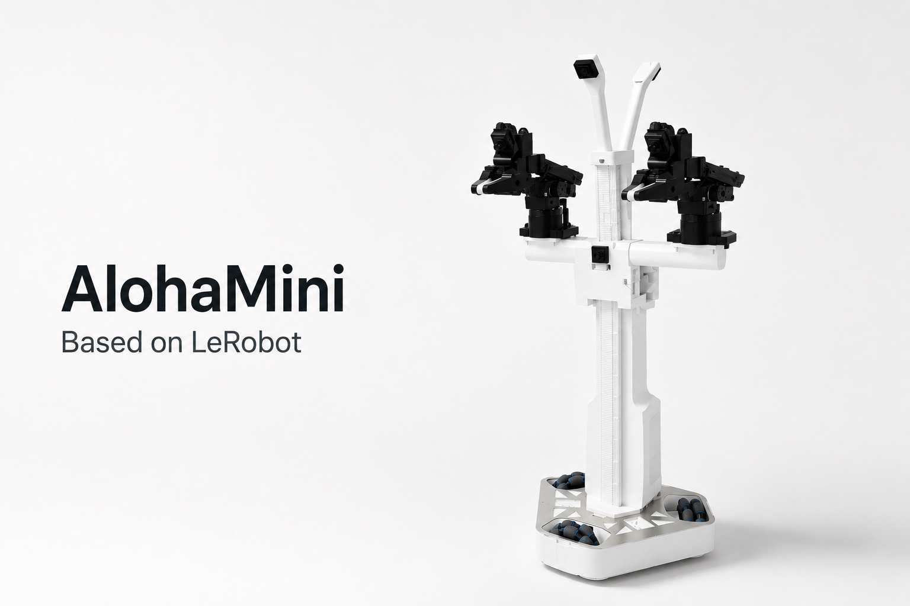

(yq-us0tnge3dszgxb69-u03b26aa4)=

(yq-us0tnge3dszgxb69-Bw801)=

### （二）课程简介

(yq-us0tnge3dszgxb69-u2a6505bb)=

AlohaMini 提供集机器人设备、配套课程、教学支持、赛事训练与企业研学于一体的完整具身智能教育解决方案，帮助学校开展从入门体验到进阶实践的教学。

(yq-us0tnge3dszgxb69-u432c4d7b)=

学生可以亲手组装和操作机器人，逐步学习如何通过动作示范、数据采集与模型训练，让机器人完成抓取、搬运等真实任务，在实践中理解人工智能、培养动手能力与团队协作能力。

(yq-us0tnge3dszgxb69-ubf1e82bf)=

(yq-us0tnge3dszgxb69-f21efcb0)=

### （三）相关资质与落地案例

(yq-us0tnge3dszgxb69-d4a37c07)=

#### 3.1 首届全国青少年人工智能大赛（白名单赛事）比赛用机

(yq-us0tnge3dszgxb69-4a07e73e)=

##### 赛事基本信息

(yq-us0tnge3dszgxb69-ud5e33ff5)=

2026.8.1-2026.8.3，首届全国青少年人工智能大赛决赛开幕式在上海黄浦滨江・里滩文化中心成功举办，本次大赛由中国福利会、中国妇女发展基金会主办，黄浦区人民政府联合主办，中国福利会少年宫承办，属于教育部白名单赛事。

(yq-us0tnge3dszgxb69-ud8fbb509)=

赛事结束后，目前已有多个上海学校确定采购AlohaMini，海南、湖北、湖南、河南、安徽、贵州、重庆、吉林等地均在推进设备采购与相关培训落地工作。

(yq-us0tnge3dszgxb69-u1a5a88a8)=

官网链接：[全国青少年人工智能大赛](https://aic.cwicp.cn/r/w?cmd=com.awspaas.user.apps.datamanager_html&appId=datamanager&html=echartHt&ext5=0&ext3=FONTEND20251223001_S_)

(yq-us0tnge3dszgxb69-u2ba46b6b)=

百度百科词条：https://baike.baidu.com/item/%E5%85%A8%E5%9B%BD%E9%9D%92%E5%B0%91%E5%B9%B4%E4%BA%BA%E5%B7%A5%E6%99%BA%E8%83%BD%E5%A4%A7%E8%B5%9B/67355476

| **项目** | **内容** |
| --- | --- |
| 主办单位 | 中国福利会、中国妇女发展基金会 |
| 联合主办 | 黄浦区人民政府 |
| 承办单位 | 中国福利会少年宫 |
| 赛事属性 | 教育部2025—2028学年白名单赛事、公益性竞赛、免报名费 |
| 首届全国决赛时间 | 2026年8月1日 |
| 全国决赛地点 | 上海黄浦滨江·里滩文化中心 |
| AlohaMini赛道 | 具身智能赛道 |
| 比赛形式 | 限时线下实操，完成动态机器人任务 |

(yq-us0tnge3dszgxb69-u15df136c)=

赛事材料可作为学生科技实践经历的证明之一；具体是否纳入综合素质评价及认定方式，以各地教育部门、学校当年度规定为准。

(yq-us0tnge3dszgxb69-uaa1effc2)=

❗如需深入了解赛事详情、参赛能力要求、初赛及决赛赛题、竞赛规则、奖项设置与晋级机制等内容，敬请阅读本文档[全国青少年人工智能大赛（赛事详情）](https://bcnz96us0h7n.feishu.cn/wiki/WDIGwA6C2iq1DnkLs9ycYyJUnnf?from=from_copylink)

(yq-us0tnge3dszgxb69-ueec980b7)=

(yq-us0tnge3dszgxb69-u18e2a404)=

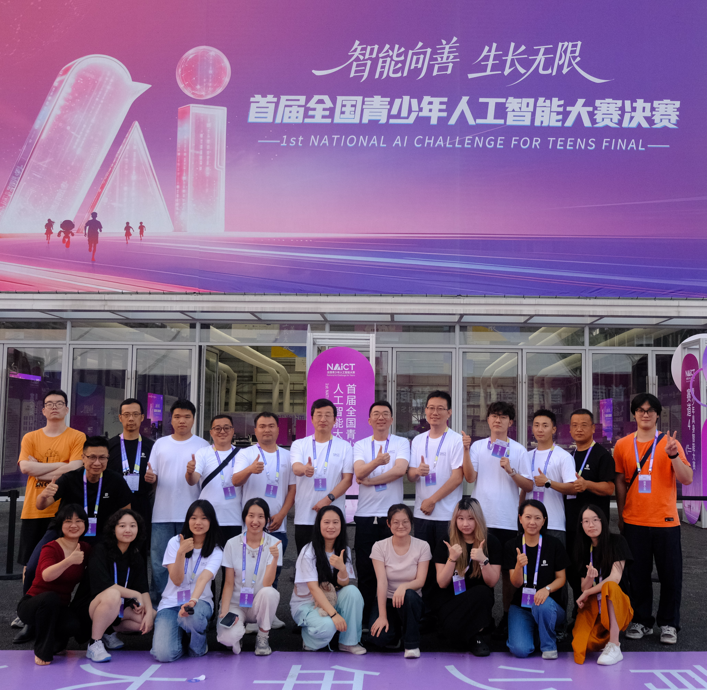

(yq-us0tnge3dszgxb69-1cbcb3a7)=

##### AlohaMini赛事应用情况

- 30台AlohaMini作为首届全国青少年人工智能大赛全国决赛具身智能赛道比赛用机，AlohaMini团队成员前往比赛现场提供官方技术支持。

- 在决赛“智慧商超”任务中，参赛学生使用AlohaMini完成现场具身智能任务挑战，即摇操与训练AlohaMini机器人避障走到超市货架前抓取物品并放至制定收银区域。

- AlohaMini已与赛事主办方签署为期三年的设备保修与服务保障协议。

- 主流媒体报道：

- 看看新闻：https://weixin.qq.com/sph/AIlVC9uIR4

- 魔都眼：https://weixin.qq.com/sph/A7tfR5yqZ2

- 相关图片与比赛视频：

(yq-us0tnge3dszgxb69-u330fefbc)=

(yq-us0tnge3dszgxb69-ue83b9ac5)=

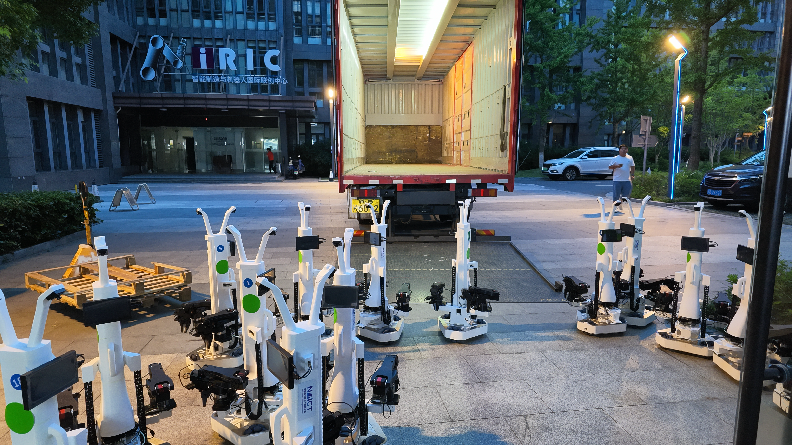

(yq-us0tnge3dszgxb69-ua5f73959)=

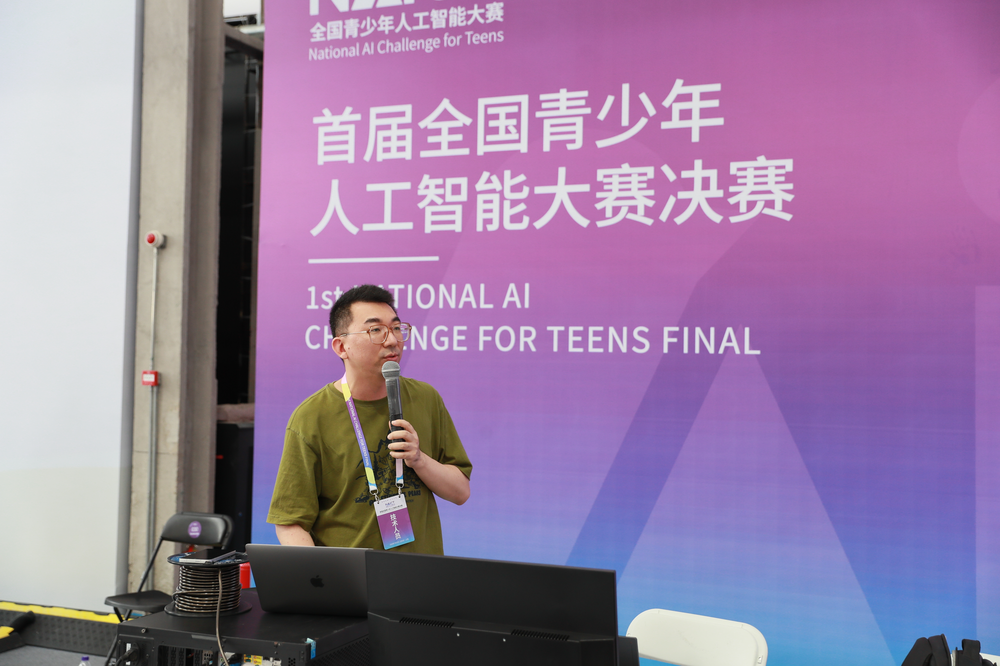

(yq-us0tnge3dszgxb69-u3600d83a)=

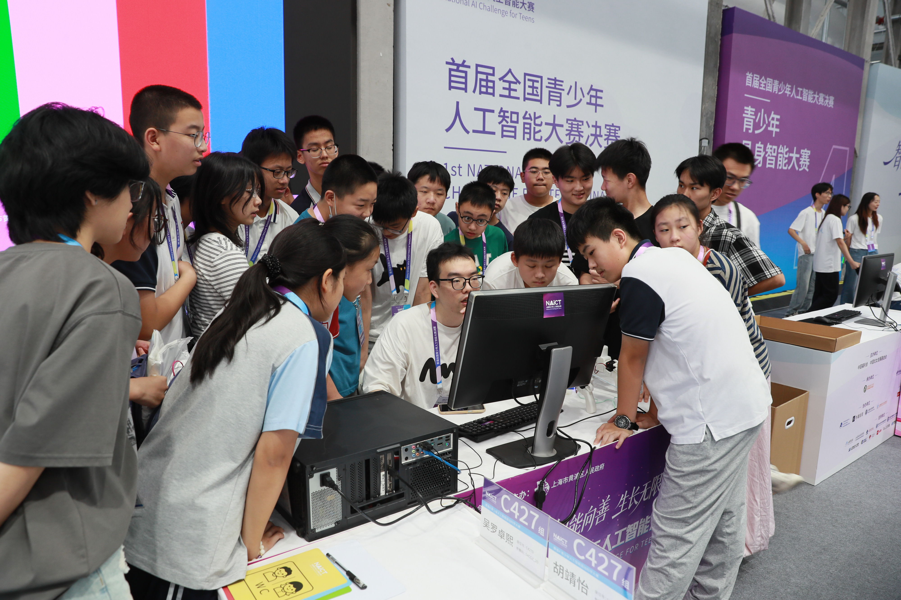

(yq-us0tnge3dszgxb69-ue2ad666b)=

(yq-us0tnge3dszgxb69-ufe507960)=


(yq-us0tnge3dszgxb69-u18e40224)=

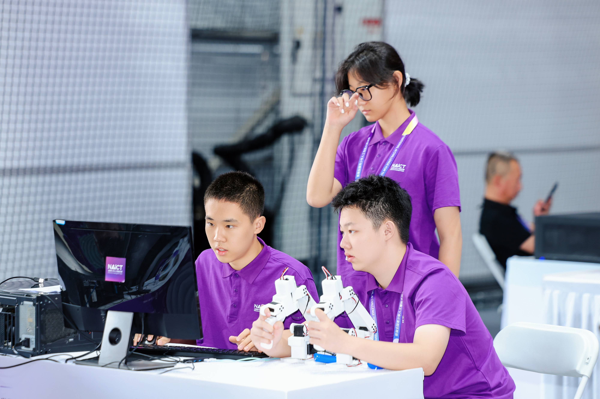

(yq-us0tnge3dszgxb69-uc49b220d)=

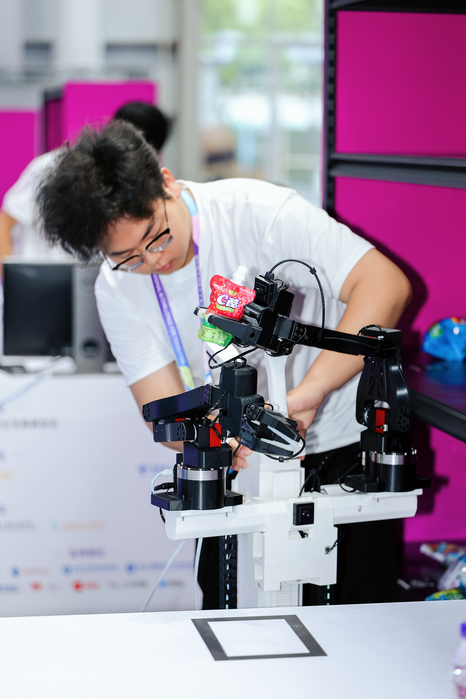

(yq-us0tnge3dszgxb69-aShbb)=

```{raw} html
<div class="am-video-embed"><iframe src="https://player.bilibili.com/player.html?bvid=BV1QbMQ6XEEL&amp;page=1&amp;autoplay=0" title="AlohaMini具身智能教育解决方案 · Bilibili 视频 BV1QbMQ6XEEL" loading="eager" allow="fullscreen; picture-in-picture" allowfullscreen referrerpolicy="strict-origin-when-cross-origin"></iframe></div>
```

[前往 Bilibili 观看 ↗](https://www.bilibili.com/video/BV1QbMQ6XEEL/)

(yq-us0tnge3dszgxb69-0c1349f0)=

##### 赛事晋级路径

1. **省级初赛：4—5月**

1. 由各省组织开展。

1. 原则上由学校统一报名，不接受学生个人直接报名。

1. 学生需以学校或相关组织为单位参与选拔和参赛。

1. **晋级全国决赛**

1. 初赛一等奖队伍获得全国决赛晋级资格。

1. 具身智能赛道中，初赛一等奖队伍前90%可获得全国决赛资格。

1. 组委会保留少量统筹名额，具体以当年度赛事通知为准。

1. **全国决赛：7—8月**

1. 在上海举行线下全国决赛。

1. 参赛队伍需在规定时间内完成现场机器人任务，并接受任务结果与现场表现评价。

(yq-us0tnge3dszgxb69-8d613984)=

##### 参赛组别与能力要求

| **组别** | **能力要求** | **课程培养重点** |
| --- | --- | --- |
| 初中组 | 具备基础Python认知、机器人传感器基础概念和基本操作能力即可进入 | 机器人结构、遥操作、任务拆解、基础编程 |
| 高中组 | 对编程、算法理解、系统集成和临场调试能力要求更高 | 任务策略、算法理解、系统调试、稳定性优化 |

(yq-us0tnge3dszgxb69-udd472d78)=

具身智能赛道是全国青少年人工智能大赛难度最高赛道之一。

(yq-us0tnge3dszgxb69-u63379481)=

它不以提交PPT或单纯完成项目答辩为核心，而是要求学生在真实机器人平台上限时完成现实任务，因此对任务理解、现场操作、团队协作和临场调试能力提出了更高要求。

(yq-us0tnge3dszgxb69-87e9414e)=

##### 与AlohaMini课程的衔接

(yq-us0tnge3dszgxb69-u30cb6652)=

AlohaMini课程可围绕具身智能赛道的核心能力进行长期培养：

- 春秋季、寒暑假等常规班完成具身智能知识认知与技术实践等，孩子可实际使用机器人复现决赛赛题。

- 初赛阶段强化赛题理解、机器人操作、任务稳定性和团队协作。

- 决赛阶段开展限时任务训练、现场调试和模拟比赛训练。

- 小学高年级学生以兴趣启蒙和能力储备为主，进入初中后可自然衔接赛事课程。

(yq-us0tnge3dszgxb69-uf7818ba5)=

(yq-us0tnge3dszgxb69-ce121a95)=

#### 3.2 中小学乡村教育

(yq-us0tnge3dszgxb69-ueb362b7d)=

公众号推文：https://mp.weixin.qq.com/s/qFJlmK-urRpj9i8Tm1JKQg

(yq-us0tnge3dszgxb69-228532e5)=

##### 江苏省宝应县望直港AI创想营

(yq-us0tnge3dszgxb69-u76e98177)=

由省级有关部门主办的“乡村学生暑期AI创想营”在宝应县望直港镇中心小学、望直港镇中心初级中学开展。

(yq-us0tnge3dszgxb69-u47881cce)=

课程跳出传统理论讲授模式，将更多时间交给观察、互动与实践。

(yq-us0tnge3dszgxb69-u54ec6387)=

学生亲手操作AlohaMini，观察机器人如何接收指令、感知环境并完成具体任务，理解人工智能不仅存在于电脑和手机中，也可以拥有“身体”，进入真实世界并与环境互动。

(yq-us0tnge3dszgxb69-u53221fb0)=

(yq-us0tnge3dszgxb69-u79de012a)=

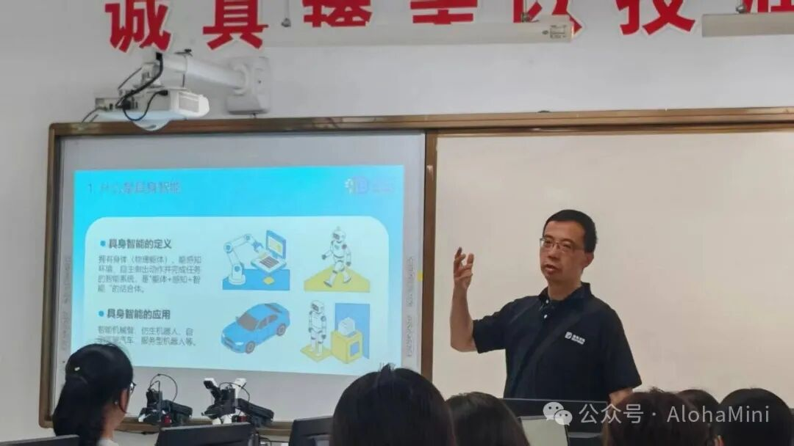

(yq-us0tnge3dszgxb69-u5aac8be7)=

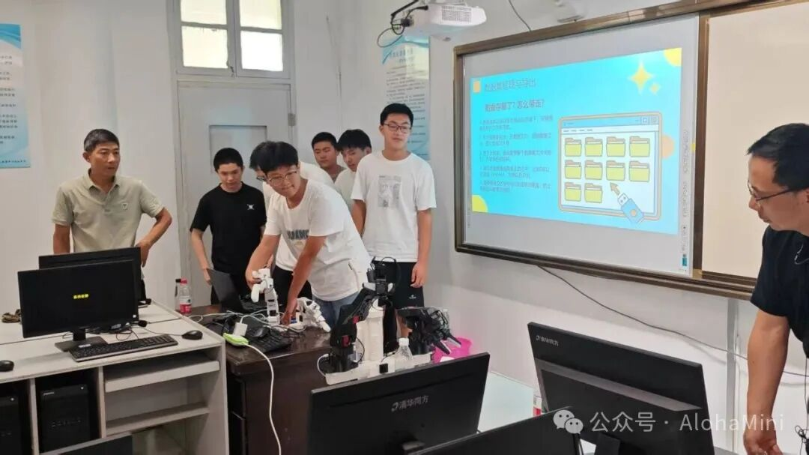

(yq-us0tnge3dszgxb69-cadaff27)=

##### 江苏省金湖县银涂镇具身智能体验课程

(yq-us0tnge3dszgxb69-u2f96d32f)=

金湖县银涂镇中心小学、银涂镇中心初级中学陆续开设具身智能体验课程。

(yq-us0tnge3dszgxb69-u3fef9543)=

AlohaMini走进中小学课堂，帮助学生认识机器人如何“看见”环境、理解指令，并将算法转化为真实行动。在任务挑战和互动体验中，学生建立对人工智能和机器人技术的直观理解。

(yq-us0tnge3dszgxb69-u18dfa202)=

(yq-us0tnge3dszgxb69-ue1e58765)=

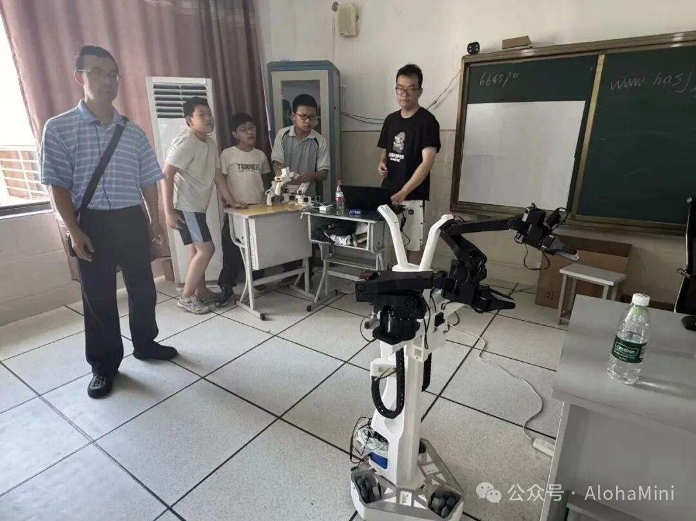

(yq-us0tnge3dszgxb69-u0b8d9665)=

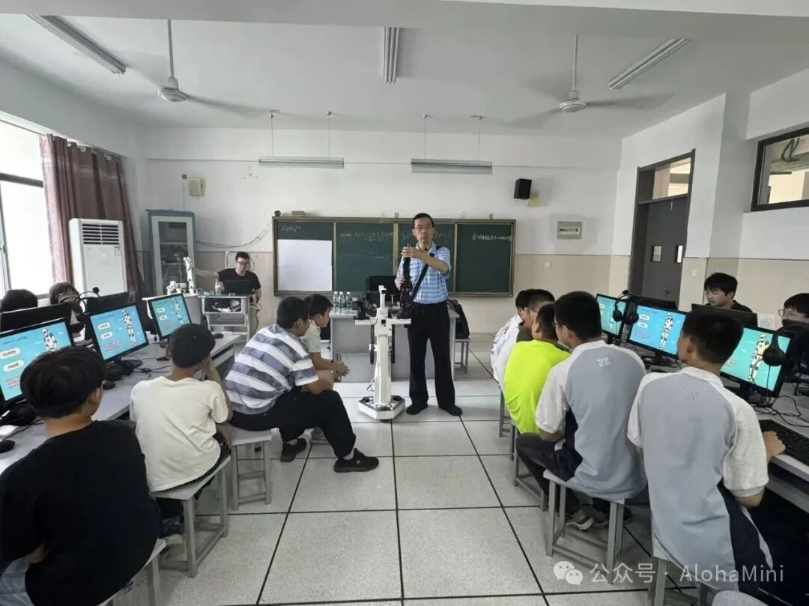

(yq-us0tnge3dszgxb69-ua9ca4ac6)=

(yq-us0tnge3dszgxb69-9823d9d1)=

#### 3.3 北京陈经纶中学社团课程

(yq-us0tnge3dszgxb69-ue4ed2149)=

AlohaMini 现已与北京市陈经纶中学（北京市重点高中、朝阳区老牌名校）达成课程合作。

(yq-us0tnge3dszgxb69-u5d8bdcd6)=

自 2026 年 9 月 18 日起，**每周五开设具身智能特色社团课**。

(yq-us0tnge3dszgxb69-ue2251206)=

课程配套完整课程纲要与专属教师，形成标准化落地体系。课堂将带领高中生走完完整实践链路：从具身智能理论基础入门，到机器人实物组装、手动遥操作调试，再到实操数据采集、AI 模型训练，打通具身智能 “理论‑硬件‑数据‑大模型” 全流程学习闭环，让学生沉浸式体验人形机器人技术的完整开发链路。

(yq-us0tnge3dszgxb69-u5f2b82d4)=

北京市陈经纶中学官网：[北京市陈经纶中学](http://www.bjcjl.net/)

(yq-us0tnge3dszgxb69-u283a16ff)=

(yq-us0tnge3dszgxb69-u626e358b)=

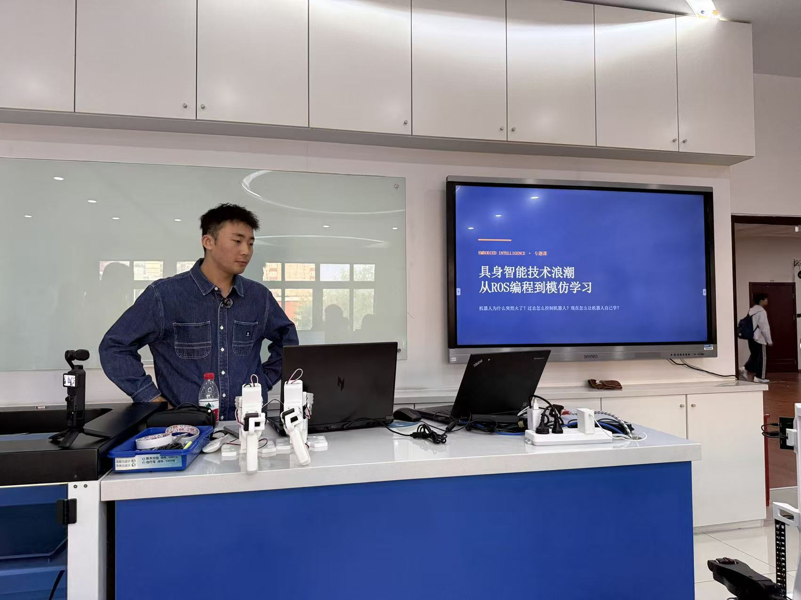

(yq-us0tnge3dszgxb69-u92bc8e92)=

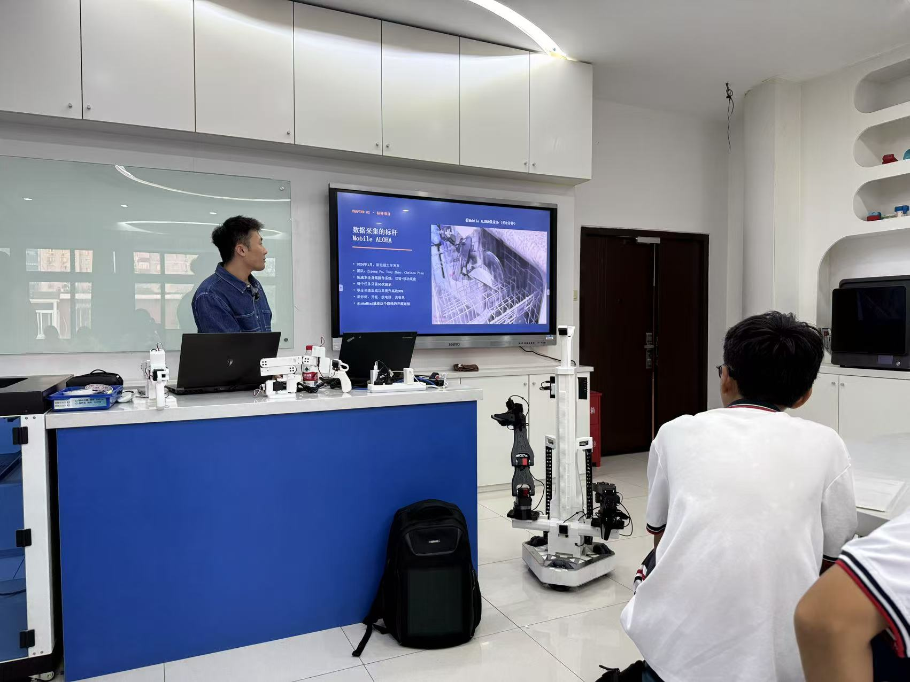

(yq-us0tnge3dszgxb69-u67599ac7)=

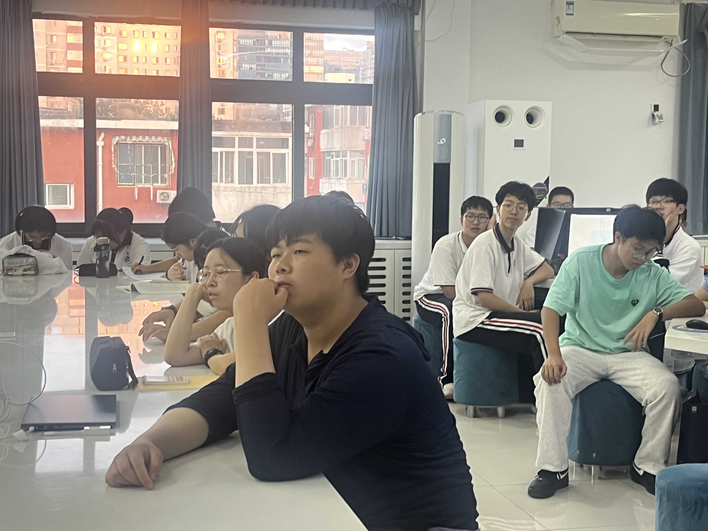

(yq-us0tnge3dszgxb69-u0e30dc47)=

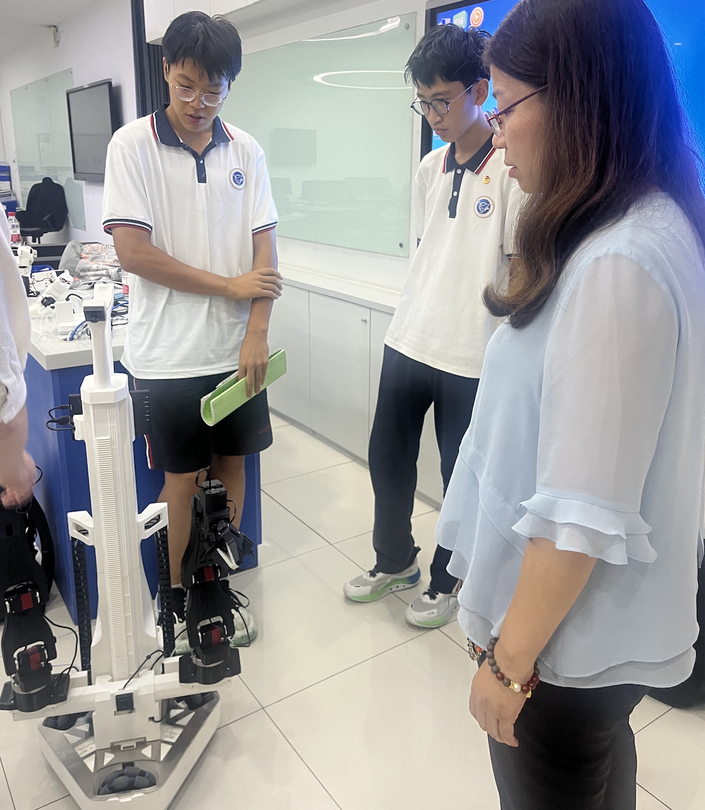

(yq-us0tnge3dszgxb69-ufb52921e)=

(yq-us0tnge3dszgxb69-9c498aa6)=

#### 3.4 高校与科研合作

(yq-us0tnge3dszgxb69-udd53b4e1)=

AlohaMini已进入多所国内外知名高校与科研院所，助力具身智能前沿研究与相关教学项目实践。

(yq-us0tnge3dszgxb69-u570e7767)=

合作客户：北京航空航天大学、同济大学、南京大学、伦敦大学学院（UCL）、韩国工学大学（Tech University of Korea）、商汤科技、Intel India等

(yq-us0tnge3dszgxb69-ud97c7a80)=

(yq-us0tnge3dszgxb69-ude64811d)=

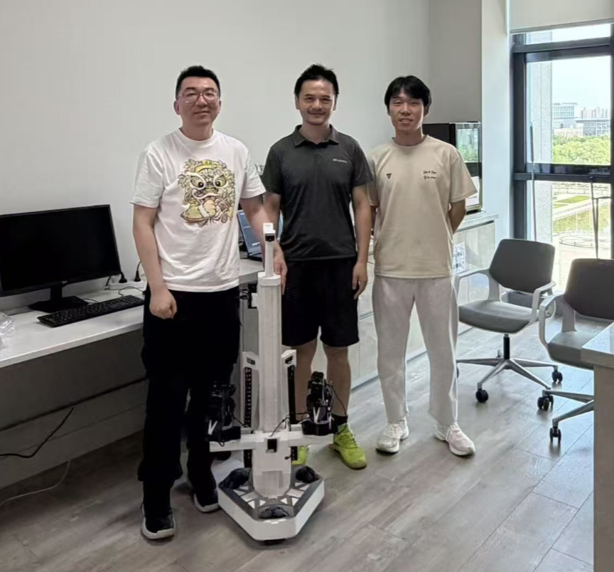

(yq-us0tnge3dszgxb69-u41a5b645)=

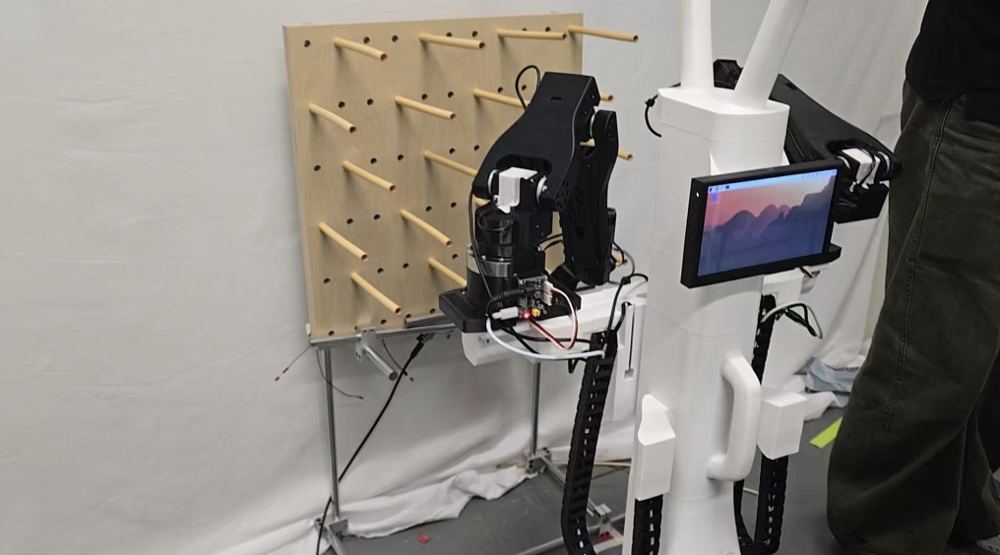

(yq-us0tnge3dszgxb69-ueeb6f18a)=

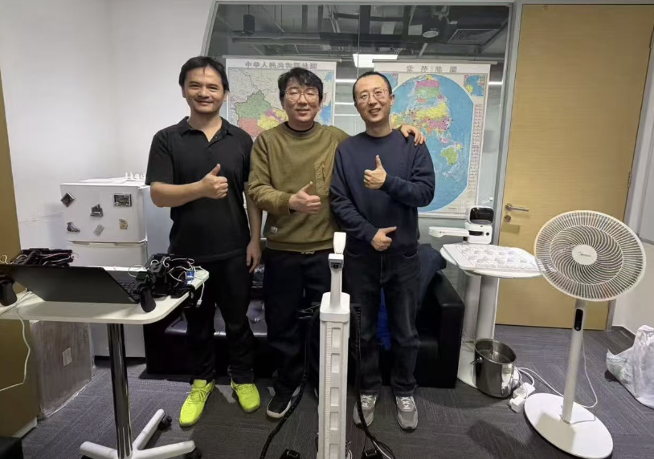

(yq-us0tnge3dszgxb69-u221359a4)=

---

(yq-us0tnge3dszgxb69-0d871f15)=

## 二、核心优势

(yq-us0tnge3dszgxb69-ce457c0b)=

### 前沿：复现前沿算法

(yq-us0tnge3dszgxb69-u8ac50419)=

课程围绕具身智能领域的重要技术路线——模仿学习展开。学生不只学习传统的规则编程或遥控操作，还将理解机器人如何通过人类示范、数据采集和模型学习，逐步获得完成任务的能力。

- 认识机器人结构、传感器、执行器和控制系统。

- 使用Leader臂完成遥操作任务。

- 了解遥操作示范如何转化为图像、机器人状态和动作数据。

- 学习判断数据质量，理解数据对模型效果的影响。

- 理解模型学习与机器人自主执行之间的关系。

- 在进阶课程中体验“人类示范—数据采集—模型学习—自主执行”的完整技术路径。

(yq-us0tnge3dszgxb69-ac4f415d)=

### 普惠：万元级价格

(yq-us0tnge3dszgxb69-u59ca96ea)=

AlohaMini将传统双臂机器人动辄数十万元的设备投入，降低至更适合教育场景的万元级梯度。基于斯坦福大学ALOHA开源技术路线，学生能够以可控成本接触移动双臂机器人、遥操作和具身智能任务实践。

(yq-us0tnge3dszgxb69-u283a2c27)=

(yq-us0tnge3dszgxb69-u71f5919b)=

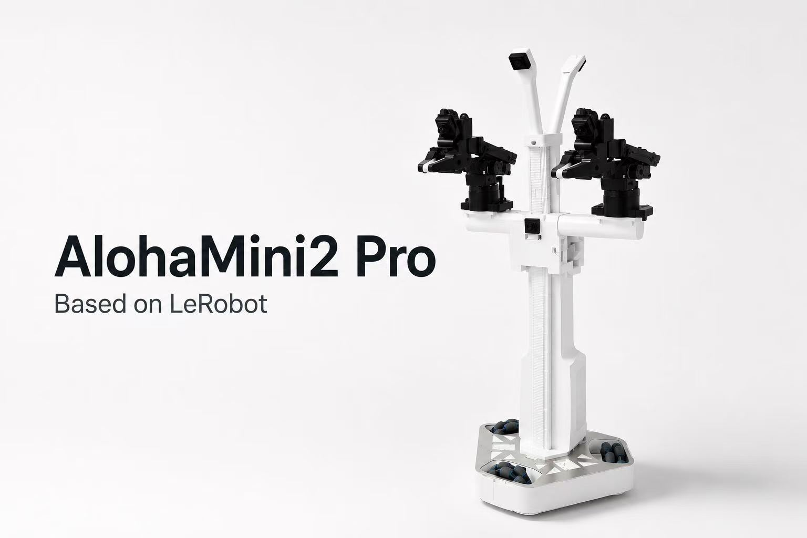

(yq-us0tnge3dszgxb69-1856114f)=

### 开放：软硬件全开源

(yq-us0tnge3dszgxb69-u9b74c6a0)=

AlohaMini2软硬件资料均在GitHub开源，具备进一步开发和二次创新的基础。

(yq-us0tnge3dszgxb69-ua66d75f5)=

基础学生可以完成标准化机器人任务；进阶学生可在教师指导下学习阅读代码、调整任务参数、改造任务流程，并尝试让机器人适应新的场景和需求。课程不止服务一次体验，也能支撑持续的项目开发和赛事训练。

(yq-us0tnge3dszgxb69-352b94c2)=

### 安全：低扭矩关节+两级堵转保护

(yq-us0tnge3dszgxb69-u3352e289)=

相较于部分体量大、关节扭矩高、运动速度快的人形机器人，AlohaMini更适合在教育场景中开展近距离观察、操作和项目教学。

(yq-us0tnge3dszgxb69-u284ecc7d)=

大型人形机器人通常需要更严格的隔离空间、操作权限和专业人员监护；

(yq-us0tnge3dszgxb69-ue0189122)=

AlohaMini则以低扭矩执行器和两级堵转保护为设计重点，更便于学生在教师指导下参与。

- 采用低扭矩执行器设计，降低课堂操作中的机械碰撞风险。

- 配备两级关节堵转保护：夹爪电流超过500mA时自动卸除夹持力；其他机械臂关节电流达到1800mA时停止力矩输出，降低夹持、堵转和设备过载风险。

- 课程配备固定安全规范，包括工作区边界管理、课前设备检查、启动与复位流程、异常停止要求及教师全程监护

- 学生以2—4人小组协作方式操作，一人控制、多人观察与安全监督，兼顾学习参与度与课堂安全。

---

(yq-us0tnge3dszgxb69-c6944f30)=

## 三、课程详情

(yq-us0tnge3dszgxb69-u0e777a06)=

本课程围绕通过**梯度化****分层教学****、官方赛事专项赋能、一线企业研学**相结合的模式，循序渐进夯实学生具身智能专业知识与实操能力，全方位锤炼综合科创素养，为学生搭建从入门进阶、赛事冲刺到产业认知的一站式科创成长通道。

(yq-us0tnge3dszgxb69-08fd9b2c)=

### 分层教学体系

(yq-us0tnge3dszgxb69-u24338717)=

针对零基础入门学生、能力进阶学生、拔尖赛事学生设置梯度化课程内容，兼顾普及性教学与精英化赛事培养，精准匹配不同阶段学生的能力水平，实现循序渐进提升。

- **基础层（零基础入门）**：聚焦具身智能基础认知，系统学习机器人结构原理、操作安全规范，掌握Leader机械臂组装、遥操作控制等基础实操技能，搭建学科知识与实操能力的基础框架。

- **提升层（能力进阶）**：侧重综合能力打磨，深耕机器人任务设计、数据采集、数据质量甄别等核心内容，同步培养学生项目梳理、成果展示、逻辑表达的综合素养。

- **进阶层（赛事拔高）**：对接行业前沿的算法与具身智能技术体系，聚焦全国青少年人工智能大赛（白名单赛事）具身智能赛道进行专项训练，针对性开展赛事任务优化，全力冲刺高水平赛事成果。

(yq-us0tnge3dszgxb69-u60f51bcd)=

同时建立常态化升学衔接机制，春秋季常规班学员可通过层层选拔，顺利衔接选拔班、初赛训练、复赛及决赛集训，形成闭环式人才培养通道。

(yq-us0tnge3dszgxb69-d0ccc545)=

### 白名单赛事衔接

(yq-us0tnge3dszgxb69-u2c122ab1)=

AlohaMini机器人为**首届全国青少年人工智能大赛具身智能赛道官方决赛指定设备**。课程严格贴合当年度官方赛事规则，定制开发初赛、决赛专项备赛课程与集训体系。

(yq-us0tnge3dszgxb69-u5d30121a)=

区别于单一的应试备赛，课程核心目标是依托赛事场景，系统锤炼学生机器人实操、任务拆解、逻辑思维、团队协作、临场应变能力等，以赛促学、以赛促练，为学生斩获赛事荣誉、构建核心竞争力筑牢坚实基础。

(yq-us0tnge3dszgxb69-ue6fa8bd2)=

(yq-us0tnge3dszgxb69-u914bbd36)=

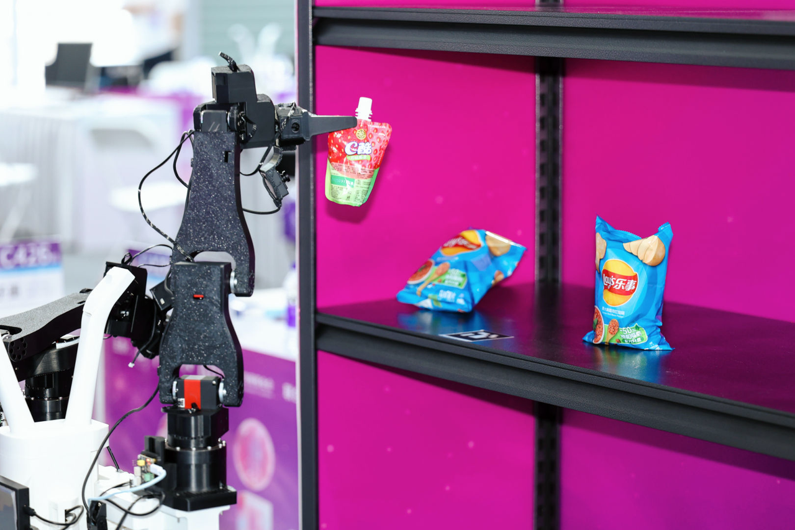

(yq-us0tnge3dszgxb69-214218b9)=

### 企业参访

(yq-us0tnge3dszgxb69-u23805bce)=

组织学生走进跨维智心机器人研发企业，沉浸式了解机器人从研发设计、装配、系统调试到场景落地应用的全流程。学生可近距离观看机器人实景任务演示，与一线研发工程师面对面交流学习，直观感受人工智能与具身智能产业的前沿技术、应用场景与行业发展趋势，拓宽科技视野、树立专业认知。

(yq-us0tnge3dszgxb69-u1d06d8e7)=

(yq-us0tnge3dszgxb69-u478f55de)=

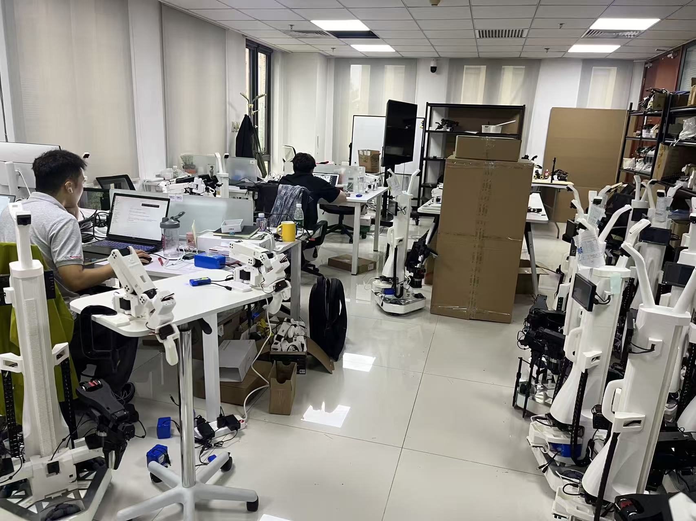

(yq-us0tnge3dszgxb69-u4fcb2b88)=

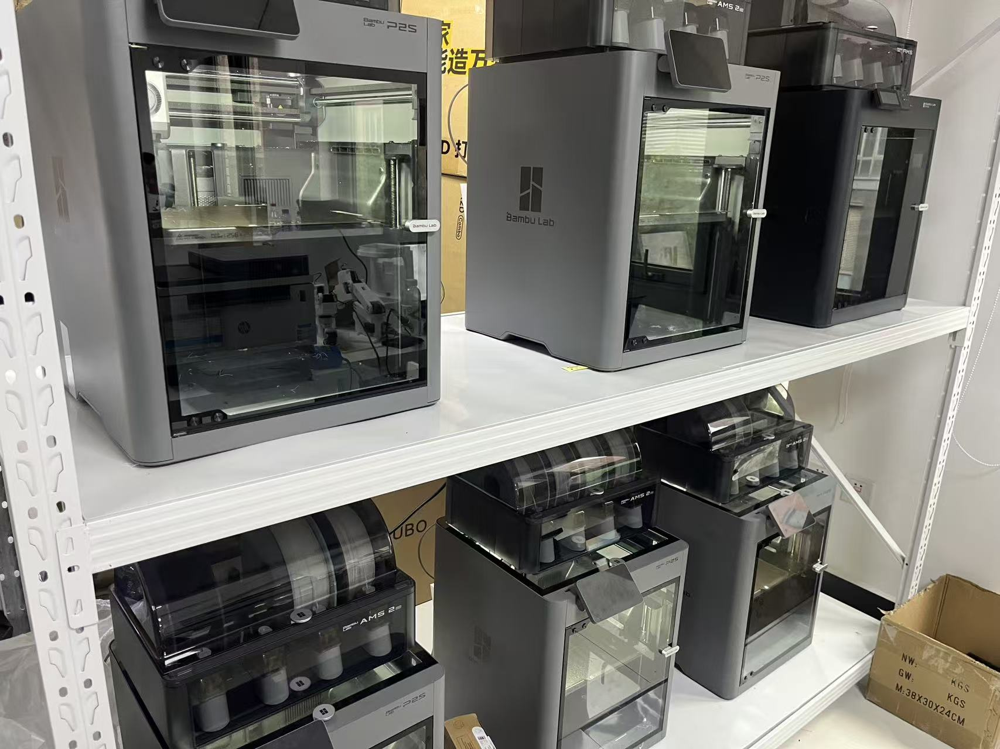

(yq-us0tnge3dszgxb69-uec7e7e61)=

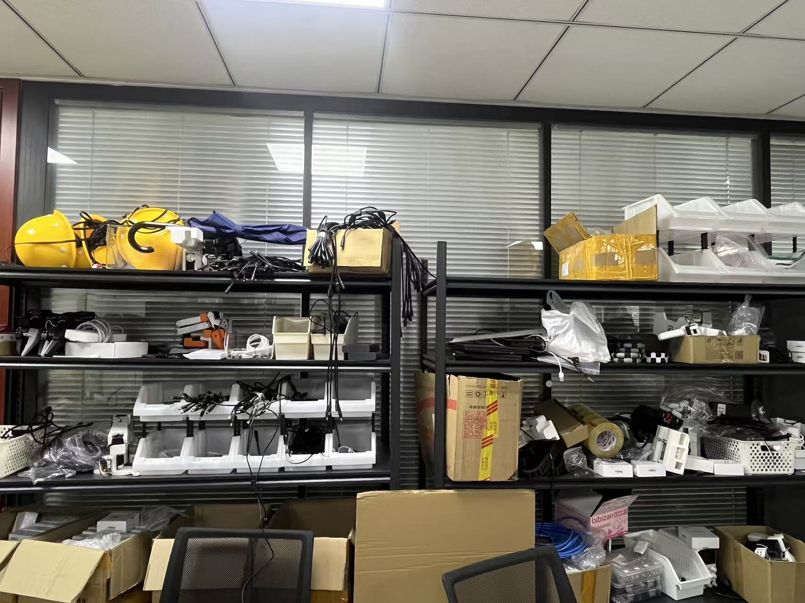

---

(yq-us0tnge3dszgxb69-tyBKV)=

### 课程样例

(yq-us0tnge3dszgxb69-AqWRx)=

#### （1）春秋季常规课程

(yq-us0tnge3dszgxb69-sKB0D)=

##### 1、课程介绍

- **AlohaMini具身智能兴趣课程**

(yq-us0tnge3dszgxb69-u0974db03)=

依托AlohaMini移动双臂机器人，开设为期16课时的春秋季常态化具身智能课程。课程每周1课时、每课时60分钟，零基础学生也可参与学习。

(yq-us0tnge3dszgxb69-uddaa8e11)=

课程从机器人行业认知、AlohaMini结构与安全规范出发，逐步开展Leader臂组装、遥操作、任务挑战、数据采集、数据质量判断和模仿学习科普。学生将在真实机器人平台上理解“人类示范—数据采集—模型学习—机器人自主执行”的具身智能技术闭环，并完成小组项目设计与成果展示。

(yq-us0tnge3dszgxb69-u62f09ccb)=

与传统机器人课程侧重积木搭建、固定编程或简单遥控不同，本课程让学生接触真实移动双臂机器人、真实任务与真实数据，建立对当前具身智能技术的直观认识和工程实践能力。

- **零基础可学**

(yq-us0tnge3dszgxb69-uf586b23d)=

课程采用2—4人小组协作模式，每名学生轮流承担操作、组装、安全、记录、讲解等角色。

- 零基础学生可从机器人认知、结构观察、基础组装和遥操作任务开始，逐步建立兴趣与操作信心。

- 具备赛事潜力的学生可进入后续选拔与专项训练，强化任务拆解、操作稳定性、团队协作和现场展示能力。

- **衔接全国青少年人工智能大赛**

(yq-us0tnge3dszgxb69-ucb087bb0)=

AlohaMini已作为首届全国青少年人工智能大赛具身智能赛道决赛用机。春秋季课程围绕该类赛事所需的核心能力进行基础培养，包括机器人结构认知、遥操作控制、真实任务执行、数据理解、项目设计和团队展示。

(yq-us0tnge3dszgxb69-uc58e16e3)=

课程结束后，可根据学生的操作能力、项目表现、协作能力和表达能力进行选拔，进入初赛专项训练。初赛课程将依据当年度官方赛题与规则，重点开展任务理解、限时操作、现场调试、项目展示和模拟比赛训练。

(yq-us0tnge3dszgxb69-ude159dea)=

其中，小学高年级学生以具身智能启蒙、工程实践和能力储备为主；初高中学生可进一步衔接赛事选拔与备赛训练，形成从兴趣培养到赛事进阶的连续路径。

- **课程成果**

(yq-us0tnge3dszgxb69-udc7a5c75)=

完成春秋季课程后，每个小组将形成：

- 一个可现场演示的AlohaMini机器人任务。

- 一份任务流程图或项目方案。

- 一段机器人任务展示视频。

- 一次小组成果讲解或答辩展示。

(yq-us0tnge3dszgxb69-uc59a8358)=

学生将在真实项目中获得机器人操作、工程思维、科学探究、团队协作与人工智能素养的综合提升，也为后续参与具身智能赛事和科技实践活动打下基础。

(yq-us0tnge3dszgxb69-TZFVo)=

##### 2、教案大纲

(yq-us0tnge3dszgxb69-uaa3cc647)=

[春秋季｜AlohaMini具身智能兴趣班（16课时/1小时/周）](https://bcnz96us0h7n.feishu.cn/wiki/FcefwhmDhizGeXkEN8BcUhzUnZe?from=from_copylink)

---

(yq-us0tnge3dszgxb69-IFpP6)=

#### （2）初赛培训｜全国青少年人工智能大赛

(yq-us0tnge3dszgxb69-cbRH5)=

##### 1、课程介绍

- **课程简介**

(yq-us0tnge3dszgxb69-u6fe7deca)=

本课程面向拟参加全国青少年人工智能大赛具身智能赛道的初中高中学生，以及完成AlohaMini春秋季基础课程、具备基础操作能力的学生。课程以真实赛事任务为导向，依托AlohaMini移动双臂机器人，帮助学生从“会操作机器人”进阶到“能够围绕赛题完成机器人项目”。

(yq-us0tnge3dszgxb69-u639dfae2)=

通过分层训练和小组协作，学生将逐步掌握硬件实操、遥操作示教、ROS通信与基础编程、数据采集、AI模型训练及项目开发等能力，为初赛任务、项目展示和后续复赛集训打下基础。

- **课程学习路径**

(yq-us0tnge3dszgxb69-u84ae248b)=

认知安全 → 硬件实操 → 遥操作示教 → 代码控制 → 数据采集 → AI训练 → 迭代优化 → 创意落地

1. 机器人初识与安全规范

1. 遥操作与示教任务训练

1. ROS技能学习

1. 数据采集与AI模型训练

1. 赛事项目开发与初赛模拟

- **课程成果**

(yq-us0tnge3dszgxb69-u5f643397)=

完成初赛备赛课程后，每支队伍将形成：

- 一套与目标赛项匹配的机器人任务方案。

- 一个可重复演示的AlohaMini任务项目。

- 一份任务流程图、程序文件或数据记录。

- 一段项目演示视频。

- 一份模拟初赛成绩与优化记录。

(yq-us0tnge3dszgxb69-u3c715593)=

课程将依据当年度官方赛题、报名要求和评分规则动态调整，重点提升学生的真实操作能力、工程实践能力、团队协作能力和临场调试能力，为参与初赛及后续赛事进阶做好准备。

(yq-us0tnge3dszgxb69-agAd6)=

##### 2、教案大纲

(yq-us0tnge3dszgxb69-uc45f3517)=

[初赛｜全国青少年人工智能大赛备赛教案](https://bcnz96us0h7n.feishu.cn/wiki/PNRPw9MbJiaa14kNdVJcVvjLn5g?from=from_copylink)

---

(yq-us0tnge3dszgxb69-m7bIz)=

## 四、交付清单

(yq-us0tnge3dszgxb69-u39a6402d)=

开设课程后，可获得以下支持：

- 标准化课程体系、教案与授课流程

- 教学PPT、任务单、评价表、学生手册和安全规范

- AlohaMini设备、配件、软件环境及课前调试

- 学生成果展示方案及视频拍摄建议

- 赛事信息跟踪和集训支持

- 企业研学活动方案及工程师交流资源
