# AlohaMini2 Pro 快速入门指南（极简）

[官方使用手册](../official-manual.md) · [语雀来源](https://alohamini.yuque.com/lq44as/tiv9xs/nyk0n5c9brbh2l4a) · 2026-09-28 整理

```{note}
本页适用于 2 Pro。已修正原文遥操作命令误填的 `alohamini2`，以及双臂校准命令缺少续行符的问题。原文的 `head_top` 相机命名与本次 GitHub 版本的 `forward` 不同；采集、数据转换和推理必须采用同一套实际特征名。AM-ACT 参数是特定采集任务示例，详见 [训练说明](../training.md)。示例 IP、设备序列号和检查点路径需要替换。出厂密码仅适用于对应交付镜像，以实际交付信息为准。
```

(yq-nyk0n5c9brbh2l4a-v7ZpE)=

## 一、启动机器人（树莓派端）

(yq-nyk0n5c9brbh2l4a-u9c64f6dd)=

1、给机器人通电，点击屏幕，查找树莓派ip地址

(yq-nyk0n5c9brbh2l4a-u905dbc62)=

(yq-nyk0n5c9brbh2l4a-u97813f26)=

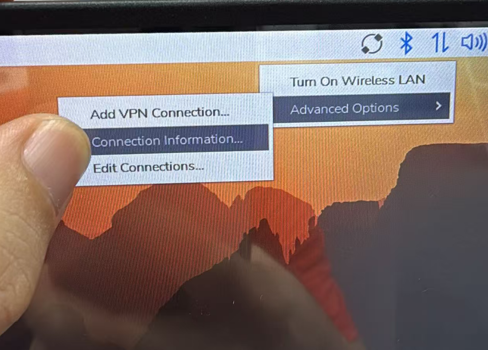

(yq-nyk0n5c9brbh2l4a-ub4b758b9)=

(yq-nyk0n5c9brbh2l4a-u167cec8b)=

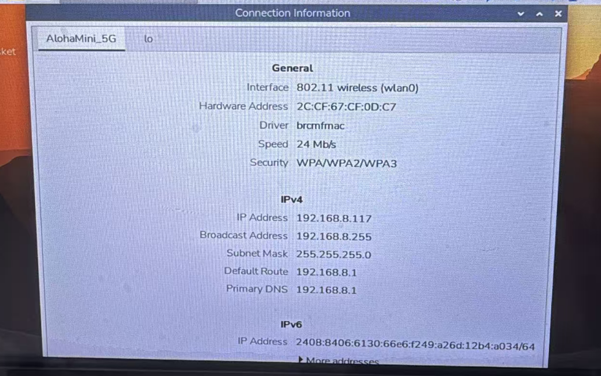

(yq-nyk0n5c9brbh2l4a-ua764b270)=

2、打开PC电脑的Terminal，运行SSH登录机器人（ssh密码：123456）：

(yq-nyk0n5c9brbh2l4a-u2e6cf64d)=

(yq-nyk0n5c9brbh2l4a-u631caf59)=

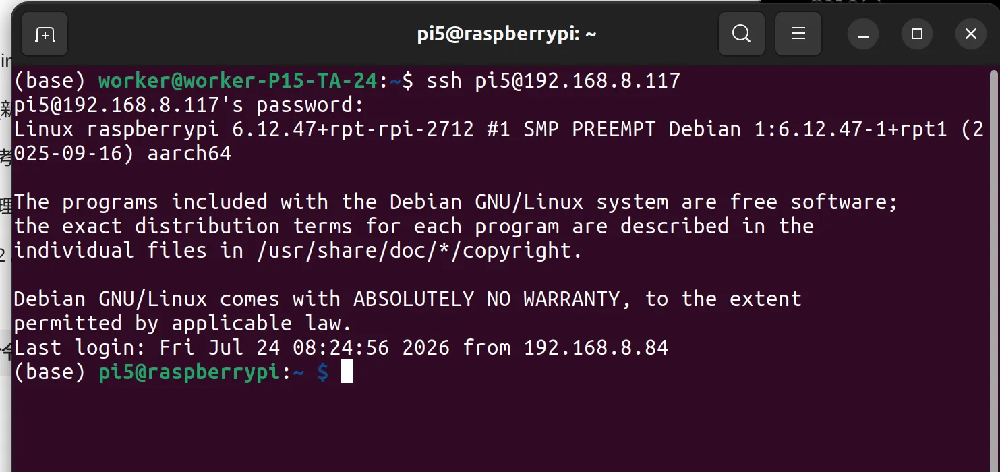

(yq-nyk0n5c9brbh2l4a-u49d53336)=

(yq-nyk0n5c9brbh2l4a-u708219e2)=

通过 SSH 登录机器人：

```bash
ssh pi5@192.168.xx.xx # 替换为机器人树莓派的IP 
# 密码123456
```

(yq-nyk0n5c9brbh2l4a-ucd4641b0)=

进入conda环境并启动主程序：

```bash
conda activate lerobot_alohamini
cd lerobot_alohamini

# AlohaMini 2 Pro (AM‑ARM 6‑DoF, sts3250 upgrade)
python -m lerobot.robots.alohamini.alohamini_host \
  --robot_model alohamini2pro
```

(yq-nyk0n5c9brbh2l4a-ufcd21544)=

程序启动后，由于设备在出厂时已完成校准，因此会自动跳过校准流程，直接进入启动状态，并开始输出各关节电流信息。

(yq-nyk0n5c9brbh2l4a-ua99f272a)=

(yq-nyk0n5c9brbh2l4a-u5jDr)=

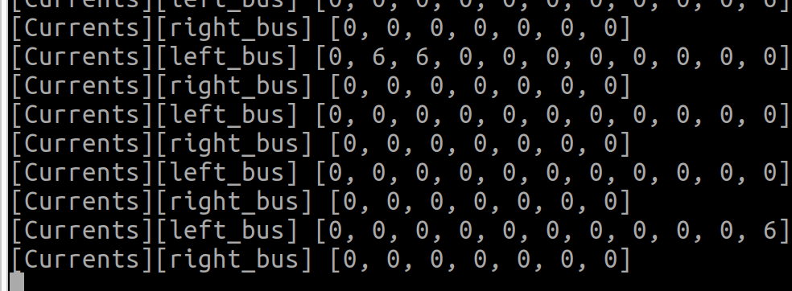

(yq-nyk0n5c9brbh2l4a-ua56e8aa5)=

至此，机器人本体启动完成。

(yq-nyk0n5c9brbh2l4a-41ac6baa)=

## 二、启动遥操作（PC端）

(yq-nyk0n5c9brbh2l4a-u518928bb)=

建议准备一台Ubuntu22.04或24.04系统，并根据 [lerobot_alohamini](https://github.com/liyiteng/lerobot_alohamini) 仓库完成环境安装（conda + 依赖）。

(yq-nyk0n5c9brbh2l4a-iEOpp)=

### 环境安装：

(yq-nyk0n5c9brbh2l4a-lqC4y)=

### 安装Conda

```bash
mkdir -p ~/miniconda3
wget https://repo.anaconda.com/miniconda/Miniconda3-latest-Linux-x86_64.sh -O ~/miniconda3/miniconda.sh
bash ~/miniconda3/miniconda.sh -b -u -p ~/miniconda3
rm ~/miniconda3/miniconda.sh
~/miniconda3/bin/conda init bash
source ~/.bashrc
```

(yq-nyk0n5c9brbh2l4a-u9b48eafd)=

(yq-nyk0n5c9brbh2l4a-ZlAFR)=

### 克隆仓库并安装依赖

```bash
git clone https://github.com/liyiteng/lerobot_alohamini.git
cd lerobot_alohamini
conda create -y -n lerobot_alohamini python=3.12
conda activate lerobot_alohamini
pip install -e ".[all]"
pip install pyzmq feetech-servo-sdk
conda install -y ffmpeg=7.1.1 -c conda-forge
```

(yq-nyk0n5c9brbh2l4a-hIwco)=

### 端口授权

```bash
sudo usermod -a -G dialout $USER
# 完成后重启电脑
```

(yq-nyk0n5c9brbh2l4a-rcacZ)=

### 1、遥操臂端口查询

(yq-nyk0n5c9brbh2l4a-uae015e37)=

a）随机挑选一只遥操臂，并用马克笔标记为左臂

b) 将左臂连接到Ubuntu电脑，输入命令

```bash
ls /dev/ttyACM*
```

(yq-nyk0n5c9brbh2l4a-ub4420c97)=

预期输出：

(yq-nyk0n5c9brbh2l4a-u55308026)=

(yq-nyk0n5c9brbh2l4a-u99f9e6c6)=

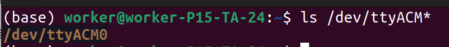

(yq-nyk0n5c9brbh2l4a-u653fa7aa)=

(yq-nyk0n5c9brbh2l4a-uc9501633)=

c)查找左臂驱动板的序列号

```text
udevadm info --attribute-walk --name=/dev/ttyACM0 | awk -F'"' '/ATTRS{serial}/{print $2; exit}'
```

(yq-nyk0n5c9brbh2l4a-u99353a77)=

预期输出：

(yq-nyk0n5c9brbh2l4a-ufb2ae0fd)=

(yq-nyk0n5c9brbh2l4a-u1fc138ef)=

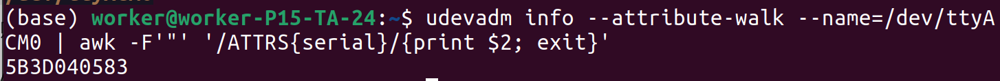

(yq-nyk0n5c9brbh2l4a-u6790971d)=

其中，5B3D040583就是左臂序列号。

(yq-nyk0n5c9brbh2l4a-ua9f1ae66)=

(yq-nyk0n5c9brbh2l4a-u59107e7a)=

d) 用马克笔标记另一只遥操臂为右臂

(yq-nyk0n5c9brbh2l4a-u6531df06)=

(yq-nyk0n5c9brbh2l4a-u5e5c7f45)=

e) 将右臂连接到Ubuntu电脑，输入命令

```bash
ls /dev/ttyACM*
```

(yq-nyk0n5c9brbh2l4a-u6691eaf9)=

预期输出：

(yq-nyk0n5c9brbh2l4a-u17b88aa7)=

(yq-nyk0n5c9brbh2l4a-u11625bba)=

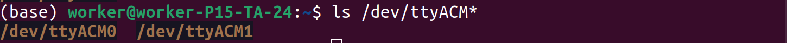

(yq-nyk0n5c9brbh2l4a-u43f608d4)=

(yq-nyk0n5c9brbh2l4a-u61a8e900)=

f)查找右臂驱动板的序列号

```bash
udevadm info --attribute-walk --name=/dev/ttyACM1 | awk -F'"' '/ATTRS{serial}/{print $2; exit}'
```

(yq-nyk0n5c9brbh2l4a-u69928c9d)=

预期输出：

(yq-nyk0n5c9brbh2l4a-u4f1a8584)=

(yq-nyk0n5c9brbh2l4a-u104a7a1a)=

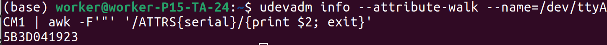

(yq-nyk0n5c9brbh2l4a-uec433d06)=

其中，5B3D041923就是右臂序列号。

(yq-nyk0n5c9brbh2l4a-ub1bf088f)=

(yq-nyk0n5c9brbh2l4a-ucbc9873f)=

g)小结

(yq-nyk0n5c9brbh2l4a-u3e00b3cf)=

通过上述步骤，我们得到了左臂驱动版的序列号(5B3D040583)和右臂驱动版的序列号(5B3D041923)

(yq-nyk0n5c9brbh2l4a-Ms5KR)=

### 2、端口绑定(写udev配置文件)

(yq-nyk0n5c9brbh2l4a-u3390fadb)=

a) 打开配置文件：90-mydevice.rules

```text
sudo nano /etc/udev/rules.d/90-mydevice.rules
```

(yq-nyk0n5c9brbh2l4a-ud9e8582c)=

b) 写入内容

```text
SUBSYSTEM=="tty", ATTRS{serial}=="5B3D040583", SYMLINK+="am_arm_leader_left"
SUBSYSTEM=="tty", ATTRS{serial}=="5B3D041923", SYMLINK+="am_arm_leader_right"
```

(yq-nyk0n5c9brbh2l4a-u98fcc83d)=

c) 重载激活

```text
sudo udevadm control --reload-rules
sudo udevadm trigger
```

(yq-nyk0n5c9brbh2l4a-udaadd6f1)=

d) 验证是否生效

```text
ls -l /dev/am*
```

(yq-nyk0n5c9brbh2l4a-u475ab649)=

预期输出：

(yq-nyk0n5c9brbh2l4a-ue5ff96fa)=

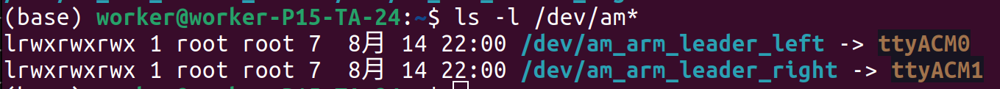

(yq-nyk0n5c9brbh2l4a-ub8d994fa)=

至此，遥操臂的端口与PC电脑绑定成功。

(yq-nyk0n5c9brbh2l4a-kNQ28)=

### 3、检查两个遥操臂状态是否正常

```text
# 进入conda环境
conda activate lerobot_alohamini
cd lerobot_alohamini

#执行获取舵机状态命令
python examples/debug/motors.py get_motors_states \
  --port /dev/am_arm_leader_left

  python examples/debug/motors.py get_motors_states \
  --port /dev/am_arm_leader_right
```

(yq-nyk0n5c9brbh2l4a-u2903067a)=

预期输出，并且操纵leader arm,可以看到POS数值的变化

(yq-nyk0n5c9brbh2l4a-u9ecf752f)=

(yq-nyk0n5c9brbh2l4a-ueb2e6800)=

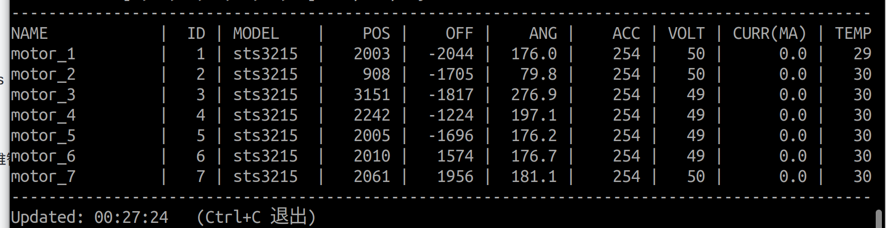

(yq-nyk0n5c9brbh2l4a-P0qe5)=

### 4、开启遥操作

(yq-nyk0n5c9brbh2l4a-u0fd52c12)=

a)第一次使用遥操臂，需要进行机械臂校准

(yq-nyk0n5c9brbh2l4a-u4722bed1)=

遥操臂校准命令：

```bash
python examples/alohamini/calibrate_bi.py \
  --teleop.id am_leader_bi \
  --teleop.arm_profile am-leader-6dof
```

(yq-nyk0n5c9brbh2l4a-ucf38e747)=

根据提示自行完成标定流程**(参考视频：**[**https://b23.tv/Dd1xFYz**](https://b23.tv/Dd1xFYz)**)**。

(yq-nyk0n5c9brbh2l4a-u2b763b9d)=

(yq-nyk0n5c9brbh2l4a-u17394f10)=

b)校准完成后，进行遥操作

```bash
python examples/alohamini/teleoperate_bi.py \
  --robot.remote_ip 192.168.x.xx \
  --robot.robot_model alohamini2pro \
  --teleop.id am_leader_bi \
  --teleop.arm_profile am-leader-6dof
```

(yq-nyk0n5c9brbh2l4a-uf949f4d7)=

自动连接远端机器人后，终端会持续输出实时状态信息。用户可通过键盘控制机器人底盘移动和升降机构运动，同时也可通过遥操臂对机械臂进行远程操作。

(yq-nyk0n5c9brbh2l4a-u5268bf0d)=

(yq-nyk0n5c9brbh2l4a-u69751080)=

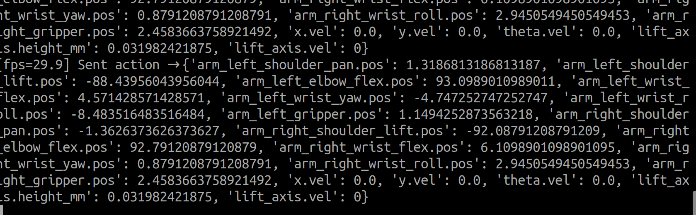

| 按键 | 功能 |
| --- | --- |
| `W` / `S` | 前进 / 后退 |
| `A` / `D` | 左转 / 右转 |
| `Z` / `X` | 左平移 / 右平移 |

| 按键 | 功能 |
| --- | --- |
| `U` / `J` | 上升 / 下降 |

(yq-nyk0n5c9brbh2l4a-TKBmk)=

## 三、配置摄像头

(yq-nyk0n5c9brbh2l4a-udc745801)=

修改配置文件：

```text
src/lerobot/robots/alohamini/config_alohamini.py
```

| 所在机器 | 作用 |
| --- | --- |
| 树莓派（下位机） | 控制实际摄像头的采集 |
| PC（上位机） | 控制客户端订阅哪些摄像头数据 |

(yq-nyk0n5c9brbh2l4a-u80bff6b1)=

> (yq-nyk0n5c9brbh2l4a-u8119888d)=
> 
> 
> 
> ⚠️ **两端必须保持一致。** 若树莓派启用了某个摄像头而 PC 端没有，或反之，会导致连接异常或数据不匹配。每次修改后，请同步更新两台机器上的文件，并重启两端的进程。

(yq-nyk0n5c9brbh2l4a-YcSjd)=

### 摄像头配置说明

(yq-nyk0n5c9brbh2l4a-u2a364288)=

配置文件中，所有摄像头均通过 `alohamini_cameras_config()` 函数进行统一管理。
如需禁用某个摄像头，只需将对应配置注释掉即可。

```python
def alohamini_cameras_config() -> dict[str, CameraConfig]:
    return {
        "head_top": OpenCVCameraConfig(
            index_or_path="/dev/am_camera_head_top", fps=30, width=640, height=480, rotation=Cv2Rotation.NO_ROTATION
        ),
        # "head_back": OpenCVCameraConfig(
        #     index_or_path="/dev/am_camera_head_back", fps=30, width=640, height=480, rotation=Cv2Rotation.NO_ROTATION
        # ),
        # "head_front": OpenCVCameraConfig(
        #     index_or_path="/dev/am_camera_head_front", fps=30, width=640, height=480, rotation=Cv2Rotation.NO_ROTATION
        # ),
        # "wrist_left": OpenCVCameraConfig(
        #     index_or_path="/dev/am_camera_wrist_left", fps=30, width=640, height=480, rotation=Cv2Rotation.NO_ROTATION
        # ),
        # "wrist_right": OpenCVCameraConfig(
        #     index_or_path="/dev/am_camera_wrist_right", fps=30, width=640, height=480, rotation=Cv2Rotation.NO_ROTATION
        # ),
    }
```

(yq-nyk0n5c9brbh2l4a-u89e01820)=

---

(yq-nyk0n5c9brbh2l4a-FfSF4)=

## 四、录制数据集

(yq-nyk0n5c9brbh2l4a-fe6f4a4d)=

### 录制数据集

(yq-nyk0n5c9brbh2l4a-uc73f874a)=

在终端中输入下面指令，录制一个新数据集（注意修改成合适的参数）：

```text
python examples/alohamini/record_bi.py \
  --dataset.repo_id user/am2_bi_test \
  --dataset.root "$HOME/user/am2_bi_test" \
  --dataset.num_episodes 1 \
  --dataset.fps 25 \
  --dataset.episode_time_s 60 \
  --dataset.reset_time_s 10 \
  --dataset.single_task "pickup1" \
  --robot.remote_ip 192.168.8.117 \
  --robot.robot_model alohamini2pro \
  --teleop.id am_leader_bi \
  --teleop.arm_profile am-leader-6dof \
  --dataset.push_to_hub=false \
  --display-data=true
```

(yq-nyk0n5c9brbh2l4a-uf9037d3a)=

参数：

(yq-nyk0n5c9brbh2l4a-u570f769f)=

--dataset.repo_id 数据集逻辑名称 xxx/xxx的形式

(yq-nyk0n5c9brbh2l4a-ua8f750dc)=

--dataset.root 数据集实际保存的位置

(yq-nyk0n5c9brbh2l4a-ud677db3a)=

--dataset.num_episodes 本次录制的数据回合的数量

(yq-nyk0n5c9brbh2l4a-u492e4e5d)=

--dataset.fps 本次录制的数据集帧率（推荐25）

(yq-nyk0n5c9brbh2l4a-u47832297)=

--dataset.reset_time_s 每个数据回合之间休息的时间，用于还原状态

(yq-nyk0n5c9brbh2l4a-u86daddd4)=

--display-data=true 是否显示回传的画面

(yq-nyk0n5c9brbh2l4a-ucd8a13dc)=

(yq-nyk0n5c9brbh2l4a-u99443077)=

默认目录：

```text
~/.cache/huggingface/lerobot/
```

(yq-nyk0n5c9brbh2l4a-ub2fec7f1)=

指定其他保存目录：

```bash
--dataset.root ~/user/am2_bi_test
```

(yq-nyk0n5c9brbh2l4a-uf8432008)=

`--dataset.root` 只改变本地保存位置，不改变 `dataset.repo_id`。目标目录在新建数据集时应不存在。

(yq-nyk0n5c9brbh2l4a-d9edd818)=

### 续传数据集

(yq-nyk0n5c9brbh2l4a-uce6d7f96)=

在原命令中增加 `--resume`，并保持相同的 `repo_id` 和 `root`：

```text
python examples/alohamini/record_bi.py \
  --dataset.repo_id user/am2_bi_test \
  --dataset.root "$HOME/user/am2_bi_test" \
  --dataset.num_episodes 1 \
  --dataset.fps 25 \
  --dataset.episode_time_s 60 \
  --dataset.reset_time_s 10 \
  --dataset.single_task "pickup1" \
  --robot.remote_ip 192.168.8.117 \
  --robot.robot_model alohamini2pro \
  --teleop.id am_leader_bi \
  --teleop.arm_profile am-leader-6dof \
  --dataset.push_to_hub=false \
  --display-data=true \
  --resume
```

(yq-nyk0n5c9brbh2l4a-ud968786c)=

(yq-nyk0n5c9brbh2l4a-ub88bece8)=

一旦新建数据集，再次录制就需要增加--resume参数，否则会报错：文件已存在。

(yq-nyk0n5c9brbh2l4a-u1fb776e6)=

(yq-nyk0n5c9brbh2l4a-8a7a4375)=

## 五、回放数据集

(yq-nyk0n5c9brbh2l4a-u3d3bfd4e)=

这里有两种“回放”：

1. 在 Rerun 中查看图像、状态和动作，不控制机器人。

1. `replay` 到真机，让机器人执行数据集中记录的动作。

(yq-nyk0n5c9brbh2l4a-f3d4e81c)=

### 1、Rerun 可视化数据集

```text
HF_HUB_OFFLINE=1 \
lerobot-dataset-viz \
  --repo-id user/am2_bi_test \
  --root "$HOME/user/am2_bi_test" \
  --episode-index 0 \
  --display-compressed-images
```

(yq-nyk0n5c9brbh2l4a-d9c69f54)=

### 2、`replay` 到真机

```text
HF_HUB_OFFLINE=1 \
python examples/alohamini/replay_bi.py \
  --dataset.repo_id user/am2_bi_test \
  --dataset.root "$HOME/user/am2_bi_test" \
  --dataset.episode 0 \
  --robot.remote_ip 192.168.8.117 \
  --robot.robot_model alohamini2pro
```

(yq-nyk0n5c9brbh2l4a-JbJBa)=

## 

(yq-nyk0n5c9brbh2l4a-22416fd2)=

## 六、训练数据集

(yq-nyk0n5c9brbh2l4a-669b954f)=

### 示例方法1、本机训练普通ACT模型（容易训练，但对移动支持较差）

(yq-nyk0n5c9brbh2l4a-u9ac2eb81)=

直接终端执行命令即可：

```text
HF_HUB_OFFLINE=1 \
HF_DATASETS_OFFLINE=1 \
TORCH_HOME="$HOME/.cache/torch" \
lerobot-train \
  --dataset.repo_id=user/am2_bi_test \
  --dataset.root="$HOME/user/am2_bi_test" \
  --dataset.video_backend=pyav \
  --policy.type=act \
  --policy.device=cuda \
  --policy.push_to_hub=false \
  --save_checkpoint_to_hub=false \
  --output_dir=outputs/train/act_am2_bi_test \
  --job_name=act_am2_bi_test \
  --steps=100000 \
  --batch_size=6 \
  --wandb.enable=false
```

(yq-nyk0n5c9brbh2l4a-a8c4493e)=

### 示例方法2、本机训练AM-ACT模型（适用于移动型任务）

(yq-nyk0n5c9brbh2l4a-udd2f4453)=

第一步：在 PC 生成纯视觉数据集

```text
python -m lerobot.scripts.create_alohamini_visual_only_dataset \
  --source "$HOME/user/am2_bi_test" \
  --target "$HOME/user/am2_bi_test_visual_only" \
  --keep-camera forward \
  --keep-camera wrist_right \
  --drop-state
```

(yq-nyk0n5c9brbh2l4a-ufb029b76)=

第二步：运行训练命令

```text
HF_HUB_OFFLINE=1 \
HF_DATASETS_OFFLINE=1 \
TORCH_HOME="$HOME/.cache/torch" \
lerobot-train \
  --dataset.repo_id=user/am2_bi_test_visual_only \
  --dataset.root="$HOME/user/am2_bi_test_visual_only" \
  --dataset.video_backend=pyav \
  --policy.type=am_act \
  --policy.device=cuda \
  --policy.fixed_action_dims='[0,1,2,3,4,5,6]' \
  --policy.discrete_action_dims='[14,15,16]' \
  --policy.discrete_action_values='[[-0.15,0,0.15],[-0.15,0,0.15],[-45,0,45]]' \
  --policy.discrete_action_class_weights='[[3,1,1.5],[3,1,2],[2,1,2]]' \
  --policy.discrete_action_loss_weight=1.0 \
  --policy.push_to_hub=false \
  --save_checkpoint_to_hub=false \
  --output_dir=outputs/train/am2_bi_test_visual_only \
  --job_name=am_act_am2_bi_test \
  --steps=100000 \
  --batch_size=6 \
  --wandb.enable=false
```

(yq-nyk0n5c9brbh2l4a-u85e0aaa6)=

注意，以上默认的policy参数仅适用于1、右臂夹取，左臂始终静止 2、底盘在数据集中需要有前后、旋转、平移的操作。若数据集中缺少平移动作，则训练时报错（ValueError: Action dimension 15 has zero std and cannot be classified.）。

(yq-nyk0n5c9brbh2l4a-zyiLE)=

### 

(yq-nyk0n5c9brbh2l4a-uf6d2f191)=

(yq-nyk0n5c9brbh2l4a-x8hf8)=

## 七、本地推理

(yq-nyk0n5c9brbh2l4a-u43b7168a)=

推理前先启动树莓派 Host，并清空机器人周围区域。

```text
# 在PC的终端中运行命令
conda activate lerobot_alohamini
cd lerobot_alohamini

python examples/alohamini/evaluate_bi.py \
  --eval.n_episodes 1 \
  --fps 25 \
  --dataset.single_task "pick up the block and place it in the box" \
  --policy.path outputs/train/act_pick_test_01/checkpoints/020000/pretrained_model \
  --dataset.repo_id local/eval_act_pick_test_01 \
  --dataset.push_to_hub=false \
  --robot.remote_ip 192.168.8.117 \
  --robot.id my_alohamini \
  --robot.robot_model alohamini2pro \
  --inference.type sync \
  --interpolation_multiplier 3
```

(yq-nyk0n5c9brbh2l4a-u31567234)=

关键参数：

- `--inference.type sync`：每个策略控制步同步调用一次 `select_action()`；ACT 等策略使用该模式。

- `--fps 25`：策略动作频率。首次测试建议 15～20 Hz，确认稳定后再提高。

- `--interpolation_multiplier 1`：关闭动作插值。设置为 3 时，每两个策略动作之间生成中间动作，

(yq-nyk0n5c9brbh2l4a-ucd7d6269)=

机器人命令频率变为 `fps × 3`，但不会提高模型推理频率。

- `--dataset.repo_id`：本次评估数据集名称；`evaluate_bi.py` 会记录观测和实际发送的动作。

- `--dataset.push_to_hub=false`：只保存在本机，不上传 Hugging Face Hub。

- `--robot.robot_model`：必须与树莓派 Host 端型号完全一致，否则状态和动作维度可能错位。

(yq-nyk0n5c9brbh2l4a-udb89a1d5)=

第一次推理建议：

- `--eval.n_episodes 1`

- `--eval.episode_time_s 15`

- `--inference.type sync`

- `--interpolation_multiplier 1`

- 手放在电源开关附近

- 发现动作方向、幅度或速度异常时立即停止
